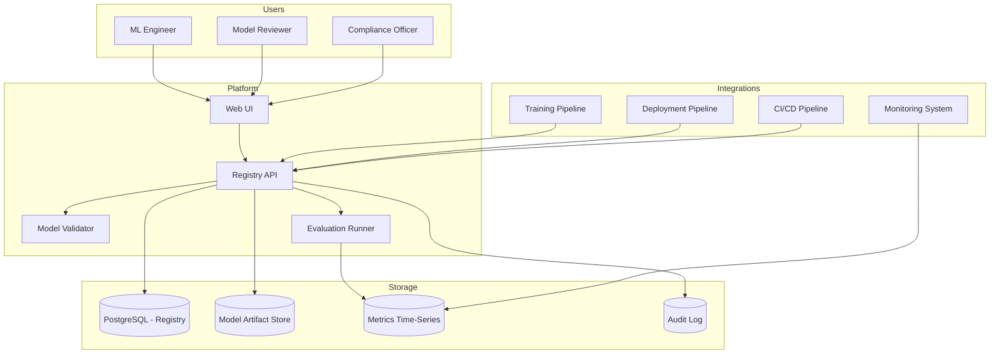

# System Design: Model Registry and Management Platform

## Problem Statement

Design a centralized model registry that tracks all AI models used across the bank -- from LLMs (OpenAI, Anthropic, open-source) to embedding models, classifiers, and custom fine-tuned models. The platform should manage model versions, performance metrics, deployment status, approval workflows, and deprecation schedules.

## Requirements

### Functional Requirements
1. Register and version all AI models used in production
2. Track model metadata: provider, type, capabilities, cost, performance
3. Model evaluation results stored and compared
4. Approval workflow before production deployment
5. Deprecation tracking and migration planning
6. Model comparison dashboard
7. Integration with model training pipelines
8. Compliance reporting (which models are used where, audit trail)
9. Model card generation (documentation)
10. Incident tracking per model

### Non-Functional Requirements
1. Support 200+ registered models
2. Real-time model status dashboard
3. Query latency: < 100ms for model lookups
4. Full audit trail of all model changes
5. API for programmatic access by CI/CD pipelines

## Architecture



## Detailed Design

### 1. Model Registry Data Model

```python
class ModelRegistration:
    """Complete model registration record."""
    
    def __init__(self, name: str, model_type: str, provider: str,
                 version: str, description: str, owner: str):
        self.name = name
        self.model_type = model_type  # llm, embedding, classifier, etc.
        self.provider = provider  # openai, anthropic, internal, huggingface
        self.version = version
        self.description = description
        self.owner = owner
        self.status = "registered"  # registered, evaluating, approved, deployed, deprecated, retired
        self.created_at = datetime.utcnow()
        self.tags: list[str] = []
        self.capabilities: dict = {}
        self.cost_info: ModelCost = None
        self.evaluation_results: list[EvaluationResult] = []
        self.approval_history: list[ApprovalRecord] = []
        self.deployed_in: list[str] = []  # List of applications using this model
    
    def to_dict(self) -> dict:
        return {
            "name": self.name,
            "type": self.model_type,
            "provider": self.provider,
            "version": self.version,
            "status": self.status,
            "owner": self.owner,
            "description": self.description,
            "tags": self.tags,
            "created_at": self.created_at.isoformat(),
            "capabilities": self.capabilities,
            "deployed_in": self.deployed_in,
        }
```

### 2. Model Approval Workflow

```python
class ModelApprovalWorkflow:
    """Manage model approval for production deployment."""
    
    def __init__(self, db, notification_service):
        self.db = db
        self.notifier = notification_service
    
    def submit_for_approval(self, model_name: str, version: str,
                             submitter: User, use_case: str) -> str:
        """Submit a model for production approval."""
        
        approval_id = str(uuid.uuid4())
        
        self.db.execute("""
            INSERT INTO model_approvals
            (id, model_name, version, submitter_id, use_case, 
             status, created_at, required_approvers)
            VALUES (%s, %s, %s, %s, %s, 'pending', %s, 3)
        """, (
            approval_id, model_name, version, submitter.id,
            use_case, datetime.utcnow()
        ))
        
        # Notify approvers
        approvers = self._get_approvers(model_name)
        for approver in approvers:
            self.notifier.notify(approver, {
                "type": "model_approval_request",
                "model": f"{model_name}:{version}",
                "use_case": use_case,
                "approval_id": approval_id,
            })
        
        return approval_id
    
    def approve(self, approval_id: str, approver: User, 
                comments: str = None) -> bool:
        """Approve a model."""
        
        self.db.execute("""
            INSERT INTO approval_votes 
            (approval_id, approver_id, vote, comments, voted_at)
            VALUES (%s, %s, 'approve', %s, %s)
        """, (approval_id, approver.id, comments, datetime.utcnow()))
        
        # Check if enough votes
        votes = self.db.query("""
            SELECT COUNT(*) as approve_count
            FROM approval_votes
            WHERE approval_id = %s AND vote = 'approve'
        """, (approval_id,))
        
        required = self.db.query("""
            SELECT required_approvers FROM model_approvals WHERE id = %s
        """, (approval_id,))
        
        if votes[0]["approve_count"] >= required[0]["required_approvers"]:
            self.db.execute("""
                UPDATE model_approvals SET status = 'approved', approved_at = %s
                WHERE id = %s
            """, (datetime.utcnow(), approval_id))
            
            return True
        
        return False
```

### 3. Model Evaluation Runner

```python
class EvaluationRunner:
    """Run standardized evaluations on registered models."""
    
    def __init__(self, evaluation_suites: dict, llm_gateway):
        self.suites = evaluation_suites
        self.gateway = llm_gateway
    
    async def run_evaluation(self, model_name: str, version: str,
                              suite_name: str = "standard") -> EvaluationResult:
        """Run evaluation suite against a model."""
        
        suite = self.suites[suite_name]
        results = []
        
        for test_case in suite.test_cases:
            # Run the model on the test case
            response = await self.gateway.generate(
                model=f"{model_name}:{version}",
                prompt=test_case.input,
                temperature=0.0
            )
            
            # Score the response
            score = test_case.scorer.score(response.text, test_case.expected)
            
            results.append(TestCaseResult(
                test_id=test_case.id,
                score=score,
                response=response.text,
                expected=test_case.expected
            ))
        
        # Aggregate
        overall_score = sum(r.score for r in results) / len(results)
        
        return EvaluationResult(
            model=model_name,
            version=version,
            suite=suite_name,
            overall_score=overall_score,
            test_results=results,
            run_at=datetime.utcnow()
        )
    
    def compare_models(self, model_a: str, model_b: str,
                       suite_name: str = "standard") -> ComparisonResult:
        """Compare two models on the same evaluation suite."""
        
        eval_a = self._get_latest_evaluation(model_a, suite_name)
        eval_b = self._get_latest_evaluation(model_b, suite_name)
        
        # Per-test comparison
        comparisons = []
        for test_a, test_b in zip(eval_a.test_results, eval_b.test_results):
            comparisons.append(TestComparison(
                test_id=test_a.test_id,
                score_a=test_a.score,
                score_b=test_b.score,
                winner="a" if test_a.score > test_b.score else "b"
            ))
        
        return ComparisonResult(
            model_a=model_a, score_a=eval_a.overall_score,
            model_b=model_b, score_b=eval_b.overall_score,
            test_comparisons=comparisons,
            overall_winner="a" if eval_a.overall_score > eval_b.overall_score else "b"
        )
```

## Interview Questions

### Q: A model that is approved and in production starts showing degraded performance. How does the registry help?

**Strong Answer**: "The registry integrates with the monitoring system to track per-model performance in production. When degradation is detected, the registry: (1) Flags the model's status as 'degraded' and alerts the model owner. (2) Shows all applications currently using this model so impact can be assessed. (3) Suggests alternative approved models that could serve as replacements. (4) Provides the evaluation history to determine if this is a known issue or new regression. (5) If a rollback is needed, the registry has the previous approved version readily available. The key value is: the registry provides the 'single source of truth' about model health, enabling fast incident response."
