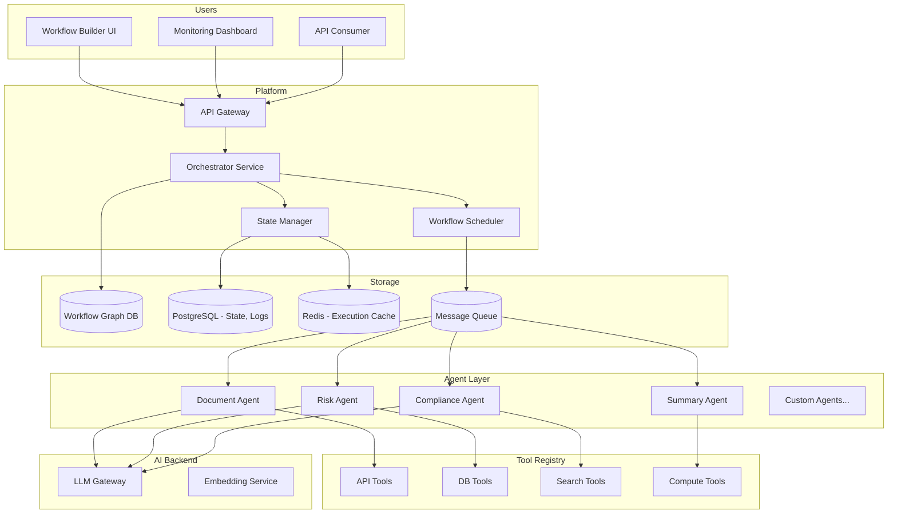

# System Design: Multi-Agent Orchestration Platform

## Problem Statement

Design a platform that enables complex AI workflows involving multiple specialized agents working together. For example, a loan application review process might involve a document extraction agent, a risk assessment agent, a compliance checker agent, and a summary agent -- each with different tools and capabilities. The platform should support agent creation, workflow definition, tool registration, state management, and monitoring.

## Requirements

### Functional Requirements
1. Define agents with specific capabilities, tools, and prompts
2. Chain agents in workflows (sequential, parallel, conditional)
3. Each agent can call registered tools (APIs, databases, other services)
4. Shared state/context between agents in a workflow
5. Human-in-the-loop checkpoints at defined workflow stages
6. Workflow versioning and rollback
7. Visual workflow builder (no-code/low-code)
8. Agent performance monitoring (accuracy, latency, cost)
9. Tool registry with versioning and access control
10. Workflow execution engine with retry and error handling

### Non-Functional Requirements
1. Support 100+ concurrent workflow executions
2. Each workflow may involve 5-20 agent steps
3. End-to-end workflow latency: < 30 seconds for 10-step workflow
4. Availability: 99.9%
5. All agent actions and tool calls logged
6. Idempotent workflow execution (safe to retry)
7. Cost tracking per workflow and per agent

## Architecture



## Detailed Design

### 1. Workflow Definition

```python
from typing import List, Dict, Optional

class WorkflowDefinition:
    """Define a multi-agent workflow."""
    
    def __init__(self, name: str, version: str, description: str):
        self.name = name
        self.version = version
        self.description = description
        self.steps: List[WorkflowStep] = []
        self.variables: Dict[str, Any] = {}
    
    def add_step(self, step: "WorkflowStep"):
        self.steps.append(step)
    
    def to_dict(self) -> dict:
        return {
            "name": self.name,
            "version": self.version,
            "description": self.description,
            "steps": [s.to_dict() for s in self.steps],
            "variables": self.variables,
        }

class WorkflowStep:
    """A single step in a workflow."""
    
    def __init__(self, name: str, agent_id: str, 
                 input_mapping: dict, output_variable: str,
                 condition: str = None,
                 retry_count: int = 3,
                 timeout_seconds: int = 30,
                 requires_human_approval: bool = False):
        self.name = name
        self.agent_id = agent_id
        self.input_mapping = input_mapping  # {"agent_input_key": "workflow_variable_name"}
        self.output_variable = output_variable
        self.condition = condition  # Jinja2 template for conditional execution
        self.retry_count = retry_count
        self.timeout_seconds = timeout_seconds
        self.requires_human_approval = requires_human_approval
        self.depends_on: List[str] = []  # Step names this depends on
    
    def to_dict(self) -> dict:
        return {
            "name": self.name,
            "agent_id": self.agent_id,
            "input_mapping": self.input_mapping,
            "output_variable": self.output_variable,
            "condition": self.condition,
            "retry_count": self.retry_count,
            "timeout_seconds": self.timeout_seconds,
            "requires_human_approval": self.requires_human_approval,
            "depends_on": self.depends_on,
        }
```

### 2. Orchestrator Service

```python
class OrchestratorService:
    """Execute workflows by orchestrating agent calls."""
    
    def __init__(self, agent_registry, state_manager, tool_registry, human_gateway):
        self.agents = agent_registry
        self.state = state_manager
        self.tools = tool_registry
        self.human_gateway = human_gateway
    
    async def execute_workflow(self, workflow_def: WorkflowDefinition, 
                               initial_inputs: dict, 
                               execution_id: str = None) -> WorkflowResult:
        """Execute a workflow from definition."""
        
        execution_id = execution_id or str(uuid.uuid4())
        
        # Initialize execution state
        execution = WorkflowExecution(
            id=execution_id,
            workflow_name=workflow_def.name,
            workflow_version=workflow_def.version,
            status="running",
            started_at=datetime.utcnow(),
            variables={**workflow_def.variables, **initial_inputs},
        )
        self.state.save_execution(execution)
        
        # Execute steps in order (respecting dependencies)
        completed_steps = set()
        failed_steps = []
        
        for step in workflow_def.steps:
            # Check dependencies
            if not all(dep in completed_steps for dep in step.depends_on):
                continue
            
            # Check condition
            if step.condition:
                should_run = self._evaluate_condition(step.condition, execution.variables)
                if not should_run:
                    execution.add_step_result(step.name, "skipped")
                    completed_steps.add(step.name)
                    continue
            
            # Execute step
            try:
                # Resolve inputs
                step_inputs = {}
                for agent_key, var_name in step.input_mapping.items():
                    step_inputs[agent_key] = execution.variables.get(var_name)
                
                # Human approval checkpoint
                if step.requires_human_approval:
                    approval = await self.human_gateway.request_approval(
                        execution_id=execution_id,
                        step_name=step.name,
                        context=step_inputs,
                    )
                    if not approval.approved:
                        execution.add_step_result(step.name, "rejected")
                        execution.status = "stopped"
                        self.state.save_execution(execution)
                        return WorkflowResult(
                            execution_id=execution_id,
                            status="stopped",
                            reason=f"Step '{step.name}' rejected by human reviewer"
                        )
                
                # Call agent
                agent = self.agents.get(step.agent_id)
                result = await self._execute_with_retry(
                    agent, step_inputs, step.retry_count, step.timeout_seconds
                )
                
                # Store output
                execution.variables[step.output_variable] = result.output
                execution.add_step_result(step.name, "completed", result)
                completed_steps.add(step.name)
                
            except Exception as e:
                execution.add_step_result(step.name, "failed", error=str(e))
                failed_steps.append(step.name)
                
                if step.retry_count == 0:
                    execution.status = "failed"
                    self.state.save_execution(execution)
                    return WorkflowResult(
                        execution_id=execution_id,
                        status="failed",
                        failed_steps=failed_steps,
                        error=str(e)
                    )
        
        execution.status = "completed" if not failed_steps else "partially_completed"
        execution.completed_at = datetime.utcnow()
        self.state.save_execution(execution)
        
        return WorkflowResult(
            execution_id=execution_id,
            status=execution.status,
            outputs={step.output_variable: execution.variables[step.output_variable] 
                     for step in workflow_def.steps 
                     if step.output_variable in execution.variables},
            failed_steps=failed_steps,
        )
    
    async def _execute_with_retry(self, agent, inputs: dict, 
                                   retry_count: int, timeout: int) -> AgentResult:
        """Execute an agent call with retry."""
        
        last_error = None
        for attempt in range(retry_count + 1):
            try:
                result = await asyncio.wait_for(
                    agent.execute(inputs),
                    timeout=timeout
                )
                return result
            except asyncio.TimeoutError:
                last_error = TimeoutError(f"Agent {agent.name} timed out after {timeout}s")
            except Exception as e:
                last_error = e
            
            if attempt < retry_count:
                await asyncio.sleep(2 ** attempt)  # Exponential backoff
        
        raise last_error
```

### 3. Agent Framework

```python
class Agent:
    """Base class for all agents."""
    
    def __init__(self, name: str, description: str, 
                 llm_client, tools: List[Tool], system_prompt: str):
        self.name = name
        self.description = description
        self.llm = llm_client
        self.tools = {t.name: t for t in tools}
        self.system_prompt = system_prompt
    
    async def execute(self, inputs: dict) -> AgentResult:
        """Execute the agent with given inputs."""
        
        # Build prompt with inputs
        prompt = self._build_prompt(inputs)
        
        # LLM call with tool access
        messages = [
            {"role": "system", "content": self.system_prompt},
            {"role": "user", "content": prompt}
        ]
        
        # ReAct loop: LLM can call tools iteratively
        max_iterations = 10
        for _ in range(max_iterations):
            response = await self.llm.chat(messages, tools=list(self.tools.values()))
            
            if response.tool_calls:
                # Execute tool calls
                for tool_call in response.tool_calls:
                    tool = self.tools[tool_call.name]
                    result = await tool.execute(tool_call.arguments)
                    messages.append({"role": "assistant", "tool_calls": [tool_call]})
                    messages.append({"role": "tool", "content": result, "tool_call_id": tool_call.id})
            else:
                # Final response
                return AgentResult(
                    output=response.content,
                    tool_calls_made=len(response.tool_calls or []),
                    llm_usage=response.usage
                )
        
        raise AgentError(f"Agent {self.name} exceeded max iterations")
```

### 4. Tool Registry

```python
class ToolRegistry:
    """Registry of available tools for agents."""
    
    def __init__(self, db):
        self.db = db
        self.tools: Dict[str, Tool] = {}
    
    def register(self, tool: Tool):
        """Register a new tool."""
        self.tools[tool.name] = tool
        self.db.execute("""
            INSERT INTO tools (name, description, schema, version, created_at)
            VALUES (%s, %s, %s, %s, %s)
        """, (tool.name, tool.description, json.dumps(tool.schema), 
              tool.version, datetime.utcnow()))
    
    def get_tool(self, name: str) -> Tool:
        return self.tools.get(name)
    
    def list_tools(self, category: str = None) -> List[Tool]:
        if category:
            return [t for t in self.tools.values() if t.category == category]
        return list(self.tools.values())

class Tool:
    """A tool that an agent can use."""
    
    def __init__(self, name: str, description: str, 
                 schema: dict, execute_fn, category: str = "general",
                 version: str = "1.0"):
        self.name = name
        self.description = description
        self.schema = schema  # JSON Schema for input validation
        self.execute_fn = execute_fn
        self.category = category
        self.version = version
    
    async def execute(self, arguments: dict) -> str:
        """Execute the tool with validated arguments."""
        # Validate arguments against schema
        jsonschema.validate(arguments, self.schema)
        
        # Execute
        result = await self.execute_fn(arguments)
        return json.dumps(result)
```

### 5. Example: Loan Application Review Workflow

```python
def build_loan_review_workflow() -> WorkflowDefinition:
    """Define a loan application review workflow."""
    
    workflow = WorkflowDefinition(
        name="loan_application_review",
        version="2.0",
        description="Automated loan application review with document analysis, risk assessment, and compliance check"
    )
    
    # Step 1: Extract data from application documents
    workflow.add_step(WorkflowStep(
        name="document_extraction",
        agent_id="document_analyzer",
        input_mapping={"documents": "application_documents"},
        output_variable="extracted_data",
        retry_count=2,
        timeout_seconds=60
    ))
    
    # Step 2: Assess risk based on extracted data
    workflow.add_step(WorkflowStep(
        name="risk_assessment",
        agent_id="risk_analyst",
        input_mapping={
            "applicant_data": "extracted_data.applicant",
            "financial_data": "extracted_data.financials"
        },
        output_variable="risk_score",
        retry_count=1,
        timeout_seconds=30
    ))
    
    # Step 3: Compliance check (requires human approval if flagged)
    workflow.add_step(WorkflowStep(
        name="compliance_check",
        agent_id="compliance_checker",
        input_mapping={
            "applicant_data": "extracted_data.applicant",
            "loan_details": "extracted_data.loan_details"
        },
        output_variable="compliance_result",
        retry_count=1,
        timeout_seconds=30,
        requires_human_approval=True
    ))
    
    # Step 4: Generate summary (conditional on risk score)
    workflow.add_step(WorkflowStep(
        name="generate_summary",
        agent_id="summary_generator",
        input_mapping={
            "risk_score": "risk_score",
            "compliance_result": "compliance_result",
            "extracted_data": "extracted_data"
        },
        output_variable="final_summary",
        condition="{{ risk_score.overall_risk != 'high' }}",  # Skip if high risk
        retry_count=1,
        timeout_seconds=20
    ))
    
    return workflow
```

## Tradeoffs

### Execution Engine: Custom vs. Temporal/Argo

| Criteria | Custom | Temporal | Argo Workflows |
|---|---|---|---|
| **AI-native features** | Built-in | Requires adaptation | Not designed for AI |
| **Agent support** | Native | Via activities | Via containers |
| **Human checkpoints** | Built-in | Via signals | Manual |
| **Learning curve** | Medium | High | High |
| **Flexibility** | Full control | Framework constraints | K8s native |
| **Decision** | **SELECTED** for AI workflows | Good for general workflows | Good for K8s shops |

### State Management: In-Memory vs. Persistent

- **In-memory (Redis)**: Fast, but state lost on crash
- **Persistent (PostgreSQL)**: Durable, but slower
- **Decision**: Hybrid -- Redis for active execution state, PostgreSQL for completed execution history and recovery

## Monitoring

| Metric | Target | Alert |
|---|---|---|
| Workflow success rate | > 95% | < 90% |
| Average workflow duration | < 30s | > 60s |
| Agent error rate | < 5% | > 10% |
| Human approval wait time | < 15 min | > 1 hour |
| Cost per workflow execution | Track | > 2x average |

## Interview Questions

### Q: How do you handle a situation where an agent in the middle of a workflow produces unexpected output?

**Strong Answer**: "Multiple layers of protection: (1) Each agent's output is validated against an expected schema before being stored in workflow state. If validation fails, the step is marked as failed and the retry logic kicks in. (2) If retry also fails, the workflow execution is paused and a human reviewer is notified with the agent's input, output, and expected schema. (3) The workflow definition can include conditional steps that check intermediate results -- e.g., 'if risk_score > threshold, route to manual review.' (4) All agent outputs are logged, so post-mortem analysis is possible. The key is failing fast and visibly -- don't let bad data propagate through the workflow."

### Q: How would you version workflows without breaking running executions?

**Strong Answer**: "Workflows are immutable once published. When a workflow is updated, a new version is created (v1 -> v2). Running executions continue with their original version. New executions use the latest version by default, but can specify a specific version if needed. The workflow definitions are stored in the database with version numbers, and the orchestrator resolves the version at execution start time. For breaking changes (e.g., removing a step), I provide a migration tool that can map in-progress executions to the new workflow definition if possible, or let them complete on the old version. Completed executions always reference their specific workflow version for auditability."
