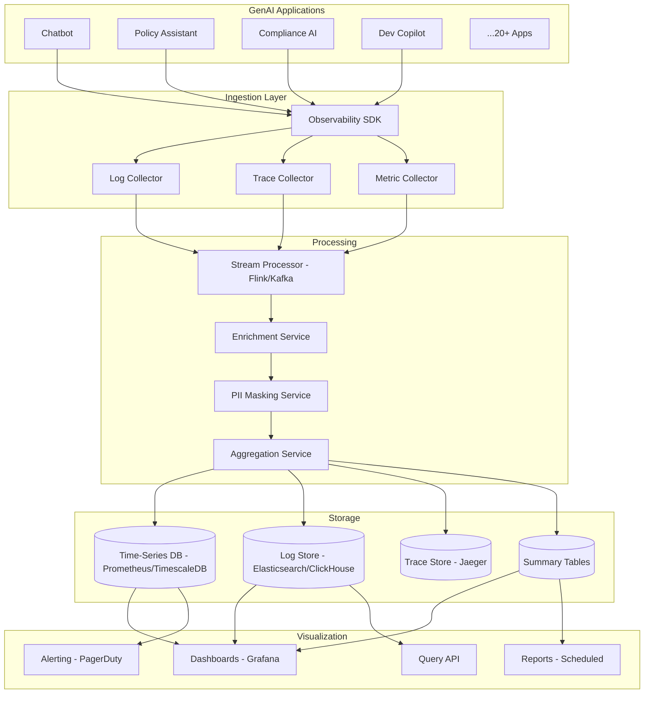

# System Design: Observability Platform for GenAI

## Problem Statement

Design a centralized observability platform that monitors all GenAI applications within the bank. The platform must track LLM usage, response quality, cost, latency, error rates, and security events across 20+ AI applications. It should provide real-time dashboards, alerting, and detailed tracing for debugging AI application behavior.

## Requirements

### Functional Requirements
1. Track every LLM call: model, prompt, response, tokens, cost, latency
2. Trace complete RAG pipeline: query -> retrieval -> re-rank -> generation
3. Monitor response quality: groundedness, hallucination rate, user satisfaction
4. Cost tracking per application, per team, per model
5. Security monitoring: PII detection, prompt injection attempts, access violations
6. Custom dashboards for different stakeholders (engineering, product, finance)
7. Alerting on anomalous behavior (cost spikes, quality drops, error surges)
8. Log retention for 1 year (compliance requirement)
9. Export data to SIEM (Security Information and Event Management)
10. Distributed tracing across microservices

### Non-Functional Requirements
1. Ingestion: 1M+ events/hour
2. Query latency: < 5 seconds for dashboard queries
3. Storage: 1 year of logs (~10TB)
4. Availability: 99.9%
5. Real-time dashboards: < 30 second data freshness
6. Multi-tenant: each team sees only their data
7. Data privacy: PII in prompts/responses must be masked in observability data

## Architecture



## Detailed Design

### 1. Observability SDK

```python
class GenAIObservabilitySDK:
    """SDK instrumented into every GenAI application."""
    
    def __init__(self, app_id: str, collector_endpoint: str):
        self.app_id = app_id
        self.collector = collector_endpoint
        self.tracer = self._init_tracer()
    
    def trace_llm_call(self, model: str, prompt: str, response: str,
                       input_tokens: int, output_tokens: int,
                       cost: float, latency_ms: float,
                       metadata: dict = None):
        """Record an LLM call."""
        
        event = {
            "event_id": str(uuid.uuid4()),
            "timestamp": datetime.utcnow().isoformat(),
            "app_id": self.app_id,
            "event_type": "llm_call",
            "model": model,
            "prompt_preview": self._truncate_and_mask(prompt, max_length=500),
            "response_preview": self._truncate_and_mask(response, max_length=500),
            "input_tokens": input_tokens,
            "output_tokens": output_tokens,
            "total_tokens": input_tokens + output_tokens,
            "cost": cost,
            "latency_ms": latency_ms,
            "metadata": metadata or {},
            "trace_id": self.tracer.current_trace_id,
            "span_id": self.tracer.current_span_id,
        }
        
        self._send_event(event)
    
    def trace_retrieval(self, query: str, retrieved_count: int,
                        retrieval_latency_ms: float, scores: list[float],
                        metadata: dict = None):
        """Record a retrieval operation."""
        
        event = {
            "event_id": str(uuid.uuid4()),
            "timestamp": datetime.utcnow().isoformat(),
            "app_id": self.app_id,
            "event_type": "retrieval",
            "query_preview": self._truncate_and_mask(query, max_length=200),
            "retrieved_count": retrieved_count,
            "retrieval_latency_ms": retrieval_latency_ms,
            "top_scores": scores[:5],
            "metadata": metadata or {},
            "trace_id": self.tracer.current_trace_id,
        }
        
        self._send_event(event)
    
    def trace_quality(self, groundedness_score: float, 
                      hallucination_detected: bool = False,
                      user_feedback: str = None,
                      metadata: dict = None):
        """Record response quality assessment."""
        
        event = {
            "event_id": str(uuid.uuid4()),
            "timestamp": datetime.utcnow().isoformat(),
            "app_id": self.app_id,
            "event_type": "quality_assessment",
            "groundedness_score": groundedness_score,
            "hallucination_detected": hallucination_detected,
            "user_feedback": user_feedback,
            "metadata": metadata or {},
            "trace_id": self.tracer.current_trace_id,
        }
        
        self._send_event(event)
    
    def _truncate_and_mask(self, text: str, max_length: int = 500) -> str:
        """Truncate text and mask PII for observability."""
        truncated = text[:max_length]
        # Mask PII patterns
        truncated = re.sub(r'\b\d{3}-\d{2}-\d{4}\b', '[SSN]', truncated)
        truncated = re.sub(r'\b\d{10,17}\b', '[ACCOUNT]', truncated)
        truncated = re.sub(r'\b[A-Za-z0-9._%+-]+@[A-Za-z0-9.-]+\.[A-Z|a-z]{2,}\b', '[EMAIL]', truncated)
        return truncated
    
    def _send_event(self, event: dict):
        """Send event to collector (async, batched)."""
        self._batch_buffer.append(event)
        if len(self._batch_buffer) >= 100:
            self._flush()
```

### 2. Cost Tracking and Aggregation

```python
class CostAggregator:
    """Aggregate and analyze GenAI costs."""
    
    def __init__(self, tsdb_connection):
        self.db = tsdb_connection
    
    def record_cost_event(self, app_id: str, team_id: str, model: str,
                          input_tokens: int, output_tokens: int,
                          cost: float, timestamp: datetime):
        """Record a cost event for aggregation."""
        
        self.db.execute("""
            INSERT INTO cost_events 
            (app_id, team_id, model, input_tokens, output_tokens, 
             total_cost, timestamp, hour_bucket)
            VALUES (%s, %s, %s, %s, %s, %s, %s, %s)
        """, (
            app_id, team_id, model, input_tokens, output_tokens,
            cost, timestamp, timestamp.replace(minute=0, second=0)
        ))
    
    def get_cost_by_team(self, team_id: str, period: str = "month") -> dict:
        """Get cost breakdown for a team."""
        
        if period == "month":
            group_by = "DATE_TRUNC('month', timestamp)"
        elif period == "week":
            group_by = "DATE_TRUNC('week', timestamp)"
        else:
            group_by = "DATE(timestamp)"
        
        return self.db.query(f"""
            SELECT model, 
                   SUM(total_cost) as total_cost,
                   SUM(input_tokens) as input_tokens,
                   SUM(output_tokens) as output_tokens,
                   COUNT(*) as call_count,
                   {group_by} as period
            FROM cost_events
            WHERE team_id = %s AND timestamp >= %s
            GROUP BY model, period
            ORDER BY period DESC, total_cost DESC
        """, (team_id, self._period_start(period)))
    
    def get_cost_forecast(self, team_id: str) -> dict:
        """Forecast monthly cost based on current usage."""
        
        daily_costs = self.db.query("""
            SELECT DATE(timestamp) as day, SUM(total_cost) as daily_cost
            FROM cost_events
            WHERE team_id = %s AND timestamp >= %s
            GROUP BY day
            ORDER BY day
        """, (team_id, datetime.utcnow() - timedelta(days=30)))
        
        if not daily_costs:
            return {"forecast": 0, "confidence": "low"}
        
        avg_daily = sum(d["daily_cost"] for d in daily_costs) / len(daily_costs)
        days_remaining = (datetime.utcnow().replace(day=1) + timedelta(days=32)).replace(day=1) - timedelta(days=1)
        days_remaining = days_remaining.day - datetime.utcnow().day
        
        return {
            "spent_so_far": sum(d["daily_cost"] for d in daily_costs),
            "forecast_remaining": avg_daily * max(days_remaining, 0),
            "forecast_total": avg_daily * 30,
            "daily_average": avg_daily,
            "trend": self._calculate_trend([d["daily_cost"] for d in daily_costs]),
        }
```

### 3. Quality Monitoring

```python
class QualityMonitor:
    """Monitor GenAI response quality over time."""
    
    def __init__(self, db):
        self.db = db
    
    def record_quality_event(self, app_id: str, trace_id: str,
                             groundedness: float, 
                             hallucination: bool,
                             user_satisfaction: float = None):
        """Record a quality assessment."""
        
        self.db.execute("""
            INSERT INTO quality_events
            (app_id, trace_id, groundedness_score, hallucination_detected,
             user_satisfaction, timestamp)
            VALUES (%s, %s, %s, %s, %s, %s)
        """, (
            app_id, trace_id, groundedness, hallucination,
            user_satisfaction, datetime.utcnow()
        ))
    
    def get_quality_dashboard(self, app_id: str, days: int = 7) -> dict:
        """Generate quality dashboard for an application."""
        
        since = datetime.utcnow() - timedelta(days=days)
        
        metrics = self.db.query("""
            SELECT 
                COUNT(*) as total_assessments,
                AVG(groundedness_score) as avg_groundedness,
                PERCENTILE_CONT(0.5) WITHIN GROUP (ORDER BY groundedness_score) as median_groundedness,
                PERCENTILE_CONT(0.05) WITHIN GROUP (ORDER BY groundedness_score) as p5_groundedness,
                SUM(CASE WHEN hallucination_detected THEN 1 ELSE 0 END) as hallucination_count,
                AVG(user_satisfaction) as avg_satisfaction
            FROM quality_events
            WHERE app_id = %s AND timestamp >= %s
        """, (app_id, since))
        
        # Trend analysis
        daily_trend = self.db.query("""
            SELECT DATE(timestamp) as day,
                   AVG(groundedness_score) as avg_groundedness,
                   SUM(CASE WHEN hallucination_detected THEN 1 ELSE 0 END)::float / COUNT(*) as hallucination_rate
            FROM quality_events
            WHERE app_id = %s AND timestamp >= %s
            GROUP BY day
            ORDER BY day
        """, (app_id, since))
        
        return {
            **metrics[0],
            "hallucination_rate": metrics[0]["hallucination_count"] / max(metrics[0]["total_assessments"], 1),
            "trend": daily_trend,
        }
```

### 4. Security Monitoring

```python
class SecurityMonitor:
    """Detect and alert on GenAI security events."""
    
    def __init__(self, db, alerting_service):
        self.db = db
        self.alerting = alerting_service
    
    def record_security_event(self, event_type: str, app_id: str,
                              severity: str, details: dict):
        """Record a security event."""
        
        self.db.execute("""
            INSERT INTO security_events
            (event_type, app_id, severity, details, timestamp)
            VALUES (%s, %s, %s, %s, %s)
        """, (event_type, app_id, severity, json.dumps(details), datetime.utcnow()))
        
        # Alert on high-severity events
        if severity in ("critical", "high"):
            self.alerting.send_alert(
                severity=severity,
                title=f"GenAI Security Alert: {event_type}",
                body=json.dumps(details, indent=2),
                service=f"genai-security-{app_id}"
            )
    
    def detect_prompt_injection(self, prompt: str, app_id: str) -> bool:
        """Detect potential prompt injection attempts."""
        
        injection_patterns = [
            r"ignore.*instructions",
            r"system.*prompt",
            r"you are now",
            r"forget.*previous",
            r"new.*role",
            r"disregard.*rules",
        ]
        
        for pattern in injection_patterns:
            if re.search(pattern, prompt, re.IGNORECASE):
                self.record_security_event(
                    event_type="prompt_injection_attempt",
                    app_id=app_id,
                    severity="high",
                    details={
                        "pattern_matched": pattern,
                        "prompt_preview": prompt[:200],
                    }
                )
                return True
        
        return False
    
    def get_security_dashboard(self, days: int = 30) -> dict:
        """Security events overview."""
        
        since = datetime.utcnow() - timedelta(days=days)
        
        events = self.db.query("""
            SELECT event_type, severity, COUNT(*) as count,
                   ARRAY_AGG(DISTINCT app_id) as affected_apps
            FROM security_events
            WHERE timestamp >= %s
            GROUP BY event_type, severity
            ORDER BY count DESC
        """, (since,))
        
        return {
            "total_events": sum(e["count"] for e in events),
            "by_type_and_severity": events,
            "critical_events": [e for e in events if e["severity"] == "critical"],
        }
```

### 5. Dashboard Definitions

```python
DASHBOARDS = {
    "executive_overview": {
        "title": "GenAI Platform - Executive Overview",
        "panels": [
            {"type": "stat", "title": "Total Queries Today", "query": "count(llm_calls) where time > now()-24h"},
            {"type": "stat", "title": "Total Cost Today", "query": "sum(cost) where time > now()-24h"},
            {"type": "stat", "title": "Avg Groundedness", "query": "avg(groundedness) where time > now()-24h"},
            {"type": "stat", "title": "Hallucination Rate", "query": "rate(hallucinations) / rate(assessments)"},
            {"type": "timeseries", "title": "Daily Cost Trend", "query": "sum(cost) by day"},
            {"type": "timeseries", "title": "Query Volume", "query": "count(llm_calls) by hour"},
            {"type": "table", "title": "Top Apps by Cost", "query": "sum(cost) by app_id order by cost desc limit 10"},
            {"type": "table", "title": "Model Usage", "query": "count(*) by model order by count desc"},
        ]
    },
    "engineering": {
        "title": "GenAI Platform - Engineering Dashboard",
        "panels": [
            {"type": "timeseries", "title": "Latency P50/P95/P99", "query": "histogram_quantile(latency)"},
            {"type": "timeseries", "title": "Error Rate", "query": "rate(errors) / rate(total_calls)"},
            {"type": "timeseries", "title": "Retrieval Quality", "query": "avg(retrieval_precision)"},
            {"type": "stat", "title": "Cache Hit Rate", "query": "rate(cache_hits) / rate(total_queries)"},
            {"type": "trace", "title": "Slowest Traces", "query": "traces where duration > p95"},
            {"type": "table", "title": "Recent Errors", "query": "errors order by timestamp desc limit 20"},
        ]
    },
    "finance": {
        "title": "GenAI Platform - Cost Dashboard",
        "panels": [
            {"type": "stat", "title": "Monthly Spend", "query": "sum(cost) where time > now()-30d"},
            {"type": "stat", "title": "Forecast", "query": "forecast_monthly_cost()"},
            {"type": "timeseries", "title": "Cost by Team", "query": "sum(cost) by team_id"},
            {"type": "timeseries", "title": "Cost by Model", "query": "sum(cost) by model"},
            {"type": "table", "title": "Budget Utilization", "query": "sum(cost) / budget by team_id"},
            {"type": "table", "title": "Cost per Query", "query": "sum(cost) / count(queries) by app_id"},
        ]
    }
}
```

## Tradeoffs

### Storage: Elasticsearch vs. ClickHouse vs. TimescaleDB

| Criteria | Elasticsearch | ClickHouse | TimescaleDB |
|---|---|---|---|
| **Log search** | Excellent | Good | Fair |
| **Time-series analytics** | Fair | Excellent | Excellent |
| **Cost at 10TB** | High | Medium | Medium |
| **Operational complexity** | High (ES cluster) | Medium | Low (PostgreSQL) |
| **Decision** | **SELECTED** for logs | **SELECTED** for metrics | Rejected |

**Rationale**: Use Elasticsearch for log search and full-text querying. Use ClickHouse for time-series metrics aggregation (cost, latency, quality). This two-store approach optimizes for each use case.

## Interview Questions

### Q: How do you balance comprehensive logging with data privacy requirements?

**Strong Answer**: "Three-layer approach: (1) At the SDK level, all prompts and responses are truncated and PII-masked before being sent to the observability platform. We only store previews (first 500 characters) with redacted PII. (2) The processing layer applies additional PII masking using NER models to catch any remaining sensitive data. (3) Access to the observability platform is role-based -- most users see aggregated metrics only. Only security-compliant engineers with specific approval can access full logs, and even then, PII-masked. Full unmasked data is only accessible in the application's own audit logs, not in the observability platform. The key principle is: observability data is for operational insight, not for reviewing customer data."

### Q: How would you detect a gradual degradation in response quality that doesn't trigger threshold alerts?

**Strong Answer**: "I implement statistical process control: (1) Track rolling averages of quality metrics (groundedness, satisfaction) over multiple time windows (1h, 6h, 24h). (2) Use EWMA (Exponentially Weighted Moving Average) to detect gradual drifts that don't cross absolute thresholds. (3) Compare current quality against the same time period last week (day-of-week patterns). (4) Correlate quality drops with recent deployments -- if quality dropped after a model or prompt change, flag it. (5) Use anomaly detection algorithms (Isolation Forest, Prophet) on the quality time series to detect subtle changes. The alert would be: 'Groundedness has been declining 0.5% per day for the past 5 days -- projected to breach threshold in 3 days.' This gives the team time to investigate before users are significantly impacted."
