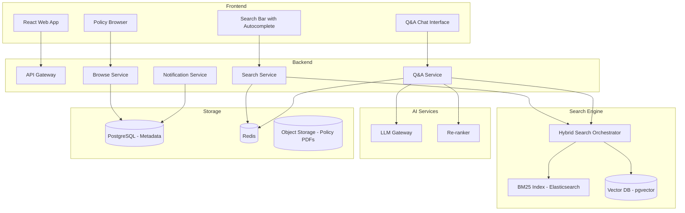

# System Design: Policy Search and Q&A System

## Problem Statement

Design a policy search and Q&A system that allows bank employees to quickly find and understand banking policies. The system should support both keyword search (find a specific policy document) and natural language Q&A (ask questions about policy content). Current employees spend an average of 30 minutes per day searching for policy information across 10,000+ policy documents.

## Requirements

### Functional Requirements
1. Keyword search across all policy documents (by title, content, tags)
2. Natural language Q&A with answers grounded in policy text
3. Policy browsing by category (retail banking, corporate, compliance, operations)
4. Document version history (see what changed between versions)
5. Highlight relevant sections in search results
6. Save/bookmark frequently accessed policies
7. Policy change notifications (subscribe to specific policy categories)
8. Export policy excerpts for reports

### Non-Functional Requirements
1. Search latency: P95 < 500ms for keyword search, < 3s for Q&A
2. Support 20,000 employees, 100,000 searches/day
3. Index 10,000+ policy documents (~5M chunks)
4. 99.9% availability during business hours
5. All searches logged for audit
6. Role-based access to restricted policies
7. Multi-language support (English primary, Spanish/French secondary)

## Architecture



## Detailed Design

### 1. Search Service

```python
class SearchService:
    def __init__(self, bm25_index, vector_store, hybrid_orchestrator, cache):
        self.bm25 = bm25_index
        self.vector = vector_store
        self.hybrid = hybrid_orchestrator
        self.cache = cache
    
    def search(self, query: str, user: User, 
               filters: dict = None, k: int = 20) -> SearchResult:
        """Hybrid search across all policy documents."""
        
        # Check cache
        cache_key = f"search:{hashlib.md5((query + str(filters)).encode()).hexdigest()}"
        cached = self.cache.get(cache_key)
        if cached:
            return cached
        
        # Apply access control filters
        access_filter = {
            "department": {"$in": user.allowed_departments},
            "min_clearance": {"$lte": user.clearance_level},
            "status": "active"
        }
        if filters:
            access_filter.update(filters)
        
        # Hybrid search
        results = self.hybrid.search(
            query=query,
            bm25_index=self.bm25,
            vector_store=self.vector,
            k=k,
            filter=access_filter,
            alpha=0.35  # Favor vector search slightly
        )
        
        # Post-process: highlight matches, group by document
        processed = self._post_process(results, query)
        
        # Cache for 5 minutes
        self.cache.set(cache_key, processed, ttl=300)
        
        return processed
    
    def _post_process(self, results: list, query: str) -> SearchResult:
        """Group by document, highlight matches, add metadata."""
        
        grouped = {}
        for chunk in results:
            doc_id = chunk.metadata["doc_id"]
            if doc_id not in grouped:
                grouped[doc_id] = {
                    "doc_id": doc_id,
                    "doc_title": chunk.metadata["doc_title"],
                    "doc_version": chunk.metadata.get("doc_version"),
                    "department": chunk.metadata.get("department"),
                    "matched_chunks": [],
                    "best_score": chunk.metadata.get("score", 0)
                }
            
            matched_chunks = grouped[doc_id]["matched_chunks"]
            matched_chunks.append({
                "chunk_id": chunk.metadata["id"],
                "content": chunk.page_content,
                "highlighted": self._highlight_matches(chunk.page_content, query),
                "section": chunk.metadata.get("section_title", ""),
                "score": chunk.metadata.get("score", 0)
            })
        
        # Sort documents by best chunk score
        docs = sorted(grouped.values(), key=lambda d: d["best_score"], reverse=True)
        
        return SearchResult(documents=docs, total=len(docs), query=query)
```

### 2. Q&A Service

```python
class QAService:
    def __init__(self, search_service, reranker, llm, cache):
        self.search = search_service
        self.reranker = reranker
        self.llm = llm
        self.cache = cache
    
    def answer(self, question: str, user: User) -> QAAnswer:
        """Answer a question using RAG over policy documents."""
        
        # Search for relevant policies
        search_results = self.search.search(question, user, k=15)
        
        if not search_results.documents:
            return QAAnswer(
                answer="I couldn't find any relevant policy information for this question.",
                confidence=0.0,
                sources=[]
            )
        
        # Get text from matched chunks
        all_chunks = []
        for doc in search_results.documents:
            for chunk in doc["matched_chunks"]:
                all_chunks.append(chunk)
        
        # Re-rank
        chunk_texts = [c["content"] for c in all_chunks]
        reranked = self.reranker.rerank(question, chunk_texts, top_k=5)
        
        # Check if top score is high enough
        if reranked[0]["score"] < 0.3:
            return QAAnswer(
                answer="I found some potentially relevant documents, but none directly address your question. Would you like to review the documents anyway?",
                confidence=0.3,
                sources=search_results.documents[:3]
            )
        
        # Generate answer
        context = self._assemble_context(reranked, all_chunks)
        response = self.llm.generate(
            system=self._qa_system_prompt(),
            context=context,
            question=question
        )
        
        # Verify groundedness
        groundedness = self._verify_groundedness(response, context)
        
        return QAAnswer(
            answer=response.text,
            confidence=groundedness.score,
            sources=self._format_sources(reranked, search_results.documents),
            follow_up_suggestions=self._generate_followups(question, context)
        )
    
    def _qa_system_prompt(self) -> str:
        return """You are a banking policy expert assistant. Answer questions using ONLY the provided policy documents.

Rules:
- Cite specific policy sections with document name, version, and section number
- If the answer is not in the documents, say so clearly
- Use the exact numbers and terms from the policy
- Do not infer or guess information not stated in the documents
- If policies conflict, note the discrepancy and cite both sources"""
```

### 3. Policy Browser

```python
class PolicyBrowser:
    """Navigate and browse policy documents by category."""
    
    def get_categories(self) -> list[dict]:
        return [
            {"id": "retail", "name": "Retail Banking", "count": 3200},
            {"id": "corporate", "name": "Corporate Banking", "count": 1800},
            {"id": "compliance", "name": "Compliance & Regulatory", "count": 2500},
            {"id": "operations", "name": "Operations", "count": 1500},
            {"id": "risk", "name": "Risk Management", "count": 1000},
        ]
    
    def get_policies(self, category: str, user: User, 
                     page: int = 1, per_page: int = 20) -> list[dict]:
        """List policies in a category."""
        
        query = """
            SELECT doc_id, doc_title, doc_version, department, 
                   updated_at, effective_from, effective_until,
                   status, change_summary
            FROM policy_documents
            WHERE department = %s
              AND metadata->>'status' = 'active'
              AND metadata->>'min_clearance' <= %s
            ORDER BY updated_at DESC
            LIMIT %s OFFSET %s
        """
        
        return self.db.execute(query, (
            category, user.clearance_level, per_page, (page - 1) * per_page
        ))
    
    def get_version_history(self, doc_id: str) -> list[dict]:
        """Get version history for a policy document."""
        
        return self.db.query("""
            SELECT doc_version, updated_at, updated_by, change_summary,
                   effective_from, effective_until
            FROM policy_versions
            WHERE doc_id = %s
            ORDER BY updated_at DESC
        """, (doc_id,))
```

### 4. Notification Service

```python
class NotificationService:
    """Notify users about policy changes."""
    
    def subscribe(self, user_id: str, category: str, 
                  notification_type: str = "email") -> str:
        """Subscribe to policy change notifications."""
        
        subscription_id = str(uuid.uuid4())
        self.db.execute("""
            INSERT INTO policy_subscriptions 
            (user_id, category, notification_type, created_at)
            VALUES (%s, %s, %s, %s)
        """, (user_id, category, notification_type, datetime.utcnow()))
        
        return subscription_id
    
    def notify_changes(self, category: str, changed_docs: list[dict]):
        """Notify subscribers about policy changes."""
        
        subscribers = self.db.query("""
            SELECT user_id, notification_type
            FROM policy_subscriptions
            WHERE category = %s
        """, (category,))
        
        for subscriber in subscribers:
            if subscriber["notification_type"] == "email":
                send_email(
                    to=subscriber["user_email"],
                    subject=f"Policy Update: {len(changed_docs)} changes in {category}",
                    body=self._build_notification_email(changed_docs)
                )
            elif subscriber["notification_type"] == "in_app":
                create_in_app_notification(
                    user_id=subscriber["user_id"],
                    title="Policy Updates",
                    body=f"{len(changed_docs)} policies updated in {category}",
                    data={"changed_docs": changed_docs}
                )
```

## Tradeoffs

### Search Engine: Elasticsearch + pgvector vs. Weaviate vs. Pinecone

**Selected: Elasticsearch (BM25) + pgvector (vector)**

| Criteria | ES + pgvector | Weaviate | Pinecone |
|---|---|---|---|
| **Keyword search** | Excellent (ES) | Good | Via sparse vectors |
| **Vector search** | Good (pgvector) | Excellent | Excellent |
| **Infrastructure** | ES + PostgreSQL (may already exist) | New service | New SaaS |
| **Complexity** | Medium (2 systems) | Low (1 system) | Low (1 SaaS) |
| **Access control** | ES RBAC + SQL RBAC | Weaviate RBAC | API-level |
| **Decision** | **SELECTED** | Rejected | Rejected |

**Rationale**: The bank likely already runs Elasticsearch for log analytics and/or PostgreSQL for transaction data. Leveraging existing infrastructure reduces cost and operational complexity. The hybrid search quality is excellent when each engine does what it does best.

### Q&A Model Selection

For policy Q&A, accuracy matters more than creativity:

- **Default**: gpt-4o-mini (good quality, low cost, fast)
- **Compliance queries**: gpt-4o (highest accuracy, higher cost)
- **Routing**: Use a classifier to determine query complexity and select model

## Bottlenecks and Scaling

| Component | Initial | Scale Trigger | Scaled |
|---|---|---|---|
| Elasticsearch | 3-node cluster, 500 QPS | > 300 QPS sustained | Add data nodes |
| pgvector | Single instance, 200 QPS | > 150 QPS | Read replicas |
| LLM API | Shared rate limit (1000 RPM) | > 600 RPM | Multiple API keys, queue |
| Redis | Single instance, 100K ops/sec | > 60K ops/sec | Redis Cluster |

## Security

1. **Document-level access control**: Filter at retrieval time, not after
2. **Search query logging**: Log all searches (who searched what, when)
3. **PII redaction**: In both queries and displayed results
4. **Export controls**: Limit policy export/download based on clearance
5. **Audit trail**: Who accessed which policy, when, and what they did

## Monitoring

- Search latency (P50, P95, P99)
- Search result quality (click-through rate on results)
- Q&A groundedness score
- Q&A user satisfaction (thumbs up/down)
- Most searched terms (daily/weekly trends)
- Failed searches (no results returned)
- Cost per query

## Interview Questions

### Q: How would you handle a policy update that changes the answer to many previously answered questions?

**Strong Answer**: "When a policy document is updated, I would: (1) Immediately re-index the updated document in both BM25 and vector indices. (2) Invalidate cache entries that include chunks from this document. (3) Identify all cached Q&A responses that used the old version and mark them as stale. (4) Proactively notify all users who previously searched for or bookmarked this policy. (5) If the change is significant (e.g., fee change), trigger a broader communication to all potentially affected employees. The key is that cache invalidation and notification must happen atomically with the re-indexing to prevent stale answers."

### Q: Users complain that search results don't match their expectations for industry-standard terms. What do you do?

**Strong Answer**: "This is a vocabulary mismatch problem. I would: (1) Build a banking terminology synonym dictionary (e.g., 'fee' <-> 'charge', 'loan' <-> 'credit facility'). (2) Use query expansion to search with synonyms in addition to the original query. (3) Analyze search logs to identify common queries with low click-through rates -- these indicate vocabulary mismatches. (4) Consider fine-tuning the embedding model on banking-domain query-document pairs. (5) Add a feedback loop where users can suggest better search terms for a document. Over time, this builds a synonym mapping that improves search quality organically."
