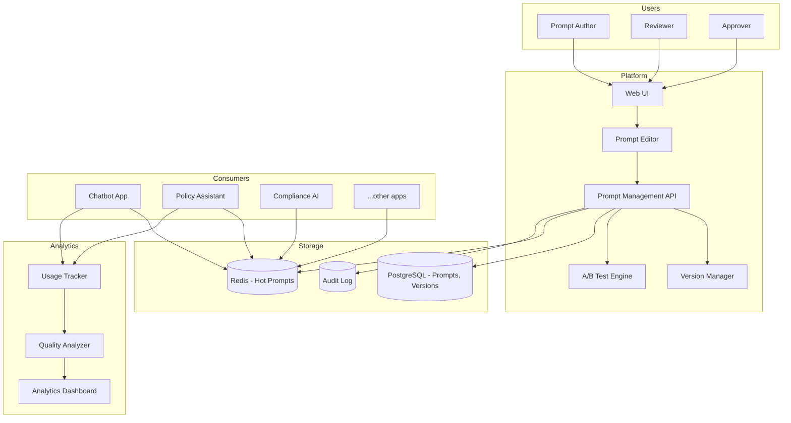

# System Design: Prompt Management Platform

## Problem Statement

Design a centralized platform for managing prompts used across all GenAI applications in the bank. The platform should enable prompt creation, versioning, A/B testing, performance tracking, and collaboration -- replacing the current state where prompts are hardcoded in application source code with no visibility into what prompts are in use or how they perform.

## Requirements

### Functional Requirements
1. Create, edit, and version prompts through a web interface
2. Organize prompts by application, category, and environment (dev/staging/prod)
3. A/B test prompt variants with automatic performance comparison
4. Track prompt performance: usage, cost, quality metrics
5. Prompt template variables and dynamic content injection
6. Approval workflow for production prompt changes
7. Prompt analytics: which prompts are used most, which perform best
8. Export/import prompts for backup and migration
9. Role-based access: prompt authors, reviewers, approvers
10. Integration with CI/CD: prompts can be deployed via pipeline

### Non-Functional Requirements
1. Prompt retrieval latency: < 10ms (must not add to generation latency)
2. Support 500+ prompts across 20+ applications
3. 99.99% availability (prompts are critical path)
4. Prompt change audit trail
5. Rollback to any previous prompt version
6. Local caching of prompts in applications for resilience

## Architecture



## Detailed Design

### 1. Prompt Data Model

```python
class Prompt:
    """A prompt with versioning and metadata."""
    
    def __init__(self, id: str, name: str, app_id: str, category: str,
                 description: str, template: str, variables: list[str],
                 metadata: dict = None):
        self.id = id
        self.name = name
        self.app_id = app_id
        self.category = category
        self.description = description
        self.template = template  # Jinja2 template
        self.variables = variables  # Required template variables
        self.metadata = metadata or {}
        self.versions: list[PromptVersion] = []
        self.current_version: str = None
    
    def render(self, version: str = None, **kwargs) -> str:
        """Render the prompt template with variables."""
        ver = self.get_version(version or self.current_version)
        template = jinja2.Template(ver.template)
        return template.render(**kwargs)

class PromptVersion:
    """A specific version of a prompt."""
    
    def __init__(self, version: str, template: str, created_by: str,
                 created_at: datetime, change_description: str,
                 status: str = "draft",  # draft, review, approved, deprecated
                 ab_test_id: str = None,
                 performance_metrics: dict = None):
        self.version = version
        self.template = template
        self.created_by = created_by
        self.created_at = created_at
        self.change_description = change_description
        self.status = status
        self.ab_test_id = ab_test_id
        self.performance_metrics = performance_metrics or {}
```

### 2. Prompt Management API

```python
class PromptManagementAPI:
    """CRUD API for prompts."""
    
    def __init__(self, db, cache, audit_logger):
        self.db = db
        self.cache = cache
        self.audit = audit_logger
    
    def create_prompt(self, prompt: Prompt, user: User) -> str:
        """Create a new prompt."""
        
        prompt_id = str(uuid.uuid4())
        prompt.id = prompt_id
        
        self.db.execute("""
            INSERT INTO prompts 
            (id, name, app_id, category, description, variables, metadata, created_by, created_at)
            VALUES (%s, %s, %s, %s, %s, %s, %s, %s, %s)
        """, (
            prompt_id, prompt.name, prompt.app_id, prompt.category,
            prompt.description, json.dumps(prompt.variables),
            json.dumps(prompt.metadata), user.id, datetime.utcnow()
        ))
        
        # Create initial version
        self.create_version(prompt_id, "v1", prompt.template, user, 
                           "Initial version")
        
        self.audit.log("prompt_created", user, {"prompt_id": prompt_id})
        
        return prompt_id
    
    def create_version(self, prompt_id: str, version: str, 
                       template: str, user: User, 
                       change_description: str) -> str:
        """Create a new version of an existing prompt."""
        
        version_id = str(uuid.uuid4())
        
        self.db.execute("""
            INSERT INTO prompt_versions
            (id, prompt_id, version, template, created_by, created_at,
             change_description, status)
            VALUES (%s, %s, %s, %s, %s, %s, %s, 'draft')
        """, (
            version_id, prompt_id, version, template,
            user.id, datetime.utcnow(), change_description
        ))
        
        # Update prompt's current version
        self.db.execute("""
            UPDATE prompts SET current_version = %s WHERE id = %s
        """, (version, prompt_id))
        
        # Invalidate cache
        self.cache.delete(f"prompt:{prompt_id}")
        
        self.audit.log("prompt_version_created", user, {
            "prompt_id": prompt_id,
            "version": version,
            "change_description": change_description,
        })
        
        return version_id
    
    def get_prompt(self, prompt_id: str, version: str = None) -> Prompt:
        """Get a prompt, optionally specific version."""
        
        # Check cache first
        cache_key = f"prompt:{prompt_id}:{version or 'current'}"
        cached = self.cache.get(cache_key)
        if cached:
            return Prompt.from_dict(json.loads(cached))
        
        # Load from DB
        prompt = self._load_prompt_from_db(prompt_id)
        if version:
            prompt.current_version = version
        
        # Cache for 5 minutes
        self.cache.setex(cache_key, 300, json.dumps(prompt.to_dict()))
        
        return prompt
    
    def promote_version(self, prompt_id: str, version: str, 
                        user: User) -> bool:
        """Promote a prompt version from draft -> review -> approved."""
        
        current_status = self.db.query("""
            SELECT status FROM prompt_versions
            WHERE prompt_id = %s AND version = %s
        """, (prompt_id, version))
        
        if not current_status:
            return False
        
        new_status = self._next_status(current_status[0]["status"])
        
        self.db.execute("""
            UPDATE prompt_versions SET status = %s WHERE prompt_id = %s AND version = %s
        """, (new_status, prompt_id, version))
        
        self.audit.log("prompt_version_promoted", user, {
            "prompt_id": prompt_id,
            "version": version,
            "from_status": current_status[0]["status"],
            "to_status": new_status,
        })
        
        return True
```

### 3. A/B Testing Engine

```python
class ABTestEngine:
    """A/B test prompt variants."""
    
    def __init__(self, db, traffic_split_service):
        self.db = db
        self.traffic = traffic_split_service
    
    def create_test(self, prompt_id: str, variant_a: str, variant_b: str,
                    traffic_split: float = 0.5, duration_days: int = 7,
                    success_metric: str = "groundedness") -> str:
        """Create an A/B test between two prompt variants."""
        
        test_id = str(uuid.uuid4())
        
        self.db.execute("""
            INSERT INTO ab_tests
            (id, prompt_id, variant_a, variant_b, traffic_split,
             success_metric, status, created_at, end_at)
            VALUES (%s, %s, %s, %s, %s, %s, 'running', %s, %s)
        """, (
            test_id, prompt_id, variant_a, variant_b, traffic_split,
            success_metric, datetime.utcnow(),
            datetime.utcnow() + timedelta(days=duration_days)
        ))
        
        # Configure traffic split
        self.traffic.configure_test(
            prompt_id=prompt_id,
            test_id=test_id,
            variant_a_weight=traffic_split,
            variant_b_weight=1 - traffic_split,
        )
        
        return test_id
    
    def get_results(self, test_id: str) -> dict:
        """Get A/B test results."""
        
        test = self.db.query("""
            SELECT * FROM ab_tests WHERE id = %s
        """, (test_id,))
        
        if not test:
            return None
        
        # Collect metrics for each variant
        variant_a_metrics = self._collect_metrics(test["prompt_id"], test["variant_a"])
        variant_b_metrics = self._collect_metrics(test["prompt_id"], test["variant_b"])
        
        # Statistical significance
        significance = self._calculate_significance(
            variant_a_metrics, variant_b_metrics, test["success_metric"]
        )
        
        return {
            "test_id": test_id,
            "prompt_id": test["prompt_id"],
            "variant_a": {
                "version": test["variant_a"],
                "metrics": variant_a_metrics,
                "sample_size": variant_a_metrics["count"],
            },
            "variant_b": {
                "version": test["variant_b"],
                "metrics": variant_b_metrics,
                "sample_size": variant_b_metrics["count"],
            },
            "success_metric": test["success_metric"],
            "winner": "a" if significance["a_better"] else "b" if not significance["b_better"] else None,
            "statistically_significant": significance["significant"],
            "confidence": significance["confidence"],
        }
    
    def conclude_test(self, test_id: str, winner: str) -> bool:
        """Conclude test and promote winning variant."""
        
        test = self.db.query("SELECT * FROM ab_tests WHERE id = %s", (test_id,))
        
        self.db.execute("""
            UPDATE ab_tests SET status = 'concluded', winner = %s, concluded_at = %s
            WHERE id = %s
        """, (winner, datetime.utcnow(), test_id))
        
        # Promote winning version
        winning_version = test[f"variant_{winner}"]
        self.db.execute("""
            UPDATE prompts SET current_version = %s WHERE id = %s
        """, (winning_version, test["prompt_id"]))
        
        # Stop traffic split
        self.traffic.stop_test(test_id)
        
        return True
```

### 4. Application Integration

```python
class PromptClient:
    """Client library used by GenAI applications to fetch prompts."""
    
    def __init__(self, api_url: str, api_key: str):
        self.api_url = api_url
        self.api_key = api_key
        self.local_cache = {}  # In-memory prompt cache
        self.cache_ttl = 300  # 5 minutes
        self.last_fetch = {}
    
    def get_prompt(self, prompt_id: str, version: str = None, 
                   **variables) -> str:
        """Get and render a prompt."""
        
        cache_key = f"{prompt_id}:{version or 'current'}"
        
        # Check local cache
        if cache_key in self.local_cache:
            if time.time() - self.last_fetch[cache_key] < self.cache_ttl:
                prompt = self.local_cache[cache_key]
                return prompt.render(**variables)
        
        # Fetch from API
        prompt = self._fetch_from_api(prompt_id, version)
        
        # Cache locally
        self.local_cache[cache_key] = prompt
        self.last_fetch[cache_key] = time.time()
        
        return prompt.render(**variables)
    
    def _fetch_from_api(self, prompt_id: str, version: str = None) -> Prompt:
        """Fetch prompt from management API."""
        
        url = f"{self.api_url}/prompts/{prompt_id}"
        if version:
            url += f"/versions/{version}"
        
        response = requests.get(url, headers={"Authorization": f"Bearer {self.api_key}"})
        response.raise_for_status()
        
        return Prompt.from_dict(response.json())
```

## Tradeoffs

### Prompt Storage: Database vs. Git

| Criteria | Database | Git |
|---|---|---|
| **Versioning** | Manual | Native |
| **Web UI editing** | Easy | Requires Git integration |
| **API access** | Direct | Via Git API |
| **CI/CD integration** | Webhook-based | Native |
| **Approval workflow** | Built-in | PR-based |
| **Decision** | **SELECTED** (with Git export) | Rejected as primary |

**Rationale**: Database provides better real-time collaboration, web editing, and API performance. However, we also export prompts to Git for backup and CI/CD integration.

### Caching: Local vs. Centralized

- **Local (in-app)**: Fastest, but stale data possible
- **Centralized (Redis)**: Fresher data, adds network latency
- **Decision**: Both -- Redis as source of truth, local cache with short TTL (5 min) for resilience

## Interview Questions

### Q: How do you handle a situation where a prompt change causes production issues?

**Strong Answer**: "Immediate rollback: (1) The previous version is always preserved and can be restored with a single API call. (2) Applications cache prompts locally, so even if the management API is down, they continue with the last known good version. (3) The approval workflow ensures that production prompt changes are reviewed before deployment. (4) A/B testing catches quality regressions before full rollout. For the rollback itself, I implement an automated rollback trigger -- if a newly promoted prompt version shows quality metrics below threshold within the first hour, automatically revert to the previous version and alert the prompt author."

### Q: How do you ensure prompt consistency across different applications?

**Strong Answer**: "I implement shared prompt components and style guidelines: (1) Common system prompts (tone, style, safety instructions) are defined as reusable prompt templates that applications can include via template inheritance (Jinja2 extends/includes). (2) A 'prompt style guide' defines the bank's preferred tone, formatting, and citation standards. (3) The prompt review process includes a consistency check -- reviewers verify that new prompts follow style guidelines. (4) Cross-application prompt audits periodically compare system prompts across apps to identify inconsistencies. (5) Shared prompts are versioned independently, so when a common system prompt is updated, all dependent applications get the update on their next cache refresh."
