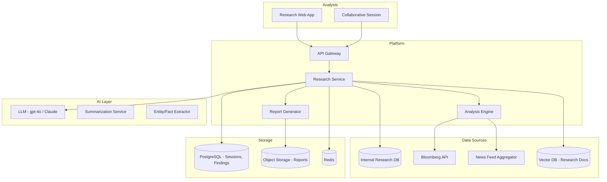

# System Design: Research Assistant

## Problem Statement

Design an AI research assistant that helps bank analysts and strategists gather, analyze, and synthesize information from internal reports, market data, news feeds, and research papers. The assistant should support deep research workflows including multi-document analysis, comparative analysis, trend identification, and report generation.

## Requirements

### Functional Requirements
1. Natural language Q&A across research document corpus
2. Multi-document comparative analysis ("Compare Q3 reports for our top 5 competitors")
3. Trend detection and summarization over time
4. Automatic research report generation from gathered data
5. Citation management with source verification
6. Integration with Bloomberg, Reuters, internal research databases
7. Collaborative research sessions (multiple analysts)
8. Export research findings to PowerPoint/Word

### Non-Functional Requirements
1. Support 500 research analysts
2. Handle large context windows (100K+ tokens for multi-document analysis)
3. Response latency: P95 < 10 seconds for complex research queries
4. All sources must be citable and verifiable
5. 99.9% availability
6. Data from licensed sources must respect licensing terms

## Architecture



## Detailed Design

### 1. Research Service

```python
class ResearchService:
    """Main research assistant service."""
    
    def __init__(self, retriever, llm, extractor, summarizer):
        self.retriever = retriever
        self.llm = llm
        self.extractor = extractor
        self.summarizer = summarizer
    
    async def research_query(self, query: str, scope: dict = None,
                              depth: str = "standard") -> ResearchResult:
        """Execute a research query."""
        
        # Phase 1: Gather relevant documents
        docs = self.retriever.retrieve(query, scope=scope, k=30)
        
        # Phase 2: Extract key facts and entities
        facts = []
        for doc in docs:
            extracted = await self.extractor.extract_facts(doc.content)
            facts.extend([Fact(text=f, source=doc.metadata) for f in extracted])
        
        # Phase 3: Synthesize answer
        if depth == "deep":
            # Multi-pass analysis for complex queries
            analysis = await self._deep_analysis(query, facts, docs)
        else:
            analysis = await self._standard_analysis(query, facts, docs)
        
        # Phase 4: Generate response with citations
        response = await self.llm.generate(
            system=self._research_assistant_prompt(),
            context=self._format_context(facts, docs),
            question=query,
            analysis=analysis
        )
        
        return ResearchResult(
            answer=response.text,
            facts=facts,
            sources=[doc.metadata for doc in docs[:10]],
            confidence=self._assess_confidence(facts, docs),
            follow_up_questions=self._suggest_followups(query, facts)
        )
    
    async def comparative_analysis(self, topics: list[str], 
                                     dimensions: list[str]) -> ComparisonReport:
        """Compare multiple topics across dimensions."""
        
        # Gather data for each topic
        topic_data = {}
        for topic in topics:
            docs = self.retriever.retrieve(topic, k=20)
            facts = []
            for doc in docs:
                extracted = await self.extractor.extract_facts(doc.content)
                facts.extend(extracted)
            topic_data[topic] = {"docs": docs, "facts": facts}
        
        # Compare across dimensions
        comparison = {}
        for dimension in dimensions:
            comparison[dimension] = {}
            for topic, data in topic_data.items():
                relevant_facts = [f for f in data["facts"] 
                                  if dimension.lower() in f.lower()]
                comparison[dimension][topic] = self.summarizer.summarize(
                    relevant_facts, max_length=200
                )
        
        # Generate comparison narrative
        narrative = await self.llm.generate(
            system="You are a research analyst. Write a comparative analysis.",
            data=json.dumps(comparison, indent=2),
            dimensions=dimensions
        )
        
        return ComparisonReport(
            topics=topics,
            dimensions=dimensions,
            comparison=comparison,
            narrative=narrative.text,
            sources=list(set(d["docs"] for d in topic_data.values()))
        )
```

### 2. Report Generator

```python
class ReportGenerator:
    """Generate structured research reports."""
    
    def generate_report(self, topic: str, findings: list[Fact],
                        outline: dict = None) -> ResearchReport:
        """Generate a formatted research report."""
        
        if not outline:
            outline = self._generate_outline(topic, findings)
        
        # Fill in each section
        sections = []
        for section in outline["sections"]:
            relevant_findings = [f for f in findings 
                                 if self._is_relevant(f, section["topic"])]
            
            section_content = self.llm.generate(
                system=f"Write the '{section['title']}' section of a research report.",
                findings=relevant_findings,
                max_tokens=section.get("max_tokens", 1000)
            )
            
            sections.append(Section(
                title=section["title"],
                content=section_content.text,
                citations=[f.source for f in relevant_findings]
            ))
        
        # Executive summary (generated last, based on full report)
        full_text = "\n\n".join(s.content for s in sections)
        executive_summary = self.summarizer.summarize(full_text, max_length=500)
        
        return ResearchReport(
            title=topic,
            executive_summary=executive_summary,
            sections=sections,
            generated_at=datetime.utcnow(),
            source_count=len(set(f.source for f in findings))
        )
    
    def export_to_powerpoint(self, report: ResearchReport) -> bytes:
        """Export report as PowerPoint presentation."""
        
        from pptx import Presentation
        from pptx.util import Inches
        
        prs = Presentation()
        
        # Title slide
        title_slide = prs.slides.add_slide(prs.slide_layouts[0])
        title_slide.shapes.title.text = report.title
        title_slide.placeholders[1].text = report.executive_summary[:200]
        
        # Section slides
        for section in report.sections:
            slide = prs.slides.add_slide(prs.slide_layouts[1])
            slide.shapes.title.text = section.title
            
            # Add content as bullet points
            body = slide.placeholders[1]
            tf = body.text_frame
            for paragraph in section.content.split("\n\n")[:5]:
                p = tf.add_paragraph()
                p.text = paragraph[:200]
        
        # Save
        output = io.BytesIO()
        prs.save(output)
        return output.getvalue()
```

## Interview Questions

### Q: How do you handle conflicting information from different research sources?

**Strong Answer**: "I implement a conflict detection and resolution system: (1) During fact extraction, the system identifies conflicting claims (e.g., Company A's revenue reported as $5B in source X but $5.3B in source Y). (2) Conflicts are surfaced to the analyst with both claims and their sources clearly labeled. (3) The system applies source credibility scoring -- Bloomberg data ranks higher than a blog post. (4) For financial data, the system can query authoritative APIs (SEC filings, Bloomberg terminal) to resolve the conflict. (5) The final report includes a 'Data Quality Notes' section that flags any unresolved conflicts. The key principle is: never silently choose -- always surface conflicts and let the analyst decide."
