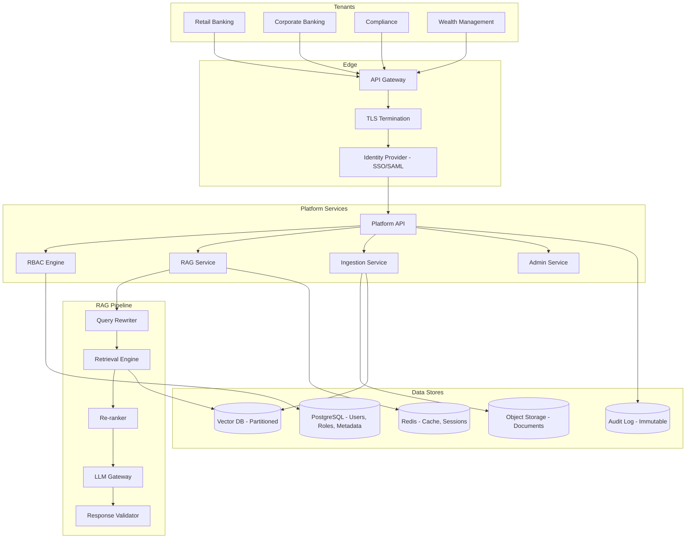

# System Design: Secure RAG Platform with Access Controls

## Problem Statement

Design a secure, multi-tenant RAG platform that serves multiple departments within a bank, each with strict access controls. The platform must ensure that users can only retrieve and receive information from documents they are authorized to access, while maintaining high performance and a unified experience across the organization.

## Requirements

### Functional Requirements
1. Multi-tenant: serve 10+ departments with isolated data
2. Role-based access control (RBAC) with department, clearance level, and document-level permissions
3. RAG-based Q&A over department-specific and shared knowledge bases
4. Document search with access-aware results
5. Audit logging of all queries, retrievals, and responses
6. Admin console for managing users, roles, and document access
7. Document ingestion pipeline with metadata extraction
8. Support for text, PDF, and structured data sources

### Non-Functional Requirements
1. Retrieval latency: P95 < 200ms
2. End-to-end latency: P95 < 3 seconds
3. Availability: 99.95%
4. Support 50,000 users, 500,000 queries/day
5. Zero cross-tenant data leakage
6. SOC 2 Type II, GDPR compliance
7. All data encrypted at rest and in transit
8. Row-level security in the database

## Architecture



## Detailed Design

### 1. Multi-Tenant Data Isolation

```python
class TenantIsolation:
    """Ensure strict data isolation between tenants."""
    
    def __init__(self, db_connection):
        self.db = db_connection
    
    def get_tenant_filter(self, user: User) -> dict:
        """Build database filter that enforces tenant isolation."""
        
        return {
            "$and": [
                {"tenant_id": user.tenant_id},  # Must belong to user's tenant
                {"department": {"$in": user.allowed_departments}},
                {"min_clearance": {"$lte": user.clearance_level}},
                {"status": "active"},
                {"effective_from": {"$lte": datetime.now().isoformat()}},
                {"$or": [
                    {"effective_until": None},
                    {"effective_until": {"$gte": datetime.now().isoformat()}}
                ]}
            ]
        }
    
    def build_vector_query(self, query_embedding: list, user: User, k: int = 20) -> str:
        """Build SQL query with tenant isolation."""
        
        return """
            SELECT id, content, metadata,
                   embedding <=> $1::vector as distance
            FROM document_chunks
            WHERE tenant_id = $2
              AND department = ANY($3)
              AND (metadata->>'min_clearance')::int <= $4
              AND metadata->>'status' = 'active'
              AND (metadata->>'effective_from')::timestamptz <= NOW()
              AND (metadata->>'effective_until')::timestamptz >= NOW()
              OR metadata->>'effective_until' IS NULL
            ORDER BY distance
            LIMIT $5
        """
    
    def verify_no_cross_tenant_leak(self, response: str, user: User) -> bool:
        """Verify response doesn't contain data from other tenants."""
        
        # Check that all cited sources belong to user's tenant
        cited_sources = extract_citations(response)
        for citation in cited_sources:
            doc = self.db.get_document(citation.doc_id)
            if doc and doc.tenant_id != user.tenant_id:
                return False
        
        return True
```

### 2. RBAC Engine

```python
class RBACEngine:
    """Role-based access control for the RAG platform."""
    
    def __init__(self, db):
        self.db = db
    
    def check_permission(self, user: User, resource: str, action: str) -> bool:
        """Check if user has permission for an action on a resource."""
        
        # Get user's roles
        roles = self.db.query("""
            SELECT role_name FROM user_roles WHERE user_id = %s
        """, (user.id,))
        
        # Get permissions for those roles
        permissions = self.db.query("""
            SELECT DISTINCT permission
            FROM role_permissions
            WHERE role_name = ANY(%s)
            AND resource = %s
        """, ([r["role_name"] for r in roles], resource))
        
        permitted_actions = {p["permission"] for p in permissions}
        return action in permitted_actions
    
    def get_accessible_documents(self, user: User) -> dict:
        """Build the filter for documents accessible by this user."""
        
        roles = self.db.query("""
            SELECT role_name FROM user_roles WHERE user_id = %s
        """, (user.id,))
        
        # Get document access rules for user's roles
        rules = self.db.query("""
            SELECT department, min_clearance, document_types
            FROM role_document_access
            WHERE role_name = ANY(%s)
        """, ([r["role_name"] for r in roles],))
        
        departments = set()
        min_clearance = 999
        for rule in rules:
            departments.add(rule["department"])
            min_clearance = min(min_clearance, rule["min_clearance"])
        
        return {
            "departments": list(departments),
            "max_clearance": min_clearance
        }
```

### 3. Row-Level Security in PostgreSQL

```sql
-- Enable row-level security on document_chunks table
ALTER TABLE document_chunks ENABLE ROW LEVEL SECURITY;

-- Policy: Users can only see documents from their tenant
CREATE POLICY tenant_isolation_policy ON document_chunks
    USING (tenant_id = current_setting('app.current_tenant_id')::uuid);

-- Policy: Department-level access
CREATE POLICY department_access_policy ON document_chunks
    USING (
        department = ANY(
            string_to_array(current_setting('app.user_departments'), ',')
        )
    );

-- Policy: Clearance level check
CREATE POLICY clearance_policy ON document_chunks
    USING (
        (metadata->>'min_clearance')::int <= 
        current_setting('app.user_clearance')::int
    );

-- Set session variables on each request
-- In application code:
SET app.current_tenant_id = 'user-tenant-uuid';
SET app.user_departments = 'retail_banking,wealth';
SET app.user_clearance = '3';
```

### 4. Response Validator

```python
class ResponseValidator:
    """Validate responses before returning to users."""
    
    def __init__(self, tenant_checker, pii_redactor, groundedness_checker):
        self.tenant_checker = tenant_checker
        self.pii_redactor = pii_redactor
        self.groundedness = groundedness_checker
    
    def validate(self, response: str, user: User, context: str) -> ValidationResult:
        """Comprehensive response validation."""
        
        issues = []
        
        # Check 1: No cross-tenant data leakage
        if not self.tenant_checker.verify_no_cross_tenant_leak(response, user):
            issues.append("Potential cross-tenant data leakage detected")
            return ValidationResult(valid=False, issues=issues, block=True)
        
        # Check 2: PII redaction
        redacted, redactions = self.pii_redactor.redact(response)
        if redactions:
            response = redacted
            issues.append(f"PII redacted: {len(redactions)} items")
        
        # Check 3: Groundedness
        groundedness = self.groundedness.check(response, context)
        if groundedness.score < 0.7:
            issues.append(f"Low groundedness score: {groundedness.score:.2f}")
            return ValidationResult(
                valid=False, issues=issues, 
                block=True, reason="Response not sufficiently grounded"
            )
        
        # Check 4: Citation validity
        citations = extract_citations(response)
        for citation in citations:
            doc = self.get_document(citation.doc_id)
            if not doc or not self._user_can_access(user, doc):
                issues.append(f"Invalid citation: user cannot access {citation.doc_id}")
                return ValidationResult(valid=False, issues=issues, block=True)
        
        return ValidationResult(
            valid=True, 
            issues=issues,
            response=response,
            groundedness=groundedness.score
        )
    
    def _user_can_access(self, user: User, doc: Document) -> bool:
        """Verify user can access a specific document."""
        return (
            doc.tenant_id == user.tenant_id and
            doc.department in user.allowed_departments and
            doc.min_clearance <= user.clearance_level
        )
```

### 5. Audit Logging

```python
class AuditLogger:
    """Immutable audit logging for compliance."""
    
    def __init__(self, db, log_service):
        self.db = db
        self.log_service = log_service  # External log aggregation (e.g., Splunk)
    
    def log_query(self, user: User, query: str, response: str, 
                  sources: list, metadata: dict):
        """Log a complete query-response interaction."""
        
        audit_entry = {
            "entry_id": str(uuid.uuid4()),
            "timestamp": datetime.utcnow().isoformat(),
            "user_id": user.id,
            "user_name": user.name,
            "user_tenant": user.tenant_id,
            "user_roles": user.roles,
            "query": query,
            "query_hash": hashlib.sha256(query.encode()).hexdigest(),
            "response_length": len(response),
            "source_count": len(sources),
            "source_ids": [s.metadata.get("doc_id") for s in sources],
            "response_hash": hashlib.sha256(response.encode()).hexdigest(),
            "metadata": metadata,  # latency, confidence, etc.
        }
        
        # Write to append-only audit table
        self.db.execute("""
            INSERT INTO audit_log 
            (entry_id, timestamp, user_id, user_name, user_tenant, user_roles,
             query, query_hash, response_length, source_count, source_ids,
             response_hash, metadata)
            VALUES (%s, %s, %s, %s, %s, %s, %s, %s, %s, %s, %s, %s, %s)
        """, (
            audit_entry["entry_id"], audit_entry["timestamp"],
            audit_entry["user_id"], audit_entry["user_name"],
            audit_entry["user_tenant"], json.dumps(audit_entry["user_roles"]),
            audit_entry["query"], audit_entry["query_hash"],
            audit_entry["response_length"], audit_entry["source_count"],
            json.dumps(audit_entry["source_ids"]),
            audit_entry["response_hash"], json.dumps(audit_entry["metadata"])
        ))
        
        # Also send to external log service
        self.log_service.send(audit_entry)
    
    def get_audit_trail(self, user_id: str = None, 
                        tenant_id: str = None,
                        since: datetime = None) -> list[dict]:
        """Retrieve audit trail for compliance review."""
        
        query = "SELECT * FROM audit_log WHERE 1=1"
        params = []
        
        if user_id:
            query += " AND user_id = %s"
            params.append(user_id)
        if tenant_id:
            query += " AND user_tenant = %s"
            params.append(tenant_id)
        if since:
            query += " AND timestamp >= %s"
            params.append(since.isoformat())
        
        query += " ORDER BY timestamp DESC"
        
        return self.db.query(query, params)
```

## Tradeoffs

### Vector DB: Shared vs. Per-Tenant

| Criteria | Shared (filtered) | Per-Tenant |
|---|---|---|
| **Cost** | Lower (one instance) | Higher (N instances) |
| **Isolation** | Application-level | Infrastructure-level |
| **Leakage risk** | Medium (bug could leak) | Very low |
| **Operational complexity** | Low | High |
| **Decision** | **SELECTED** (with RLS) | For highest-security tenants |

**Rationale**: For most departments, shared vector DB with row-level security provides sufficient isolation at lower cost. For the most sensitive departments (e.g., Internal Audit, M&A), consider dedicated vector DB instances.

### Cache: Shared vs. Per-Tenant

- **Shared cache**: Risk of serving cached response from different tenant's data
- **Per-tenant cache**: Includes tenant_id in cache key
- **Decision**: Per-tenant cache keys: `cache:{tenant_id}:{query_hash}`

## Security Checklist

- [ ] Tenant isolation at database level (RLS)
- [ ] Tenant isolation at application level (filter on every query)
- [ ] Tenant isolation at cache level (tenant_id in cache key)
- [ ] Response validation (no cross-tenant citations)
- [ ] PII redaction before external API calls
- [ ] Audit logging (append-only, immutable)
- [ ] Encryption at rest (AES-256)
- [ ] Encryption in transit (TLS 1.3)
- [ ] API key scoped to tenant
- [ ] Session timeout (15 min idle)
- [ ] Rate limiting per tenant
- [ ] Admin actions require dual approval

## Interview Questions

### Q: How would you prove to an auditor that cross-tenant data leakage is impossible?

**Strong Answer**: "I would demonstrate defense in depth at every layer: (1) Database level: Row-level security policies enforced by PostgreSQL -- even if the application layer has a bug, the database prevents cross-tenant access. (2) Application level: Every retrieval query includes tenant_id filter. (3) Cache level: Cache keys include tenant_id. (4) Response level: Post-generation validation checks that all cited sources belong to the user's tenant. (5) Audit level: Every interaction is logged with tenant_id, so any leakage would be detectable. I would show the auditor the RLS policies, the application filter code, the cache key generation logic, the response validator, and the audit log schema. Together, these form a provable chain of isolation."

### Q: A department head wants to share some documents with another department. How do you handle this?

**Strong Answer**: "I implement a document sharing workflow: (1) The document owner explicitly marks the document as 'shared with' specific departments. (2) This creates an explicit access grant in the RBAC system. (3) The shared document gets additional department entries in its access control metadata. (4) The sharing action is logged in the audit trail with who shared what with whom and when. (5) The document owner can revoke sharing at any time. Importantly, sharing is opt-in and explicit -- there is no implicit sharing or default-open behavior. This satisfies both the need for collaboration and the requirement for strict access control."
