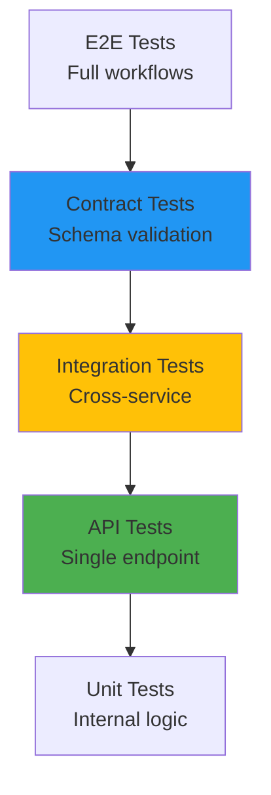
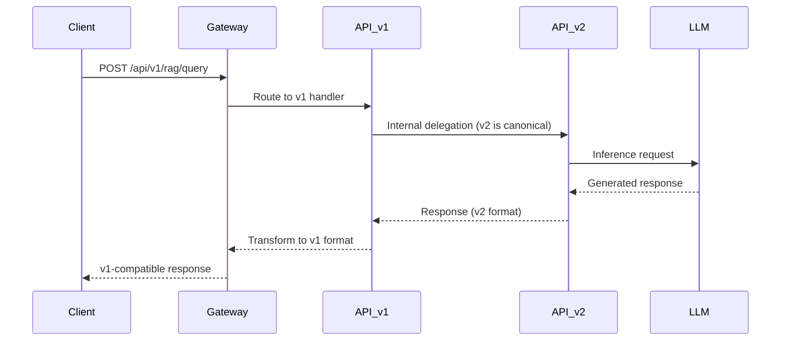

# API Testing in Banking GenAI Systems

## Overview

API testing is the backbone of quality assurance in banking GenAI systems, where multiple services communicate over well-defined contracts. Unlike unit tests that validate isolated logic, API tests verify that service boundaries behave correctly under real-world conditions -- including malformed inputs, network failures, and unexpected payload sizes.

In a regulated banking environment, API tests must also validate:
- **Authorization enforcement** on every endpoint
- **Data masking** for PII fields in responses
- **Rate limiting** to prevent abuse of expensive GenAI inference endpoints
- **Audit logging** for every API call involving customer data
- **Contract compliance** with external payment networks and regulatory APIs

---

## API Testing Pyramid



API tests sit above unit tests but below full integration tests, offering the best balance of coverage and speed for microservice architectures.

---

## Testing Categories

### 1. Functional API Testing

Verifies that each endpoint returns the correct response for valid inputs.

```python
# tests/api/test_rag_query.py
import pytest
from httpx import AsyncClient, ASGITransport

@pytest.mark.asyncio
async def test_rag_query_returns_answer(app, auth_token):
    transport = ASGITransport(app=app)
    async with AsyncClient(transport=transport, base_url="http://test") as client:
        response = await client.post(
            "/api/v1/rag/query",
            json={
                "query": "What is the interest rate on savings accounts?",
                "customer_id": "CUST-001",
                "tenant": "retail-banking"
            },
            headers={"Authorization": f"Bearer {auth_token}"}
        )
        assert response.status_code == 200
        data = response.json()
        assert "answer" in data
        assert "sources" in data
        assert len(data["sources"]) > 0
        # Verify PII is masked
        assert "ssn" not in data["answer"].lower()
        assert "account_number" not in str(data["sources"])
```

### 2. Contract Testing with OpenAPI Schema

Validate that APIs conform to their published OpenAPI specifications.

```yaml
# openapi/banking-rag-api.yaml
openapi: "3.0.3"
info:
  title: Banking RAG Query API
  version: "2.1.0"
  x-audience: external
  x-regulatory-classification: pii-handling

paths:
  /api/v1/rag/query:
    post:
      summary: Query the RAG system
      requestBody:
        required: true
        content:
          application/json:
            schema:
              type: object
              required:
                - query
                - customer_id
              properties:
                query:
                  type: string
                  minLength: 1
                  maxLength: 2000
                customer_id:
                  type: string
                  pattern: "^CUST-[0-9]{3,}$"
                tenant:
                  type: string
                  enum: [retail-banking, wealth-management, corporate]
      responses:
        "200":
          description: Successful response
          headers:
            X-RateLimit-Remaining:
              schema:
                type: integer
            X-Audit-Id:
              schema:
                type: string
                format: uuid
          content:
            application/json:
              schema:
                $ref: "#/components/schemas/RagResponse"
        "429":
          description: Rate limit exceeded
        "503":
          description: GenAI model unavailable

components:
  schemas:
    RagResponse:
      type: object
      required:
        - answer
        - confidence
      properties:
        answer:
          type: string
        confidence:
          type: number
          minimum: 0.0
          maximum: 1.0
        sources:
          type: array
          items:
            type: object
            properties:
              document_id:
                type: string
              relevance_score:
                type: number
              content_snippet:
                type: string
```

```python
# tests/api/test_contract.py
import json
import jsonschema
from pathlib import Path

def test_rag_response_conforms_to_contract(rag_response):
    """Validate every API response against the OpenAPI-derived JSON Schema."""
    schema_path = Path("openapi/banking-rag-api.yaml")
    # In practice, generate JSON Schema from OpenAPI spec during CI
    schema = load_generated_schema("RagResponse")
    jsonschema.validate(instance=rag_response, schema=schema)
```

### 3. Negative Testing

Verify the API handles invalid inputs gracefully without leaking information.

```python
@pytest.mark.parametrize("bad_payload,expected_status", [
    ({"query": "", "customer_id": "CUST-001"}, 400),       # empty query
    ({"query": "x" * 5000, "customer_id": "CUST-001"}, 400),  # too long
    ({"query": "hello", "customer_id": "INVALID"}, 400),   # bad pattern
    ({"customer_id": "CUST-001"}, 400),                     # missing query
    ({}, 400),                                               # empty body
])
async def test_rag_query_rejects_invalid_input(client, auth_token, bad_payload, expected_status):
    response = await client.post(
        "/api/v1/rag/query",
        json=bad_payload,
        headers={"Authorization": f"Bearer {auth_token}"}
    )
    assert response.status_code == expected_status
    # Error messages must NOT reveal internal details
    body = response.json()
    assert "stack" not in body
    assert "traceback" not in body
    assert "internal" not in body.get("error", "").lower()
```

### 4. Authorization Testing

```python
class TestAuthorization:
    """Every endpoint must enforce access control."""

    async def test_unauthenticated_request_denied(self, client):
        response = await client.post("/api/v1/rag/query", json={"query": "test"})
        assert response.status_code == 401

    async def test_expired_token_denied(self, client, expired_token):
        response = await client.post(
            "/api/v1/rag/query",
            json={"query": "test", "customer_id": "CUST-001"},
            headers={"Authorization": f"Bearer {expired_token}"}
        )
        assert response.status_code == 401

    async def test_insufficient_scope_denied(self, client, token_readonly):
        """Write endpoints must reject read-only tokens."""
        response = await client.put(
            "/api/v1/rag/documents/CUST-001",
            json={"content": "Updated policy"},
            headers={"Authorization": f"Bearer {token_readonly}"}
        )
        assert response.status_code == 403

    async def test_cross_tenant_access_denied(self, client, tenant_a_token):
        """Tenant A must not access Tenant B's customer data."""
        response = await client.get(
            "/api/v1/customers/CUST-TENANT-B-001",
            headers={"Authorization": f"Bearer {tenant_a_token}"}
        )
        assert response.status_code == 403
```

---

## API Fuzzing

Fuzzing sends malformed, unexpected, or boundary-pushing inputs to find edge cases that standard tests miss.

### Protocol-Level Fuzzing with Boofuzz

```python
# fuzzing/api_fuzz.py
"""
Fuzz the RAG API with protocol-level mutations.
Catches: deserialization bugs, buffer overflows, injection vectors.
"""
from boofuzz import Session, Target, TCPSocketConnection, s_get, s_send, s_static, s_string

def fuzz_api_endpoint():
    session = Session(
        target=Target(connection=TCPSocketConnection("api-gateway", 8443))
    )

    # Fuzz JSON body with oversized strings
    s_string("query", fuzzable=False)
    s_static(b': "')
    s_string("A" * 100, name="query_value", fuzzable=True)
    s_static(b'"')

    session.connect(session.root, s_get("rag_query"))
    session.fuzz()
```

### Semantic Fuzzing with Hypothesis

```python
from hypothesis import given, strategies as st
from hypothesis_jsonschema import from_schema

@given(from_schema(RAG_QUERY_SCHEMA))
def test_rag_query_handles_any_valid_input(client, auth_token, payload):
    """If Hypothesis generates it and the schema says it's valid, it must return 200."""
    response = client.post(
        "/api/v1/rag/query",
        json=payload,
        headers={"Authorization": f"Bearer {auth_token}"}
    )
    assert response.status_code == 200

@given(
    query=st.text(min_size=0, max_size=10000),
    customer_id=st.text(alphabet=st.characters(blacklist_categories=("Cs",)), min_size=0, max_size=100)
)
def test_rag_query_handles_boundary_strings(client, query, customer_id):
    """Unicode edge cases, null bytes, emoji, RTL overrides."""
    response = client.post(
        "/api/v1/rag/query",
        json={"query": query, "customer_id": customer_id},
        headers={"Authorization": "Bearer valid-token"}
    )
    # Must never return 500 -- always 200, 400, or 422
    assert response.status_code not in (500, 502, 503, 504)
```

---

## API Versioning and Backward Compatibility



**Key rules for banking APIs:**
- Never break backward compatibility without a deprecation period (minimum 90 days)
- Use `Accept` header versioning for content negotiation
- Maintain at most 3 active API versions simultaneously
- Log all calls to deprecated versions for migration tracking

```python
# api/versioning.py
from fastapi import APIRouter, Request, Header

router_v1 = APIRouter(prefix="/api/v1")
router_v2 = APIRouter(prefix="/api/v2")

@router_v1.post("/rag/query")
async def rag_query_v1(
    request: Request,
    accept: str = Header(default="application/json")
):
    """v1 endpoint that delegates to v2 internally and transforms the response."""
    body = await request.json()
    # Call v2 logic
    v2_response = await handle_rag_query_v2(body)
    # Transform: v1 clients expect "result" instead of "answer"
    return {
        "result": v2_response["answer"],
        "confidence": v2_response["confidence"],
        "citations": v2_response["sources"]  # renamed field
    }
```

---

## Performance Baselines in API Tests

```python
@pytest.mark.performance
async def test_rag_query_response_time_p95(client, auth_token):
    """P95 response time must be under 3 seconds for RAG queries."""
    latencies = []
    for i in range(100):
        start = time.perf_counter()
        response = await client.post(
            "/api/v1/rag/query",
            json={"query": f"Test query {i}", "customer_id": "CUST-001"},
            headers={"Authorization": f"Bearer {auth_token}"}
        )
        assert response.status_code == 200
        latencies.append(time.perf_counter() - start)

    p95 = sorted(latencies)[94]
    assert p95 < 3.0, f"P95 latency {p95:.2f}s exceeds 3.0s budget"
```

---

## Interview Questions

1. **How do you test an API that calls an LLM with non-deterministic outputs?**
   - Use deterministic seed prompts, mock the LLM in unit tests, and use semantic similarity (embedding cosine) for integration tests rather than string equality.

2. **What is the difference between contract testing and integration testing?**
   - Contract testing validates the schema and semantics of the interface itself (provider and consumer agree on shape). Integration testing validates that two or more services work together end-to-end.

3. **How would you design fuzzing for a banking payment initiation API?**
   - Combine protocol fuzzing (boofuzz for TCP/HTTP layer) with semantic fuzzing (Hypothesis for JSON schema mutations), and include business-logic fuzzing (negative amounts, overflow balances, invalid currency codes).

4. **Explain how you would test API version backward compatibility in CI.**
   - Run the consumer test suite against both the old and new API versions. Use Pact or a custom contract test suite. Block the merge if any consumer breaks.

---

## Cross-References

- See [contract-testing.md](./contract-testing.md) for provider/consumer contract validation
- See [quality-gates.md](./quality-gates.md) for API test coverage thresholds
- See [security-testing.md](./security-testing.md) for API security scanning
- See [architecture/api-gateway-design.md](../architecture/api-gateway-design.md) for gateway patterns
- See [testing-and-quality/release-readiness.md](./release-readiness.md) for API release checklist
