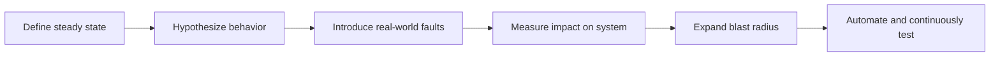
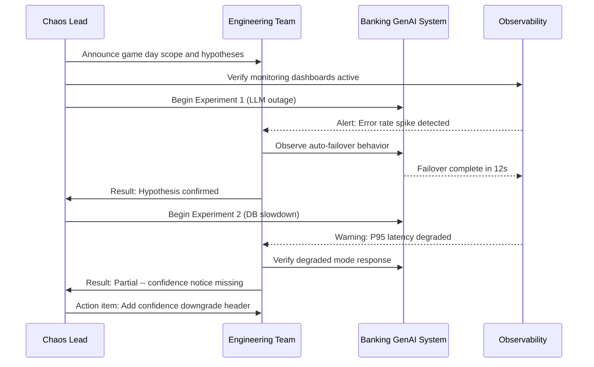

# Chaos Engineering in Banking GenAI Systems

## Overview

Chaos engineering is the discipline of experimenting on a distributed system to build confidence in its ability to withstand turbulent production conditions. For banking GenAI systems, chaos engineering is not optional -- it is a regulatory and business imperative.

A GenAI-powered banking assistant that fails silently during a fraud alert escalation has a very different risk profile than a recommendation engine returning stale suggestions.

### Why Chaos Engineering for GenAI?

- **LLM providers fail**: OpenAI, Anthropic, and other providers experience outages
- **Vector databases degrade**: Index corruption, memory pressure, network partitions
- **Embedding models drift**: Model updates can silently change retrieval quality
- **Prompt injection succeeds under edge conditions**: Adversarial inputs exploit fallback paths
- **Cascading failures**: A slow embedding service can backpressure the entire API layer

---

## Chaos Engineering Principles



1. **Define Steady State**: What does "normal" look like? (error rate < 0.1%, P95 < 2s)
2. **Hypothesize**: "If the LLM provider goes down, the system should return cached responses with a degradation notice"
3. **Minimize Blast Radius**: Start small -- kill one pod, not the entire cluster
4. **Run in Production**: Staging cannot replicate production complexity
5. **Automate Continuously**: Chaos is not a one-time exercise

---

## Steady State Definition

```python
# chaos/steady_state.py
"""
Define the steady state metrics for the banking RAG system.
All chaos experiments are measured against these thresholds.
"""
from dataclasses import dataclass

@dataclass
class SteadyState:
    """System must remain within these bounds during chaos experiments."""
    # Availability
    error_rate_max: float = 0.01          # 1% max error rate
    availability_min: float = 0.999       # 99.9% availability

    # Latency
    p50_latency_ms: float = 800
    p95_latency_ms: float = 2500
    p99_latency_ms: float = 5000

    # Quality
    answer_completeness_min: float = 0.8  # 80% of answers include sources
    hallucination_rate_max: float = 0.05  # 5% max hallucination rate

    # Business metrics
    successful_transactions_min: float = 0.95  # 95% of banking queries succeed
    customer_satisfaction_min: float = 3.5     # Min CSAT score (out of 5)

steady_state = SteadyState()
```

---

## Chaos Experiments

### Experiment 1: LLM Provider Outage

```yaml
# chaos/experiments/llm-provider-outage.yaml
name: "LLM Provider Outage"
description: >
  Simulate complete outage of primary LLM provider.
  Verify automatic failover to secondary provider.
hypothesis: >
  When the primary LLM provider is unavailable,
  the system should failover to the secondary provider
  within 30 seconds with no more than 5% error rate increase.

steady_state_hypothesis:
  - probe:
      type: http
      request:
        url: http://banking-rag-api/health
        method: GET
      expected:
        status: 200
        body:
          status: "healthy"

method:
  - type: action
    name: "block-llm-provider"
    provider:
      type: python
      module: chaos_llm.actions
      func: block_provider_endpoint
    arguments:
      provider: "openai"
      duration: 120
      iptables_rule: "-A OUTPUT -d api.openai.com -j DROP"

  - type: probe
    name: "verify-failover"
    provider:
      type: python
      module: chaos_llm.probes
      func: check_active_provider
    arguments:
      expected_provider: "anthropic"
    tolerance: 30  # seconds to failover

  - type: action
    name: "restore-llm-provider"
    provider:
      type: python
      module: chaos_llm.actions
      func: unblock_provider_endpoint
    arguments:
      provider: "openai"

rollout:
  initial_delay: 30
  timeout: 300
  steady_state_probe_interval: 10
```

```python
# chaos_llm/actions.py
"""
Chaos experiment actions for LLM provider manipulation.
"""
import subprocess
import time
import requests

def block_provider_endpoint(provider: str, duration: int, iptables_rule: str):
    """Block network access to a specific LLM provider."""
    if provider == "openai":
        target = "api.openai.com"
    elif provider == "anthropic":
        target = "api.anthropic.com"
    else:
        raise ValueError(f"Unknown provider: {provider}")

    print(f"Blocking access to {target} for {duration}s")
    subprocess.run(f"iptables {iptables_rule.replace('api.openai.com', target)}", shell=True)
    time.sleep(duration)

def unblock_provider_endpoint(provider: str, iptables_rule: str):
    """Remove the iptables rule to restore access."""
    if provider == "openai":
        target = "api.openai.com"
    elif provider == "anthropic":
        target = "api.anthropic.com"
    else:
        raise ValueError(f"Unknown provider: {provider}")

    print(f"Restoring access to {target}")
    subprocess.run(f"iptables -D OUTPUT -d {target} -j DROP", shell=True)
```

```python
# chaos_llm/probes.py
"""
Chaos experiment probes for verifying system behavior.
"""
import requests

def check_active_provider(expected_provider: str, api_url: str = "http://banking-rag-api") -> bool:
    """Check which LLM provider the system is currently using."""
    resp = requests.get(f"{api_url}/admin/active-provider")
    if resp.status_code != 200:
        return False
    active = resp.json()["provider"]
    print(f"Active provider: {active}")
    return expected_provider.lower() in active.lower()
```

### Experiment 2: Vector Database Degradation

```yaml
# chaos/experiments/vector-db-slow.yaml
name: "Vector Database Slow Queries"
description: >
  Introduce latency to vector database queries.
  Verify that the RAG system degrades gracefully.
hypothesis: >
  When vector retrieval takes >500ms, the system should
  use cached embeddings and return a partial answer
  with a confidence downgrade notice.

method:
  - type: action
    name: "add-network-latency"
    provider:
      type: python
      module: chaos_network.actions
      func: add_latency
    arguments:
      target_host: "qdrant.banking-genai.internal"
      latency_ms: 500
      jitter_ms: 200
      duration: 180

  - type: probe
    name: "check-response-quality"
    provider:
      type: python
      module: chaos_rag.probes
      func: verify_degraded_response
    tolerance:
      - type: range
        target: "$.confidence"
        expected:
          min: 0.3
          max: 0.7
```

```python
# chaos_network/actions.py
"""
Network manipulation for chaos experiments.
"""
import subprocess

def add_latency(target_host: str, latency_ms: int, jitter_ms: int, duration: int):
    """Add network latency using tc (traffic control)."""
    interface = "eth0"
    cmd = (
        f"tc qdisc add dev {interface} root netem "
        f"delay {latency_ms}ms {jitter_ms}ms"
    )
    subprocess.run(cmd, shell=True)
    subprocess.run(f"sleep {duration}", shell=True)
    subprocess.run(f"tc qdisc del dev {interface} root", shell=True)
```

### Experiment 3: Pod Kill (Kubernetes)

```python
# chaos/kubernetes_chaos.py
"""
Kill random pods in the banking GenAI namespace.
Tests Kubernetes self-healing and service continuity.
"""
from kubernetes import client, config
import random
import time

def kill_random_pod(namespace: str = "banking-genai", label_selector: str = None):
    """Kill a random pod matching the label selector."""
    config.load_incluster_config()
    v1 = client.CoreV1Api()

    pods = v1.list_namespaced_pod(namespace, label_selector=label_selector)
    if not pods.items:
        print("No pods found")
        return

    victim = random.choice(pods.items)
    print(f"Killing pod: {victim.metadata.name}")
    v1.delete_namespaced_pod(victim.metadata.name, namespace)

    # Wait for new pod to be ready
    time.sleep(5)
    for _ in range(60):
        pods = v1.list_namespaced_pod(namespace, label_selector=label_selector)
        all_ready = all(
            all(c.ready for c in p.status.conditions if c.type == "Ready")
            for p in pods.items
        )
        if all_ready and len(pods.items) >= 3:  # Min replicas
            print("All pods ready")
            return
        time.sleep(2)

    print("WARNING: Pods did not recover in time")
```

---

## Game Day Procedure



### Game Day Schedule (Quarterly)

| Time | Activity | Owner |
|---|---|---|
| 09:00 | Kickoff: Review experiments, scope, rollback plan | Chaos Lead |
| 09:15 | Steady state verification | SRE Team |
| 09:30 | Experiment 1: LLM provider outage | Platform Team |
| 10:00 | Analysis and documentation | All |
| 10:15 | Experiment 2: Vector database degradation | Data Team |
| 10:45 | Analysis and documentation | All |
| 11:00 | Experiment 3: Pod kill + network partition | SRE Team |
| 11:30 | Analysis and documentation | All |
| 11:45 | Rollback verification | SRE Team |
| 12:00 | Retrospective and action items | Chaos Lead |

---

## Automated Chaos with Gremlin

```yaml
# gremlin/chaos-scenarios.yaml
scenarios:
  - name: "Weekly Pod Chaos"
    type: resource
    target:
      type: Kubernetes
      labels:
        app: banking-genai
    attacks:
      - type: shutdown
        args:
          count: 1
        duration: 300
    schedule: "0 2 * * 3"  # Every Wednesday at 2 AM
    conditions:
      - type: system_load
        less_than: 0.7
    callbacks:
      on_start: "notify-slack #chaos-experiments"
      on_complete: "post-results-to-dashboard"

  - name: "Monthly Network Partition"
    type: network
    target:
      type: Kubernetes
      labels:
        app: banking-rag-api
    attacks:
      - type: blackhole
        args:
          hostnames:
            - "qdrant.banking-genai.internal"
          duration: 60
    schedule: "0 3 1 * *"  # First of month at 3 AM
    conditions:
      - type: time_window
        start: "03:00"
        end: "05:00"
```

---

## Chaos Engineering Anti-Patterns

| Anti-Pattern | Consequence | Fix |
|---|---|---|
| Running chaos in staging only | False confidence; staging != production | Run in production with small blast radius |
| No steady state definition | Cannot determine if experiment succeeded | Define metrics thresholds before each experiment |
| Random experiments without hypothesis | Wasted time, no learning | Every experiment must test a specific hypothesis |
| No rollback plan | Could cause real outage | Every experiment must have automatic rollback |
| One-and-done exercise | System changes invalidate old results | Run chaos experiments continuously (weekly at minimum) |
| Excluding business metrics | System appears healthy but customers impacted | Always include business-level metrics in steady state |

---

## Interview Questions

1. **When is the right time to start chaos engineering?**
   - When you have monitoring, alerting, and can reliably deploy/rollback. You need observability to measure the impact of chaos experiments.

2. **How do you justify chaos engineering to banking compliance teams?**
   - Frame it as proactive risk management. Regulatory frameworks (OCC, Fed SR 11-7) require validation of operational resilience. Chaos engineering provides documented evidence of system resilience under failure conditions.

3. **What is the blast radius and why does it matter?**
   - The blast radius is the scope of impact from a chaos experiment. Start with a single pod in a non-critical namespace. Gradually increase scope as confidence grows. In banking, never start with customer-facing production systems.

4. **How do you measure the ROI of chaos engineering?**
   - Track: MTTR improvement, number of failures caught in experiments vs. production, reduction in incident severity, and avoided downtime costs. Compare the cost of experiments (compute, engineer time) against the cost of equivalent production outages.

---

## Cross-References

- See [test-environments.md](./test-environments.md) for environment configuration
- See [kubernetes-openshift/](../kubernetes-openshift/) for Kubernetes resilience patterns
- See [incident-management/](../incident-management/) for incident response procedures
- See [architecture/disaster-recovery.md](../architecture/disaster-recovery.md) for DR architecture
