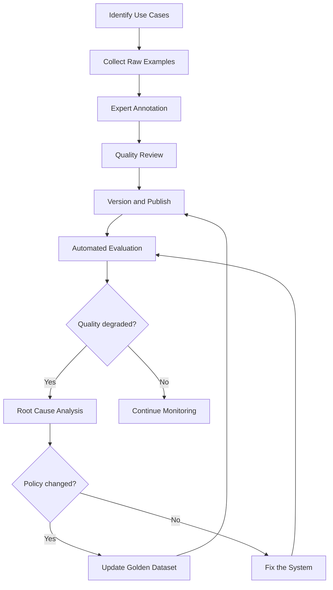

# Golden Datasets for GenAI Evaluation

## Overview

Golden datasets (also known as gold standard datasets) are curated, high-quality collections of inputs and expected outputs used to evaluate AI system performance. They serve as the ground truth against which model improvements, prompt changes, and system upgrades are measured.

In banking GenAI systems, golden datasets are critical because:
- **Regulatory compliance**: Answers must be accurate and defensible
- **Domain specificity**: Banking terminology and procedures are unique
- **Expert knowledge required**: Only domain experts can judge answer correctness
- **Version tracking**: As banking policies change, golden answers must be updated
- **Cross-model comparison**: Golden datasets enable objective comparison between LLM providers

---

## Golden Dataset Lifecycle



---

## Golden Dataset Structure

```python
# test_data/golden/schema.py
"""
Schema definition for golden dataset records.
Each record represents one test case with a query, expected answer, and metadata.
"""
from typing import List, Dict, Optional
from dataclasses import dataclass, field
from datetime import datetime
from enum import Enum

class DifficultyLevel(Enum):
    SIMPLE = "simple"        # Factual lookup (e.g., "What is the routing number?")
    MODERATE = "moderate"    # Multi-step reasoning (e.g., "Calculate the monthly payment")
    COMPLEX = "complex"      # Synthesis across documents (e.g., "Compare mortgage options")
    EXPERT = "expert"        # Requires domain expertise (e.g., "Interpret Regulation Z implications")

class IntentCategory(Enum):
    ACCOUNT_INQUIRY = "account_inquiry"
    TRANSACTION_DISPUTE = "transaction_dispute"
    PRODUCT_INFORMATION = "product_information"
    LOAN_APPLICATION = "loan_application"
    FRAUD_ALERT = "fraud_alert"
    REGULATORY_COMPLIANCE = "regulatory_compliance"
    GENERAL_ASSISTANCE = "general_assistance"

@dataclass
class GoldenRecord:
    """A single golden record with query and expected answer."""
    # Unique identifier
    id: str  # e.g., "GR-0001"

    # Input
    query: str
    context_documents: Optional[List[Dict]] = None  # Optional: specific docs to retrieve
    customer_context: Optional[Dict] = None  # Optional: simulated customer state

    # Expected output
    expected_answer: str
    key_entities: List[str] = field(default_factory=list)  # Must-include entities
    key_facts: List[str] = field(default_factory=list)     # Must-include facts
    forbidden_content: List[str] = field(default_factory=list)  # Must-NOT include

    # Metadata
    intent: IntentCategory
    difficulty: DifficultyLevel
    source_document_ids: List[str] = field(default_factory=list)
    created_by: str  # Expert annotator
    created_at: datetime = field(default_factory=datetime.now)
    last_reviewed: datetime = field(default_factory=datetime.now)
    review_status: str = "approved"  # draft, approved, deprecated

    # Evaluation metadata
    acceptable_paraphrases: List[str] = field(default_factory=list)
    evaluation_notes: str = ""

    # Version tracking
    version: int = 1
    previous_versions: List[str] = field(default_factory=list)


@dataclass
class GoldenDataset:
    """A versioned collection of golden records."""
    name: str
    version: str
    description: str
    records: List[GoldenRecord]
    created_at: datetime = field(default_factory=datetime.now)
    created_by: str = ""
    categories: List[str] = field(default_factory=list)
    statistics: Dict = field(default_factory=dict)

    def get_stats(self) -> Dict:
        """Compute dataset statistics."""
        intent_counts = {}
        difficulty_counts = {}
        for record in self.records:
            intent_counts[record.intent.value] = intent_counts.get(record.intent.value, 0) + 1
            difficulty_counts[record.difficulty.value] = difficulty_counts.get(record.difficulty.value, 0) + 1

        return {
            "total_records": len(self.records),
            "by_intent": intent_counts,
            "by_difficulty": difficulty_counts,
            "avg_answer_length": sum(len(r.expected_answer) for r in self.records) / len(self.records),
        }
```

---

## Golden Dataset Creation Process

### Step 1: Collect Real Queries

```python
# golden_dataset/collect_queries.py
"""
Collect real customer queries from production logs for golden dataset creation.
"""
import json
from datetime import datetime, timedelta

def extract_production_queries(
    log_source: str,
    start_date: datetime,
    end_date: datetime,
    min_quality_score: float = 3.0,
) -> list:
    """
    Extract high-quality queries from production.
    Filter for queries that:
    - Received positive customer feedback
    - Have clear, verifiable answers
    - Cover diverse use cases
    """
    queries = []

    # Query the analytics database
    for log_entry in read_logs(log_source, start_date, end_date):
        if log_entry.get("customer_satisfaction", 0) >= min_quality_score:
            queries.append({
                "query": log_entry["user_input"],
                "response": log_entry["system_output"],
                "category": log_entry["intent_category"],
                "satisfaction_score": log_entry["customer_satisfaction"],
                "resolved": log_entry.get("resolved", False),
                "source": "production",
                "timestamp": log_entry["timestamp"],
            })

    return queries


# Extract and cluster queries
raw_queries = extract_production_queries(
    log_source="production_rag_logs",
    start_date=datetime(2026, 1, 1),
    end_date=datetime(2026, 3, 31),
)

# Cluster by intent to ensure diversity
from sklearn.cluster import KMeans
from sentence_transformers import SentenceTransformer

embedder = SentenceTransformer("all-MiniLM-L6-v2")
embeddings = embedder.encode([q["query"] for q in raw_queries])

kmeans = KMeans(n_clusters=20, random_state=42)
clusters = kmeans.fit_predict(embeddings)

# Select representative queries from each cluster
golden_candidates = []
for cluster_id in range(20):
    cluster_queries = [q for q, c in zip(raw_queries, clusters) if c == cluster_id]
    # Pick the highest-rated query from each cluster
    best = max(cluster_queries, key=lambda q: q["satisfaction_score"])
    golden_candidates.append(best)

print(f"Selected {len(golden_candidates)} diverse queries from {len(raw_queries)} production queries")
```

### Step 2: Expert Annotation

```python
# golden_dataset/annotation_tool.py
"""
Web-based annotation tool for domain experts to create golden records.
Built with Gradio for simplicity.
"""
import gradio as gr
import json
from datetime import datetime
from pathlib import Path

ANNOTATION_FILE = Path("test_data/golden/annotations_pending_review.jsonl")

def create_annotation_interface():
    """Create a Gradio interface for expert annotation."""

    def save_annotation(query, expected_answer, key_entities, key_facts,
                       forbidden_content, intent, difficulty, notes, reviewer):
        """Save a golden record annotation."""
        record = {
            "id": f"GR-{datetime.now().strftime('%Y%m%d%H%M%S')}",
            "query": query,
            "expected_answer": expected_answer,
            "key_entities": [e.strip() for e in key_entities.split(",")],
            "key_facts": [f.strip() for f in key_facts.split(",")],
            "forbidden_content": [f.strip() for f in forbidden_content.split(",")],
            "intent": intent,
            "difficulty": difficulty,
            "evaluation_notes": notes,
            "created_by": reviewer,
            "created_at": datetime.now().isoformat(),
            "review_status": "pending",
        }

        with open(ANNOTATION_FILE, "a") as f:
            f.write(json.dumps(record) + "\n")

        return f"Saved: {record['id']}"

    with gr.Blocks(title="Banking GenAI Golden Dataset Annotation") as app:
        gr.Markdown("# Golden Dataset Annotation Tool")
        gr.Markdown("Review queries and provide expert-verified expected answers.")

        with gr.Row():
            with gr.Column():
                query = gr.Textbox(label="Customer Query", lines=3)
                expected_answer = gr.Textbox(label="Expected Answer (Expert-Verified)", lines=8)
                key_entities = gr.Textbox(label="Key Entities (comma-separated)", lines=2)
                key_facts = gr.Textbox(label="Key Facts (comma-separated)", lines=2)
                forbidden_content = gr.Textbox(label="Forbidden Content (comma-separated)", lines=2)

            with gr.Column():
                intent = gr.Dropdown(
                    choices=["account_inquiry", "transaction_dispute", "product_information",
                             "loan_application", "fraud_alert", "regulatory_compliance"],
                    label="Intent Category"
                )
                difficulty = gr.Dropdown(
                    choices=["simple", "moderate", "complex", "expert"],
                    label="Difficulty Level"
                )
                notes = gr.Textbox(label="Evaluation Notes", lines=3)
                reviewer = gr.Textbox(label="Reviewer Name")

        save_btn = gr.Button("Save Golden Record")
        output = gr.Textbox(label="Status")

        save_btn.click(
            save_annotation,
            [query, expected_answer, key_entities, key_facts, forbidden_content,
             intent, difficulty, notes, reviewer],
            output
        )

    return app

if __name__ == "__main__":
    app = create_annotation_interface()
    app.launch()
```

---

## Golden Dataset Versioning

```yaml
# test_data/golden/datasets.yaml
# Versioned golden dataset registry
datasets:
  banking_rag_v1:
    version: "1.0.0"
    created: "2025-12-01"
    created_by: "domain-expert-team"
    records: 500
    categories:
      account_inquiry: 150
      transaction_dispute: 100
      product_information: 100
      loan_application: 75
      fraud_alert: 50
      regulatory_compliance: 25
    status: "deprecated"
    notes: "Initial dataset. Replaced by v2 after policy update."

  banking_rag_v2:
    version: "2.0.0"
    created: "2026-02-15"
    created_by: "domain-expert-team"
    records: 1000
    categories:
      account_inquiry: 300
      transaction_dispute: 200
      product_information: 200
      loan_application: 150
      fraud_alert: 100
      regulatory_compliance: 50
    status: "active"
    changes_from_v1:
      - "Doubled dataset size"
      - "Added 50 fraud alert scenarios"
      - "Updated answers for new fee schedule (effective 2026-01-01)"
      - "Added Regulation Z compliance questions"
    location: "s3://test-data-bank/golden/banking_rag_v2.jsonl"

  banking_rag_v3:
    version: "3.0.0"
    created: "2026-03-20"
    created_by: "domain-expert-team"
    records: 1500
    status: "in_review"
    changes_from_v2:
      - "Added wire transfer and international payment scenarios"
      - "Updated mortgage rates for Q2 2026"
      - "Added BSA/AML compliance questions"
      - "Removed 50 deprecated product questions"
    location: "s3://test-data-bank/golden/banking_rag_v3_draft.jsonl"
```

---

## Golden Dataset Evaluation

```python
# tests/evaluate_golden.py
"""
Evaluate the current system against the golden dataset.
Produces a detailed report with per-category scores.
"""
import json
from pathlib import Path
from typing import List, Dict
from sentence_transformers import SentenceTransformer, util

def evaluate_against_golden(
    system_client,
    golden_dataset_path: str,
    similarity_threshold: float = 0.85,
) -> Dict:
    """Evaluate system against golden dataset."""
    embedder = SentenceTransformer("all-MiniLM-L6-v2")

    # Load golden dataset
    records = []
    with open(golden_dataset_path) as f:
        for line in f:
            records.append(json.loads(line))

    results_by_category = {}
    all_results = []

    for record in records:
        # Query the system
        response = system_client.query(
            query=record["query"],
            customer_id=record.get("customer_id", "GOLDEN-TEST"),
        )

        actual_answer = response.get("answer", "")
        expected_answer = record["expected_answer"]

        # Semantic similarity
        actual_emb = embedder.encode(actual_answer)
        expected_emb = embedder.encode(expected_answer)
        similarity = util.cos_sim(actual_emb, expected_emb).item()

        # Key entity check
        entities_present = all(
            entity.lower() in actual_answer.lower()
            for entity in record.get("key_entities", [])
        )

        # Forbidden content check
        has_forbidden = any(
            forbidden.lower() in actual_answer.lower()
            for forbidden in record.get("forbidden_content", [])
        )

        result = {
            "id": record["id"],
            "query": record["query"],
            "category": record["intent"],
            "similarity": similarity,
            "entities_match": entities_present,
            "has_forbidden_content": has_forbidden,
            "passed": similarity >= similarity_threshold and entities_present and not has_forbidden,
        }

        all_results.append(result)

        category = record["intent"]
        if category not in results_by_category:
            results_by_category[category] = []
        results_by_category[category].append(result)

    # Compute summary
    total_passed = sum(1 for r in all_results if r["passed"])
    summary = {
        "total": len(all_results),
        "passed": total_passed,
        "failed": len(all_results) - total_passed,
        "pass_rate": total_passed / len(all_results),
        "avg_similarity": sum(r["similarity"] for r in all_results) / len(all_results),
        "by_category": {},
    }

    for category, cat_results in results_by_category.items():
        cat_passed = sum(1 for r in cat_results if r["passed"])
        summary["by_category"][category] = {
            "total": len(cat_results),
            "passed": cat_passed,
            "pass_rate": cat_passed / len(cat_results),
            "avg_similarity": sum(r["similarity"] for r in cat_results) / len(cat_results),
        }

    return summary
```

---

## Golden Dataset Maintenance Schedule

| Activity | Frequency | Owner | Trigger |
|---|---|---|---|
| Add new records | Monthly | Domain experts | New use cases identified |
| Review existing records | Quarterly | Domain experts | Scheduled review cycle |
| Update deprecated answers | As needed | Policy team | Banking policy change |
| Remove obsolete records | Quarterly | Data team | Product deprecation |
| Full dataset audit | Annually | QA team | Annual compliance review |
| Inter-annotator agreement check | Per annotation batch | QA team | New annotator onboarding |

---

## Interview Questions

1. **How many golden records do you need for a comprehensive evaluation?**
   - There's no fixed number. Aim for: (1) At least 20-30 records per intent category, (2) Coverage of all difficulty levels, (3) Inclusion of edge cases. Start with 200-500 records and grow iteratively. Quality matters more than quantity.

2. **How do you handle disagreements between expert annotators?**
   - Use a multi-annotator process: 2 experts independently annotate each record. If they disagree, a third senior expert arbitrates. Measure inter-annotator agreement (Cohen's kappa) -- target > 0.8.

3. **A model upgrade improves golden dataset scores from 85% to 92%. Is it safe to deploy?**
   - Check the per-category breakdown. If one category dropped while others improved, investigate. Review the 8% of cases still failing to understand if the failures are acceptable. Also run red team and adversarial tests before deploying.

4. **How do you prevent golden dataset overfitting?**
   - Hold out a test set (20%) that is never used during development. Periodically add fresh records from production. Rotate some records between train and test sets. Use multiple evaluation methods (semantic similarity, entity checks, human review) so optimization on one metric does not game the system.

---

## Cross-References

- See [regression-testing.md](./regression-testing.md) for regression detection using golden datasets
- See [llm-evaluation.md](./llm-evaluation.md) for evaluation methodology
- See [human-review-workflows.md](./human-review-workflows.md) for expert annotation process
- See [test-data-management.md](./test-data-management.md) for test data lifecycle management
