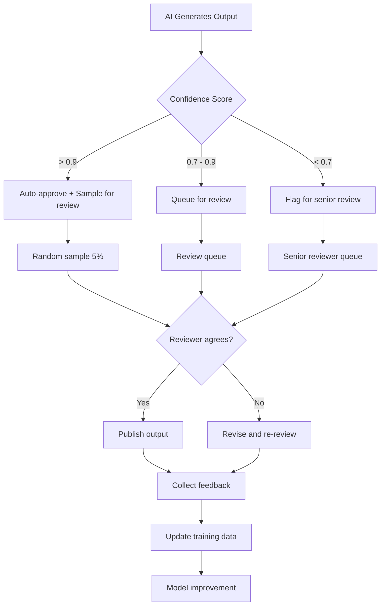

# Human Review Workflows for AI Outputs

## Overview

Human review of AI-generated outputs is essential in banking because GenAI systems can produce plausible but incorrect, incomplete, or inappropriate responses. Human-in-the-loop (HITL) workflows provide quality assurance, catch edge cases, and continuously improve the system through feedback collection.

In banking, human review is mandatory for:
- **Regulatory advice**: Answers about compliance must be verified
- **Financial calculations**: Interest, fees, and payment amounts must be accurate
- **Fraud-related communications**: Incorrect advice could enable fraud
- **Customer-facing content before launch**: All GenAI-generated documentation reviewed before publication
- **Escalation decisions**: AI-suggested fraud flags or credit decisions need human confirmation

---

## Human Review Workflow Architecture



---

## Review Queue System

```python
# review/queue.py
"""
Human review queue system for AI-generated outputs.
Manages priority, assignment, and tracking of review tasks.
"""
import enum
from dataclasses import dataclass, field
from datetime import datetime
from typing import Optional, List, Dict
from collections import defaultdict

class ReviewPriority(enum.Enum):
    LOW = "low"           # Routine queries, high confidence
    MEDIUM = "medium"     # Standard queries, moderate confidence
    HIGH = "high"         # Complex queries, low confidence
    CRITICAL = "critical" # Regulatory, fraud-related, financial calculations

class ReviewStatus(enum.Enum):
    PENDING = "pending"
    IN_REVIEW = "in_review"
    APPROVED = "approved"
    REJECTED = "rejected"
    ESCALATED = "escalated"
    NEEDS_REVISION = "needs_revision"

@dataclass
class ReviewItem:
    """A single item in the review queue."""
    id: str
    query: str
    ai_response: str
    confidence_score: float
    sources_used: List[str]
    intent_category: str
    customer_impact: str  # low, medium, high

    # Review metadata
    priority: ReviewPriority = ReviewPriority.MEDIUM
    status: ReviewStatus = ReviewStatus.PENDING
    assigned_to: Optional[str] = None
    assigned_at: Optional[datetime] = None
    reviewed_at: Optional[datetime] = None
    reviewer_notes: str = ""
    corrected_response: str = ""
    review_duration_seconds: Optional[float] = None

    # Feedback loop
    feedback_category: Optional[str] = None  # factual_error, incomplete, misleading, inappropriate, good
    feedback_details: str = ""

    # Timestamps
    created_at: datetime = field(default_factory=datetime.now)
    sla_deadline: Optional[datetime] = None

    def calculate_priority(self) -> ReviewPriority:
        """Automatically calculate review priority based on confidence and category."""
        # Regulatory and fraud queries always get high priority
        if self.intent_category in ["regulatory_compliance", "fraud_alert"]:
            return ReviewPriority.HIGH

        # Low confidence always gets high priority
        if self.confidence_score < 0.5:
            return ReviewPriority.HIGH

        # Medium confidence gets medium priority
        if self.confidence_score < 0.8:
            return ReviewPriority.MEDIUM

        return ReviewPriority.LOW


class ReviewQueue:
    """Manage the human review queue."""

    def __init__(self):
        self.items: Dict[str, ReviewItem] = {}
        self.reviewers: Dict[str, dict] = {}
        self.stats = defaultdict(int)

    def add_item(self, item: ReviewItem) -> str:
        """Add an item to the review queue."""
        item.priority = item.calculate_priority()
        item.sla_deadline = self._calculate_sla(item.priority)
        self.items[item.id] = self.items.get(item.id) or item
        self.stats["total"] += 1
        self.stats[item.priority.value] += 1
        return item.id

    def assign_next(self, reviewer_id: str, categories: List[str] = None) -> Optional[ReviewItem]:
        """Assign the next pending item to a reviewer."""
        # Find the highest priority pending item
        pending = [
            item for item in self.items.values()
            if item.status == ReviewStatus.PENDING
            and (categories is None or item.intent_category in categories)
            and (item.assigned_to is None)
        ]

        if not pending:
            return None

        # Sort by priority (critical first) and then by creation time (FIFO)
        priority_order = {
            ReviewPriority.CRITICAL: 0,
            ReviewPriority.HIGH: 1,
            ReviewPriority.MEDIUM: 2,
            ReviewPriority.LOW: 3,
        }
        pending.sort(key=lambda x: (priority_order[x.priority], x.created_at))

        item = pending[0]
        item.status = ReviewStatus.IN_REVIEW
        item.assigned_to = reviewer_id
        item.assigned_at = datetime.now()

        return item

    def complete_review(self, item_id: str, status: ReviewStatus,
                       notes: str = "", corrected_response: str = "",
                       feedback_category: str = None, feedback_details: str = ""):
        """Complete a review."""
        item = self.items[item_id]
        item.status = status
        item.reviewer_notes = notes
        item.corrected_response = corrected_response
        item.reviewed_at = datetime.now()
        item.review_duration_seconds = (item.reviewed_at - item.assigned_at).total_seconds()
        item.feedback_category = feedback_category
        item.feedback_details = feedback_details

        self.stats[status.value] += 1

    def get_sla_violations(self) -> List[ReviewItem]:
        """Get items that have exceeded their SLA deadline."""
        now = datetime.now()
        return [
            item for item in self.items.values()
            if item.status in (ReviewStatus.PENDING, ReviewStatus.IN_REVIEW)
            and item.sla_deadline and now > item.sla_deadline
        ]

    def _calculate_sla(self, priority: ReviewPriority) -> datetime:
        """Calculate SLA deadline based on priority."""
        from datetime import timedelta
        sla_hours = {
            ReviewPriority.CRITICAL: 1,
            ReviewPriority.HIGH: 4,
            ReviewPriority.MEDIUM: 24,
            ReviewPriority.LOW: 72,
        }
        return datetime.now() + timedelta(hours=sla_hours[priority])
```

---

## Review Interface (Streamlit)

```python
# review/interface.py
"""
Streamlit-based review interface for human reviewers.
"""
import streamlit as st
from review.queue import ReviewQueue, ReviewStatus, ReviewItem

st.set_page_config(page_title="AI Output Review", layout="wide")

st.title("Banking GenAI Output Review")

# Sidebar: Reviewer login
with st.sidebar:
    reviewer_id = st.text_input("Reviewer ID")
    reviewer_category = st.selectbox(
        "Review Category",
        ["all", "account_inquiry", "regulatory_compliance", "fraud_alert", "loan_application"]
    )

# Queue stats
queue = ReviewQueue()
pending = [i for i in queue.items.values() if i.status == ReviewStatus.PENDING]
st.metric("Pending Reviews", len(pending))

sla_violations = queue.get_sla_violations()
if sla_violations:
    st.error(f"{len(sla_violations)} items are past SLA deadline")

# Review panel
categories = None if reviewer_category == "all" else [reviewer_category]
next_item = queue.assign_next(reviewer_id, categories)

if next_item:
    st.subheader(f"Review Item: {next_item.id}")

    col1, col2 = st.columns(2)

    with col1:
        st.markdown("### Customer Query")
        st.info(next_item.query)
        st.markdown("### AI Response")
        st.write(next_item.ai_response)
        st.markdown(f"**Confidence:** {next_item.confidence_score:.2%}")
        st.markdown(f"**Sources:** {', '.join(next_item.sources_used)}")

    with col2:
        st.markdown("### Review")
        rating = st.slider("Answer Quality", 1, 5, 3)
        feedback_category = st.selectbox(
            "Feedback Category",
            ["good", "factual_error", "incomplete", "misleading", "inappropriate"]
        )
        feedback_details = st.text_area("Feedback Details")
        corrected_response = st.text_area("Corrected Response (if needed)", height=200)
        notes = st.text_area("Reviewer Notes")

        col_approve, col_reject = st.columns(2)
        if col_approve.button("Approve", type="primary"):
            queue.complete_review(
                next_item.id,
                status=ReviewStatus.APPROVED if rating >= 4 else ReviewStatus.NEEDS_REVISION,
                notes=notes,
                corrected_response=corrected_response,
                feedback_category=feedback_category,
                feedback_details=feedback_details,
            )
            st.success("Review saved")
            st.rerun()

        if col_reject.button("Reject"):
            queue.complete_review(
                next_item.id,
                status=ReviewStatus.REJECTED,
                notes=notes,
                feedback_category=feedback_category,
                feedback_details=feedback_details,
            )
            st.warning("Item rejected")
            st.rerun()
else:
    st.success("No pending items in your review queue")
```

---

## Feedback Collection and Model Improvement

```python
# review/feedback_loop.py
"""
Process human review feedback to improve the GenAI system.
"""
import json
from pathlib import Path
from datetime import datetime
from typing import List

def process_review_feedback(review_items: List[ReviewItem]) -> dict:
    """Aggregate review feedback to identify improvement areas."""
    feedback_stats = {}
    error_patterns = {}
    correction_dataset = []

    for item in review_items:
        if item.status == ReviewStatus.APPROVED:
            feedback_stats["approved"] = feedback_stats.get("approved", 0) + 1

        elif item.status in (ReviewStatus.REJECTED, ReviewStatus.NEEDS_REVISION):
            category = item.feedback_category or "unknown"
            feedback_stats[category] = feedback_stats.get(category, 0) + 1

            # Track error patterns
            if item.intent_category not in error_patterns:
                error_patterns[item.intent_category] = {}
            if category not in error_patterns[item.intent_category]:
                error_patterns[item.intent_category][category] = 0
            error_patterns[item.intent_category][category] += 1

            # Collect corrections for training
            if item.corrected_response:
                correction_dataset.append({
                    "query": item.query,
                    "ai_response": item.ai_response,
                    "corrected_response": item.corrected_response,
                    "category": item.intent_category,
                    "error_type": category,
                    "reviewer_notes": item.reviewer_notes,
                })

    # Save correction dataset for fine-tuning
    if correction_dataset:
        output_path = Path("test_data/feedback/corrections.jsonl")
        output_path.parent.mkdir(parents=True, exist_ok=True)
        with open(output_path, "a") as f:
            for correction in correction_dataset:
                f.write(json.dumps(correction) + "\n")

    return {
        "feedback_stats": feedback_stats,
        "error_patterns": error_patterns,
        "corrections_collected": len(correction_dataset),
        "report_date": datetime.now().isoformat(),
    }


# Weekly feedback report
def generate_weekly_feedback_report(all_reviews: List[ReviewItem]) -> str:
    """Generate a weekly report for the GenAI team."""
    stats = process_review_feedback(all_reviews)

    report = f"""
# Weekly AI Quality Report

## Summary
- Total reviews: {len(all_reviews)}
- Approval rate: {stats['feedback_stats'].get('approved', 0) / len(all_reviews):.1%}
- Corrections collected: {stats['corrections_collected']}

## Error Breakdown
"""
    for category, errors in stats['error_patterns'].items():
        report += f"\n### {category}\n"
        for error_type, count in errors.items():
            report += f"- {error_type}: {count}\n"

    report += f"\n## Top Improvement Areas\n"
    report += "1. Review error patterns above\n"
    report += "2. Add corrections to fine-tuning dataset\n"
    report += "3. Update golden dataset with corrected answers\n"

    return report
```

---

## Quality Metrics Dashboard

| Metric | Target | Current | Trend |
|---|---|---|---|
| Review throughput | 100/day | 85/day | Increasing |
| SLA compliance | > 95% | 92% | Stable |
| Approval rate | 85-95% | 88% | Improving |
| Avg review time | < 5 min | 4.2 min | Improving |
| Factual error rate | < 2% | 1.5% | Improving |
| Inter-rater agreement | > 0.8 | 0.85 | Stable |
| Feedback incorporation | < 1 week | 3 days | Improving |

---

## Interview Questions

1. **How do you decide which AI outputs need human review?**
   - Use confidence scores as the primary filter (review everything below 0.8). Add category-based rules (always review regulatory and fraud-related answers). Sample high-confidence outputs (5%) to detect systematic errors.

2. **What is the right SLA for human review of AI outputs?**
   - Depends on impact: Critical (fraud, regulatory) = 1 hour. High (financial calculations) = 4 hours. Medium (general inquiries) = 24 hours. Low (internal documentation) = 72 hours. Track SLA compliance as a quality metric.

3. **How do you prevent reviewer fatigue from degrading quality?**
   - Limit reviews per session (max 50). Rotate review assignments. Use inter-rater reliability checks (same item reviewed by 2 people). Provide regular feedback to reviewers about their accuracy.

4. **How does human review feedback improve the AI system?**
   - Corrections become fine-tuning data. Error patterns inform prompt engineering. Systematic failures trigger model changes. Golden dataset updates incorporate corrected answers. The feedback loop closes when improvements are validated against the updated golden dataset.

---

## Cross-References

- See [golden-datasets.md](./golden-datasets.md) for gold dataset curation
- See [llm-evaluation.md](./llm-evaluation.md) for evaluation methodology
- See [quality-gates.md](./quality-gates.md) for quality thresholds
- See [release-readiness.md](./release-readiness.md) for release criteria
