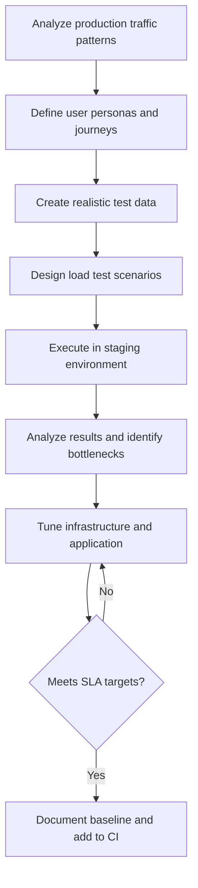

# Load Testing in Banking GenAI Systems

## Overview

Load testing simulates expected production traffic to verify that the system handles real-world usage without degradation. In banking GenAI systems, load testing is critical because:

- **Peak traffic is unpredictable**: End-of-month banking queries, tax season, market events
- **GenAI resources are expensive**: Over-provisioning wastes GPU budget; under-provisioning causes SLA breaches
- **Cascading failures**: A slow LLM inference can backpressure the entire request chain
- **Regulatory SLAs**: Banking APIs have contractual response time commitments

---

## Load Test Design Process



---

## User Personas for Banking Load Tests

Each persona represents a real user behavior pattern with specific traffic characteristics.

| Persona | Behavior | Frequency | Avg Session | Peak Concurrent |
|---|---|---|---|---|
| Retail Customer | Check balance, ask policy questions | 5x/day | 3 min | 2,000 |
| Wealth Advisor | Portfolio analysis, market insights | 20x/day | 15 min | 200 |
| Compliance Officer | Regulatory document review | 10x/day | 8 min | 50 |
| Branch Teller | Customer lookup, transaction explanation | 50x/day | 2 min | 500 |
| Internal Ops | System health queries, report generation | 5x/day | 5 min | 30 |
| API Integration | Automated fraud detection, scoring | Continuous | N/A | 100 |

---

## Load Test Scenarios

### Scenario 1: Normal Business Hours

```python
# load-tests/scenarios/normal_hours.py
"""
Simulate normal weekday banking hours traffic.
Mix of personas based on production analytics.
"""
from locust import HttpUser, task, between, events
import random
import json

class BankingGenAIUser(HttpUser):
    wait_time = between(1, 5)  # Realistic think time

    def on_start(self):
        """Authenticate and get token."""
        resp = self.client.post("/auth/token", json={
            "username": f"user_{random.randint(1, 1000)}",
            "password": "test-password"
        })
        self.token = resp.json()["access_token"]
        self.headers = {"Authorization": f"Bearer {self.token}"}

    @task(weight=40)
    def simple_query(self):
        """40% of traffic: simple banking questions."""
        queries = [
            "What is my checking account balance?",
            "What are your branch hours?",
            "How do I reset my online banking password?",
            "What is the routing number?",
            "How do I order a new debit card?",
        ]
        self.client.post("/api/v1/rag/query", json={
            "query": random.choice(queries),
            "customer_id": f"CUST-{random.randint(1000, 9999)}",
            "max_tokens": 200,
        }, headers=self.headers)

    @task(weight=25)
    def transaction_analysis(self):
        """25% of traffic: transaction analysis requests."""
        self.client.post("/api/v1/analyze/transactions", json={
            "account_id": f"ACCT-{random.randint(10000, 99999)}",
            "period": "last_30_days",
            "analysis_type": "spending_patterns",
        }, headers=self.headers)

    @task(weight=15)
    def document_summary(self):
        """15% of traffic: document summarization."""
        self.client.post("/api/v1/summarize/document", json={
            "document_id": f"DOC-{random.randint(1, 500)}",
            "summary_length": "brief",
        }, headers=self.headers)

    @task(weight=10)
    def multi_turn_conversation(self):
        """10% of traffic: multi-turn conversations."""
        session_id = f"SESSION-{random.randint(1, 1000)}"
        messages = [
            {"role": "user", "content": "I see a charge I don't recognize"},
            {"role": "assistant", "content": "I can help with that. Can you share the transaction details?"},
            {"role": "user", "content": "It's a $45 charge to 'AMZN Mktp' on March 15"},
        ]
        self.client.post("/api/v1/chat", json={
            "session_id": session_id,
            "messages": messages,
            "customer_id": f"CUST-{random.randint(1000, 9999)}",
        }, headers=self.headers)

    @task(weight=5)
    def document_upload(self):
        """5% of traffic: document ingestion."""
        self.client.post("/api/v1/documents/upload", json={
            "title": f"Test Document {random.randint(1, 100)}",
            "content": "Sample banking policy document content...",
            "category": "policy",
        }, headers=self.headers)


@events.test_start.add_listener
def on_test_start(environment, **kwargs):
    print("Load test starting -- normal business hours scenario")

@events.test_stop.add_listener
def on_test_stop(environment, **kwargs):
    stats = environment.runner.stats
    print(f"\n=== Load Test Results ===")
    print(f"Total requests: {stats.total.num_requests}")
    print(f"Average response time: {stats.total.avg_response_time:.0f}ms")
    print(f"P95 response time: {stats.total.get_response_time_percentile(0.95):.0f}ms")
    print(f"Failure rate: {stats.total.fail_ratio:.2%}")
```

### Scenario 2: Month-End Peak

```python
# load-tests/scenarios/month_end_peak.py
"""
Month-end traffic is 3x normal due to:
- Statement generation requests
- Reconciliation queries
- Compliance reporting
"""
from locust import HttpUser, task, between
import random

class PeakLoadUser(HttpUser):
    wait_time = between(0.5, 2)  # Faster pace

    @task
    def batch_queries(self):
        """Heavy batch queries during month-end."""
        for _ in range(5):  # Each user fires 5 queries in rapid succession
            self.client.post("/api/v1/rag/query", json={
                "query": random.choice(HEAVY_QUERIES),
                "customer_id": f"CUST-{random.randint(1000, 9999)}",
                "max_tokens": 1000,  # Longer responses
            })


HEAVY_QUERIES = [
    "Generate a summary of all transactions on account ACCT-12345 for March 2026",
    "List all wire transfers over $10,000 in the last 30 days",
    "What is the total interest earned on my savings account this quarter?",
    "Compare my spending this month vs. last month by category",
    "Generate a compliance report for CTR filings in Q1 2026",
]
```

### Scenario 3: Market Event Spike

```python
# load-tests/scenarios/market_event.py
"""
Sudden traffic spike during market events (rate changes, outages).
Tests auto-scaling and circuit breaker behavior.
"""
from locust import HttpUser, task, between
import random

class SpikeUser(HttpUser):
    wait_time = between(0.1, 0.5)

    @task
    def urgent_query(self):
        self.client.post("/api/v1/rag/query", json={
            "query": "What happens to my mortgage if interest rates increase?",
            "customer_id": f"CUST-{random.randint(1000, 9999)}",
            "priority": "high",
        })
```

---

## Locust Configuration for Banking Load Tests

```python
# locustfile.py
from locust import LoadTestShape

class BankingLoadProfile(LoadTestShape):
    """
    Custom load profile that mimics real banking traffic patterns:
    - Low at 6am, peaks at 10am, dips at lunch, peaks again at 3pm
    """
    stages = [
        {"duration": 60, "users": 50, "spawn_rate": 10},     # Warm-up
        {"duration": 120, "users": 200, "spawn_rate": 20},   # Morning ramp
        {"duration": 180, "users": 500, "spawn_rate": 30},   # Peak
        {"duration": 60, "users": 300, "spawn_rate": 20},    # Midday dip
        {"duration": 180, "users": 600, "spawn_rate": 30},   # Afternoon peak
        {"duration": 120, "users": 200, "spawn_rate": 20},   # Wind down
        {"duration": 60, "users": 50, "spawn_rate": 10},     # Cool down
    ]

    def tick(self):
        run_time = self.get_run_time()
        for stage in self.stages:
            if run_time < stage["duration"]:
                return (stage["users"], stage["spawn_rate"])
        return None
```

Run with:
```bash
locust -f locustfile.py \
    --host https://staging-api.banking-genai.example.com \
    --headless \
    --run-time 30m \
    --csv results/load-test \
    --html results/load-report.html
```

---

## Analyzing Load Test Results

### Bottleneck Identification

```python
# load-tests/analyze_results.py
"""
Analyze load test results to identify bottlenecks.
Reads CSV output from Locust/k6 and generates reports.
"""
import pandas as pd
import matplotlib.pyplot as plt

def analyze_load_test(csv_path: str):
    df = pd.read_csv(csv_path)

    # Response time distribution
    plt.figure(figsize=(12, 6))
    plt.hist(df['response_time'], bins=50, edgecolor='black', alpha=0.7)
    plt.axvline(x=2000, color='r', linestyle='--', label='SLA threshold (2s)')
    plt.title('Response Time Distribution')
    plt.xlabel('Response Time (ms)')
    plt.ylabel('Frequency')
    plt.legend()
    plt.savefig('results/response_time_distribution.png')

    # Throughput over time
    plt.figure(figsize=(12, 6))
    df.set_index('timestamp')['requests_per_second'].plot()
    plt.title('Throughput Over Time')
    plt.ylabel('Requests/second')
    plt.savefig('results/throughover_time.png')

    # Error rate by endpoint
    error_by_endpoint = df.groupby('endpoint')['error'].mean()
    plt.figure(figsize=(10, 5))
    error_by_endpoint.sort_values(ascending=False).plot(kind='bar')
    plt.title('Error Rate by Endpoint')
    plt.ylabel('Error Rate')
    plt.savefig('results/error_rate_by_endpoint.png')

    # Identify bottleneck
    if df['response_time'].quantile(0.95) > 3000:
        print("WARNING: P95 latency exceeds 3s SLA")
    if df['error'].mean() > 0.01:
        print(f"WARNING: Error rate is {df['error'].mean():.2%}")
    if df['gpu_utilization'].mean() > 0.85:
        print("WARNING: GPU utilization consistently above 85%")

    return df.describe()
```

---

## Infrastructure Scaling Configuration

```yaml
# kubernetes/hpa.yaml
apiVersion: autoscaling/v2
kind: HorizontalPodAutoscaler
metadata:
  name: banking-rag-api-hpa
spec:
  scaleTargetRef:
    apiVersion: apps/v1
    kind: Deployment
    name: banking-rag-api
  minReplicas: 3
  maxReplicas: 20
  metrics:
    - type: Resource
      resource:
        name: cpu
        target:
          type: Utilization
          averageUtilization: 70
    - type: Pods
      pods:
        metric:
          name: requests_per_second
        target:
          type: AverageValue
          averageValue: "100"
    - type: External
      external:
        metric:
          name: queue_depth
          selector:
            matchLabels:
              queue: rag-inference
        target:
          type: AverageValue
          averageValue: "50"
  behavior:
    scaleUp:
      stabilizationWindowSeconds: 60
      policies:
        - type: Pods
          value: 5
          periodSeconds: 60
    scaleDown:
      stabilizationWindowSeconds: 300
      policies:
        - type: Pods
          value: 2
          periodSeconds: 120
```

---

## Load Testing Checklist

- [ ] Test scenarios reflect production traffic distribution
- [ ] Test data includes realistic variety (query lengths, customer types)
- [ ] Staging environment matches production specs (or scaled proportionally)
- [ ] Database is populated with production-scale data volume
- [ ] Caching is configured identically to production
- [ ] Rate limiting is enabled and set to production thresholds
- [ ] Auto-scaling policies are configured and tested
- [ ] Circuit breakers and fallbacks are verified under overload
- [ ] Monitoring dashboards are active during the test
- [ ] Results are compared against SLA targets
- [ ] Bottleneck analysis is documented and shared with team
- [ ] Regression baseline is updated in CI/CD

---

## Interview Questions

1. **How do you determine the target concurrent users for a load test?**
   - Analyze production metrics (APM, access logs) to find peak concurrent users. Multiply by 1.5x for headroom. For new services, use product estimates and validate against similar existing services.

2. **What is the difference between load testing and stress testing?**
   - Load testing verifies the system handles expected traffic. Stress testing pushes beyond capacity to find breaking points and observe recovery behavior.

3. **How do you prevent load tests from corrupting production data?**
   - Always run against staging. Use test-specific tenant IDs, synthetic customer data, and separate database instances. Never use production credentials.

4. **Your load test shows increasing latency over time. What could be causing this?**
   - Memory leaks, connection pool exhaustion, cache eviction thrashing, database query plan degradation, or LLM context window growing without bounds in long sessions.

---

## Cross-References

- See [performance-testing.md](./performance-testing.md) for benchmarking methodology
- See [test-environments.md](./test-environments.md) for staging environment setup
- See [architecture/capacity-planning.md](../architecture/capacity-planning.md) for capacity planning
- See [incident-management/chaos-engineering.md](../incident-management/) for chaos testing
