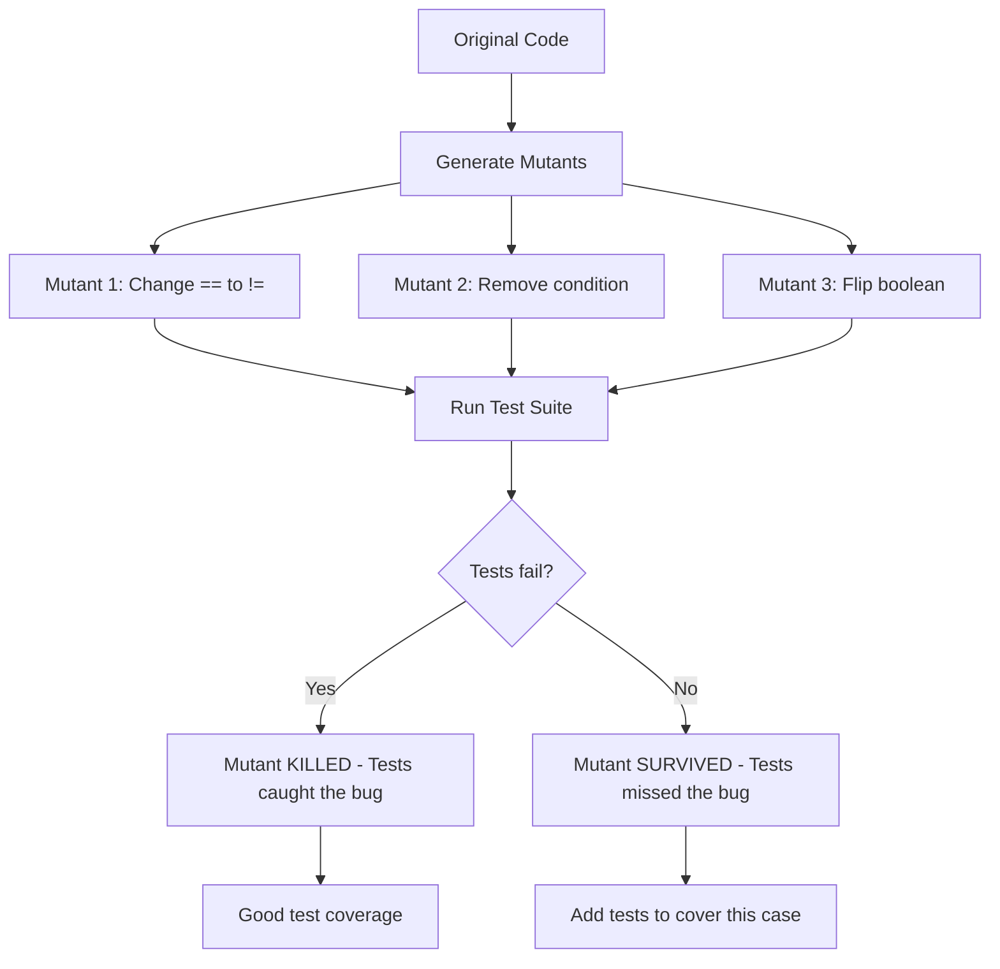

# Mutation Testing in Banking GenAI Systems

## Overview

Mutation testing evaluates the quality of your test suite by intentionally introducing small bugs (mutations) into the code and checking if the tests catch them. If a test suite passes despite the mutations, it means the tests are not thorough enough.

In banking GenAI systems, mutation testing is critical because:
- **Safety-critical code**: Authorization, PII masking, and audit logging must have bulletproof tests
- **False sense of security**: High code coverage does not mean tests are effective
- **GenAI pipeline complexity**: Many components (retrieval, ranking, generation) need validated test coverage

---

## Mutation Testing Process



---

## Mutation Testing with MutPy (Python)

```bash
# Install MutPy
pip install mutpy

# Run mutation testing on the banking RAG API
mutpy -m app.rag.query -t tests/test_rag_query.py --coverage
```

### Example: Mutating Authorization Middleware

```python
# app/middleware/auth.py -- ORIGINAL
def check_tenant_access(token_tenant: str, resource_tenant: str) -> bool:
    """Verify that the token's tenant matches the resource's tenant."""
    if token_tenant != resource_tenant:
        raise TenantAccessDenied(
            f"Tenant {token_tenant} cannot access {resource_tenant} resources"
        )
    return True
```

**Mutations MutPy would generate:**
1. Change `!=` to `==` (would allow cross-tenant access)
2. Remove the `if` body (would never raise exception)
3. Change `raise` to `pass` (would silently allow access)
4. Return `False` instead of raising (would change error handling)

```python
# tests/test_auth.py -- MUST kill all mutants
import pytest
from app.middleware.auth import check_tenant_access, TenantAccessDenied

class TestTenantAccess:
    def test_same_tenant_allowed(self):
        assert check_tenant_access("retail-banking", "retail-banking") is True

    def test_cross_tenant_denied(self):
        with pytest.raises(TenantAccessDenied):
            check_tenant_access("retail-banking", "wealth-management")

    def test_exception_contains_tenant_info(self):
        """Verify exception message doesn't leak resource details to attacker."""
        try:
            check_tenant_access("retail-banking", "wealth-management")
        except TenantAccessDenied as e:
            # Message should NOT reveal the target tenant's details
            assert "wealth-management" not in str(e)
            assert "retail-banking" in str(e)  # Should show requester's tenant
```

---

## Mutation Testing with Stryker (TypeScript)

```bash
# Install Stryker
npm install --save-dev @stryker-mutator/core @stryker-mutator/jest-runner

# Configure
# stryker.config.json
```

```json
{
  "$schema": "./node_modules/@stryker-mutator/api/schema/stryker-schema.json",
  "packageManager": "npm",
  "reporters": ["html", "clear-text", "progress"],
  "testRunner": "jest",
  "testRunner_comment": "Stryker will use your existing Jest configuration",
  "coverageAnalysis": "perTest",
  "mutate": [
    "src/middleware/auth.ts",
    "src/services/rag.ts",
    "src/utils/pii_masking.ts",
    "src/guards/role.ts"
  ],
  "thresholds": {
    "high": 90,
    "low": 70,
    "break": 80
  },
  "ignoreStatic": true
}
```

```typescript
// src/middleware/auth.ts -- ORIGINAL
export function validateRole(required: string, userRoles: string[]): boolean {
  const roleHierarchy: Record<string, string[]> = {
    admin: ['admin', 'manager', 'analyst', 'viewer'],
    manager: ['manager', 'analyst', 'viewer'],
    analyst: ['analyst', 'viewer'],
    viewer: ['viewer'],
  };

  const allowedRoles = roleHierarchy[required] || [];
  return userRoles.some(role => allowedRoles.includes(role));
}
```

```typescript
// src/middleware/__tests__/auth.test.ts
import { validateRole } from '../auth';

describe('validateRole', () => {
  it('allows admin role for admin endpoint', () => {
    expect(validateRole('admin', ['admin'])).toBe(true);
  });

  it('allows manager role for admin endpoint (inherits from hierarchy)', () => {
    expect(validateRole('admin', ['manager'])).toBe(false);
  });

  it('allows viewer for analyst endpoint', () => {
    expect(validateRole('analyst', ['viewer'])).toBe(true);
  });

  it('denies viewer for manager endpoint', () => {
    expect(validateRole('manager', ['viewer'])).toBe(false);
  });

  it('denies unknown role', () => {
    expect(validateRole('unknown', ['viewer'])).toBe(false);
  });

  it('handles empty roles array', () => {
    expect(validateRole('admin', [])).toBe(false);
  });

  it('handles unknown required role', () => {
    expect(validateRole('nonexistent', ['admin'])).toBe(false);
  });

  it('handles multiple user roles', () => {
    expect(validateRole('manager', ['viewer', 'manager'])).toBe(true);
  });
});
```

Run Stryker:
```bash
npx stryker run

# Output:
# Mutations:
#   [Killed] Changed roleHierarchy lookup to return empty array
#   [Survived] Changed some() to every() in role check
#   [Killed] Changed includes to excludes
#
# Mutation Score: 75% (3 of 4 mutants killed)
# Add tests for the surviving mutant!
```

---

## Banking-Specific Mutation Targets

### PII Masking Function

```python
# app/utils/pii_masking.py
def mask_account_number(account: str) -> str:
    """Mask account number showing only last 4 digits."""
    if not account or len(account) < 4:
        return "****"
    return "*" * (len(account) - 4) + account[-4:]
```

**Mutants to kill:**
1. `len(account) < 4` -> `len(account) > 4` (would mask short account numbers incorrectly)
2. `account[-4:]` -> `account[:4]` (would show first 4 instead of last 4)
3. `"*"` -> `account[-4:]` (would repeat last 4 instead of masking)

```python
def test_mask_account_number():
    """Comprehensive tests to kill all PII masking mutants."""
    # Normal case
    assert mask_account_number("123456789") == "*****6789"

    # Exactly 4 digits (should show all)
    assert mask_account_number("1234") == "1234"

    # Less than 4 digits
    assert mask_account_number("123") == "****"

    # Empty string
    assert mask_account_number("") == "****"

    # None
    assert mask_account_number(None) == "****"

    # Very long account number
    assert mask_account_number("12345678901234567") == "*************4567"
```

### Rate Limiting Logic

```python
# app/middleware/rate_limit.py
class RateLimiter:
    def __init__(self, redis_client, max_requests: int, window_seconds: int):
        self.redis = redis_client
        self.max_requests = max_requests
        self.window = window_seconds

    def is_allowed(self, client_id: str) -> bool:
        """Check if the client is within rate limits."""
        key = f"rate_limit:{client_id}"
        current = self.redis.get(key)

        if current is None:
            self.redis.setex(key, self.window, 1)
            return True

        if int(current) >= self.max_requests:
            return False

        self.redis.incr(key)
        return True
```

```python
class TestRateLimiter:
    def test_first_request_allowed(self, mock_redis):
        limiter = RateLimiter(mock_redis, max_requests=100, window_seconds=60)
        assert limiter.is_allowed("client-1") is True

    def test_within_limit_allowed(self, mock_redis):
        limiter = RateLimiter(mock_redis, max_requests=3, window_seconds=60)
        assert limiter.is_allowed("client-1") is True
        assert limiter.is_allowed("client-1") is True
        assert limiter.is_allowed("client-1") is True
        assert limiter.is_allowed("client-1") is False  # 4th request denied

    def test_different_clients_independent(self, mock_redis):
        limiter = RateLimiter(mock_redis, max_requests=1, window_seconds=60)
        assert limiter.is_allowed("client-1") is True
        assert limiter.is_allowed("client-1") is False
        assert limiter.is_allowed("client-2") is True  # Different client

    def test_window_expiration_resets(self, mock_redis):
        limiter = RateLimiter(mock_redis, max_requests=1, window_seconds=60)
        assert limiter.is_allowed("client-1") is True
        assert limiter.is_allowed("client-1") is False

        # Simulate window expiration
        mock_redis.expire_key("rate_limit:client-1")
        assert limiter.is_allowed("client-1") is True  # Reset after expiration
```

---

## Mutation Testing in CI

```yaml
# .github/workflows/mutation-tests.yaml
name: Mutation Tests
on:
  schedule:
    - cron: '0 2 * * 0'  # Weekly on Sunday at 2 AM
  workflow_dispatch:  # Manual trigger

jobs:
  mutation-tests:
    runs-on: ubuntu-latest
    steps:
      - uses: actions/checkout@v4

      - name: Run mutation tests
        run: |
          mutpy -m app/ -t tests/ \
            --coverage \
            --report html \
            --threshold 80

      - name: Upload mutation report
        if: always()
        uses: actions/upload-artifact@v4
        with:
          name: mutation-report
          path: mutation-report/

      - name: Post results to Slack
        if: always()
        uses: slackapi/slack-github-action@v1
        with:
          payload: |
            {
              "text": "Mutation testing results: ${{ job.status }}",
              "score": "${{ steps.mutation.outputs.score }}"
            }
```

---

## Mutation Score Benchmarks

| Component | Target Score | Current Score | Notes |
|---|---|---|---|
| Auth middleware | 95% | 88% | Need more edge case tests |
| PII masking | 100% | 95% | One surviving mutant in SSN masking |
| Rate limiter | 90% | 82% | Window expiration tests missing |
| RAG query handler | 70% | 65% | LLM mocking makes mutations hard to test |
| Vector DB client | 85% | 80% | Connection retry logic not fully tested |
| API schema validation | 90% | 90% | Meeting target |

---

## Interview Questions

1. **What is the difference between code coverage and mutation score?**
   - Code coverage measures which lines of code are executed by tests. Mutation score measures whether tests actually verify correctness. You can have 100% coverage with tests that assert nothing, and 0% mutation score.

2. **Why is mutation testing expensive and how do you optimize it?**
   - Each mutant requires a full test suite run. For 1000 mutants and a 10-minute test suite, that's 10,000 minutes (7 days). Optimize with: selective mutation (only test critical code), parallel execution, coverage-guided mutant selection, and incremental mutation (only new code).

3. **Which banking code deserves the highest mutation score target?**
   - Authorization middleware (100%), PII masking (100%), audit logging (95%), rate limiting (90%), financial calculations (95%). These are safety-critical and any bug has regulatory consequences.

4. **How do you handle mutations in GenAI code that calls LLMs?**
   - Mock the LLM in mutation tests. The mutation should test the code around the LLM call (prompt construction, error handling, response parsing), not the LLM response itself.

---

## Cross-References

- See [unit-testing.md](./unit-testing.md) for unit testing fundamentals
- See [security-testing.md](./security-testing.md) for security-focused tests
- See [quality-gates.md](./quality-gates.md) for CI quality thresholds
- See [regression-testing.md](./regression-testing.md) for regression detection
