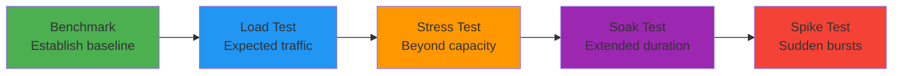

# Performance Testing in Banking GenAI Systems

## Overview

Performance testing in banking GenAI systems is fundamentally different from traditional web applications. GenAI workloads are:
- **Compute-intensive**: LLM inference consumes significant GPU/TPU resources
- **Memory-bound**: Large context windows and vector embeddings strain memory
- **Variable latency**: Token generation is inherently sequential; output length varies
- **Cost-sensitive**: Every token generated has a direct cost implication
- **Regulated**: SLA breaches in banking systems carry regulatory penalties

A payment confirmation chatbot that takes 15 seconds to respond has failed its user experience SLA, regardless of answer quality.

---

## Performance Testing Strategy



---

## k6 Load Testing

k6 is the industry-standard load testing tool for APIs. It uses JavaScript for test scripting and provides detailed metrics.

### Basic k6 Test Script

```javascript
// load-tests/rag-query-test.js
import http from 'k6/http';
import { check, sleep } from 'k6';
import { Rate, Trend } from 'k6/metrics';

// Custom metrics
const errorRate = new Rate('errors');
const apiLatency = new Trend('api_latency', true);
const tokenLatency = new Trend('ttft_ms', true);  // Time to first token

export const options = {
    stages: [
        { duration: '30s', target: 10 },    // Ramp up to 10 VUs
        { duration: '2m', target: 10 },     // Stay at 10 VUs
        { duration: '30s', target: 50 },    // Ramp up to 50 VUs
        { duration: '2m', target: 50 },     // Peak load
        { duration: '30s', target: 0 },     // Ramp down
    ],
    thresholds: {
        'http_req_duration': ['p(95)<3000'],  // 95% under 3s
        'api_latency': ['p(95)<2500'],
        'ttft_ms': ['p(95)<1000'],            // First token under 1s
        'errors': ['rate<0.01'],               // Error rate < 1%
    },
};

const BASE_URL = __ENV.API_URL || 'https://api.banking-genai.example.com';

export default function () {
    const queries = [
        'What is my current account balance?',
        'How do I dispute a transaction?',
        'What are the wire transfer fees?',
        'Explain the mortgage application process',
        'What documents do I need for a personal loan?',
    ];

    const query = queries[Math.floor(Math.random() * queries.length)];

    const payload = JSON.stringify({
        query: query,
        customer_id: `CUST-${String(Math.floor(Math.random() * 9000) + 1000)}`,
        tenant: 'retail-banking',
        max_tokens: 500,
    });

    const params = {
        headers: {
            'Content-Type': 'application/json',
            'Authorization': `Bearer ${__ENV.API_TOKEN}`,
            'X-Request-ID': crypto.randomUUID(),
        },
    };

    const start = Date.now();
    const res = http.post(`${BASE_URL}/api/v1/rag/query`, payload, params);
    const duration = Date.now() - start;

    apiLatency.add(duration);

    const passed = check(res, {
        'status is 200': (r) => r.status === 200,
        'response has answer': (r) => {
            try {
                return JSON.parse(r.body).answer.length > 0;
            } catch {
                return false;
            }
        },
        'response under 3s': (r) => duration < 3000,
        'confidence > 0.5': (r) => {
            try {
                return JSON.parse(r.body).confidence > 0.5;
            } catch {
                return false;
            }
        },
    });

    errorRate.add(!passed);
    sleep(Math.random() * 2 + 1); // Think time 1-3 seconds
}
```

### Running k6 Tests

```bash
# Local execution
k6 run load-tests/rag-query-test.js \
    --env API_URL=https://staging-api.banking-genai.example.com \
    --env API_TOKEN=${API_TOKEN}

# With Grafana dashboard (via k6 Cloud or self-hosted)
k6 run --out influxdb=http://localhost:8086/k6 load-tests/rag-query-test.js

# Distributed execution with k6 Cloud
k6 cloud load-tests/rag-query-test.js
```

### Streaming Response Performance

GenAI APIs often stream tokens via Server-Sent Events (SSE). Testing streaming requires special handling:

```javascript
// load-tests/streaming-test.js
import http from 'k6/http';
import { check } from 'k6';
import { Trend } from 'k6/metrics';

const timeToFirstToken = new Trend('ttft_ms', true);
const totalStreamDuration = new Trend('stream_total_ms', true);
const tokenRate = new Trend('tokens_per_second', true);

export default function () {
    const params = {
        headers: {
            'Content-Type': 'application/json',
            'Authorization': `Bearer ${__ENV.API_TOKEN}`,
            'Accept': 'text/event-stream',
        },
    };

    const res = http.asyncRequest(
        'POST',
        `${__ENV.API_URL}/api/v1/chat/completions`,
        JSON.stringify({
            messages: [{ role: 'user', content: 'Summarize the last 10 transactions on my checking account' }],
            stream: true,
            customer_id: 'CUST-1234',
        }),
        params
    );

    // In k6, handle SSE by streaming and measuring time-to-first-byte
    // For detailed streaming metrics, use the experimental k6 browser module
    // or integrate with a custom WebSocket/SSE collector
}
```

---

## Benchmarking LLM Inference

### Python Benchmarking Script

```python
# benchmarks/llm_inference_benchmark.py
"""
Benchmark LLM inference performance across different model configurations.
Generates a report comparing latency, throughput, and cost per query.
"""
import asyncio
import time
import statistics
from dataclasses import dataclass, asdict
from typing import List
import aiohttp

@dataclass
class BenchmarkResult:
    model: str
    prompt_length: int
    max_tokens: int
    avg_latency_ms: float
    p50_latency_ms: float
    p95_latency_ms: float
    p99_latency_ms: float
    throughput_rps: float
    error_rate: float
    cost_per_query: float
    gpu_memory_used_gb: float

async def benchmark_model(
    client: aiohttp.ClientSession,
    model: str,
    prompts: List[str],
    max_tokens: int = 256,
    concurrency: int = 10,
) -> BenchmarkResult:
    """Run a benchmark against a specific model configuration."""
    latencies = []
    errors = 0
    start_time = time.perf_counter()

    semaphore = asyncio.Semaphore(concurrency)

    async def run_query(prompt: str) -> float:
        async with semaphore:
            try:
                async with client.post(
                    f"/v1/models/{model}/completions",
                    json={"prompt": prompt, "max_tokens": max_tokens},
                    timeout=aiohttp.ClientTimeout(total=30),
                ) as resp:
                    if resp.status != 200:
                        return None
                    req_start = time.perf_counter()
                    data = await resp.json()
                    latency = (time.perf_counter() - req_start) * 1000
                    return latency
            except Exception:
                return None

    tasks = [run_query(p) for p in prompts]
    results = await asyncio.gather(*tasks)

    valid_latencies = [r for r in results if r is not None]
    errors = len(results) - len(valid_latencies)

    elapsed = time.perf_counter() - start_time
    throughput = len(valid_latencies) / elapsed

    return BenchmarkResult(
        model=model,
        prompt_length=statistics.mean(len(p) for p in prompts),
        max_tokens=max_tokens,
        avg_latency_ms=statistics.mean(valid_latencies),
        p50_latency_ms=statistics.median(valid_latencies),
        p95_latency_ms=sorted(valid_latencies)[int(len(valid_latencies) * 0.95)],
        p99_latency_ms=sorted(valid_latencies)[int(len(valid_latencies) * 0.99)],
        throughput_rps=round(throughput, 2),
        error_rate=round(errors / len(results), 4),
        cost_per_query=calculate_cost(model, valid_latencies),
        gpu_memory_used_gb=get_gpu_memory(model),
    )


def calculate_cost(model: str, latencies: List[float]) -> float:
    """Calculate approximate cost based on model pricing."""
    pricing = {
        "gpt-4-turbo": 0.01,
        "claude-3-sonnet": 0.008,
        "llama-3-70b-self-hosted": 0.002,
        "mistral-large": 0.006,
    }
    base_cost = pricing.get(model, 0.01)
    return base_cost


def get_gpu_memory(model: str) -> float:
    """Approximate GPU memory for self-hosted models."""
    memory = {
        "llama-3-70b-self-hosted": 140.0,  # 2x A100 80GB
        "mistral-large": 80.0,
    }
    return memory.get(model, 0.0)


async def main():
    prompts = load_benchmark_prompts("benchmarks/prompts/banking_queries.jsonl")
    models = ["gpt-4-turbo", "claude-3-sonnet", "llama-3-70b-self-hosted"]

    results = []
    async with aiohttp.ClientSession(base_url="https://inference.banking-genai.internal") as session:
        for model in models:
            print(f"Benchmarking {model}...")
            result = await benchmark_model(session, model, prompts)
            results.append(result)

    # Print comparison table
    print(f"\n{'Model':<30} {'P50 (ms)':<10} {'P95 (ms)':<10} {'P99 (ms)':<10} {'RPS':<8} {'Cost':<8}")
    print("-" * 80)
    for r in results:
        print(f"{r.model:<30} {r.p50_latency_ms:<10.0f} {r.p95_latency_ms:<10.0f} {r.p99_latency_ms:<10.0f} {r.throughput_rps:<8} ${r.cost_per_query:<.4f}")


if __name__ == "__main__":
    asyncio.run(main())
```

---

## Vector Database Performance

```python
# benchmarks/vector_db_benchmark.py
"""
Benchmark vector database performance for RAG retrieval.
Tests: index size, query latency, recall accuracy.
"""
import time
import numpy as np
from qdrant_client import QdrantClient, models

def benchmark_retrieval(client: QdrantClient, collection: str, queries: list, top_k: int = 5):
    """Measure retrieval latency and quality."""
    latencies = []
    recalls = []

    for query_embedding, ground_truth_ids in queries:
        start = time.perf_counter()
        results = client.search(
            collection_name=collection,
            query_vector=query_embedding,
            limit=top_k,
        )
        latency_ms = (time.perf_counter() - start) * 1000
        latencies.append(latency_ms)

        # Calculate recall@k
        retrieved_ids = {r.id for r in results}
        recall = len(retrieved_ids & set(ground_truth_ids)) / len(ground_truth_ids)
        recalls.append(recall)

    return {
        "avg_latency_ms": np.mean(latencies),
        "p95_latency_ms": np.percentile(latencies, 95),
        "avg_recall_at_k": np.mean(recalls),
        "total_queries": len(queries),
    }


# Run benchmark
client = QdrantClient(url="https://qdrant.banking-genai.internal:6333")
queries = load_benchmark_queries("benchmarks/queries/rag_retrieval_gold.jsonl")
results = benchmark_retrieval(client, "banking-policies-v2", queries)

print(f"Avg retrieval latency: {results['avg_latency_ms']:.1f}ms")
print(f"P95 retrieval latency: {results['p95_latency_ms']:.1f}ms")
print(f"Recall@5: {results['avg_recall_at_k']:.2%}")
```

**Banking SLA targets for vector retrieval:**
- P50: < 50ms
- P95: < 200ms
- Recall@5: > 85%

---

## APM and Observability Integration

Performance tests are only useful if you can correlate results with system metrics.

```yaml
# docker-compose.performance.yml
version: '3.8'
services:
  api:
    environment:
      - OTEL_EXPORTER_OTLP_ENDPOINT=http://otel-collector:4317
      - PERFORMANCE_PROFILING=true

  otel-collector:
    image: otel/opentelemetry-collector-contrib:0.96.0
    ports:
      - "4317:4317"
      - "8889:8889"  # Prometheus metrics

  prometheus:
    image: prom/prometheus:v2.50.0
    volumes:
      - ./monitoring/prometheus.yml:/etc/prometheus/prometheus.yml

  grafana:
    image: grafana/grafana:10.3.0
    environment:
      - GF_SECURITY_ADMIN_PASSWORD=admin
    ports:
      - "3000:3000"
```

```yaml
# monitoring/prometheus.yml
global:
  scrape_interval: 15s

scrape_configs:
  - job_name: 'banking-api'
    metrics_path: '/metrics'
    static_configs:
      - targets: ['api:8080']

  - job_name: 'llm-inference'
    static_configs:
      - targets: ['inference-engine:8081']

  - job_name: 'vector-db'
    static_configs:
      - targets: ['qdrant:6333']
```

---

## Performance Budget for Banking GenAI

| Operation | P50 | P95 | P99 | Notes |
|---|---|---|---|---|
| RAG query (simple) | 800ms | 2000ms | 4000ms | Single turn, short answer |
| RAG query (complex) | 1500ms | 4000ms | 8000ms | Multi-document retrieval |
| Document ingestion | 200ms | 500ms | 1000ms | Per document, async |
| Embedding generation | 50ms | 150ms | 300ms | Per 512-token chunk |
| Vector search (top-5) | 20ms | 50ms | 100ms | 1M+ vectors |
| Chat completion (streaming, TTFT) | 200ms | 500ms | 1000ms | Time to first token |

---

## Interview Questions

1. **How do you establish a performance baseline for a GenAI service?**
   - Run a standardized workload (fixed prompts, fixed concurrency) against the service. Record P50, P95, P99 latency, throughput, error rate, and resource utilization. Repeat across model versions to detect regressions.

2. **Why is P99 latency more important than average latency for banking APIs?**
   - Average latency hides tail latency. In banking, the slowest 1% of requests are the ones that cause customer complaints and regulatory breaches. P99 reflects the worst experience real users face.

3. **How would you load test a streaming SSE endpoint?**
   - Use tools that support SSE/WebSocket (k6 with custom handling, or Apache JMeter with plugins). Measure time-to-first-token, inter-token latency, and total stream duration. Set thresholds for each.

4. **What is the most expensive part of a RAG pipeline and how do you optimize it?**
   - Embedding generation for large documents. Optimize with: chunk caching, incremental re-embedding, smaller embedding models, and batch processing during off-peak hours.

---

## Cross-References

- See [load-testing.md](./load-testing.md) for detailed load test design
- See [test-environments.md](./test-environments.md) for environment parity
- See [architecture/capacity-planning.md](../architecture/capacity-planning.md) for capacity planning
- See [architecture/cost-management.md](../architecture/cost-management.md) for cost optimization
