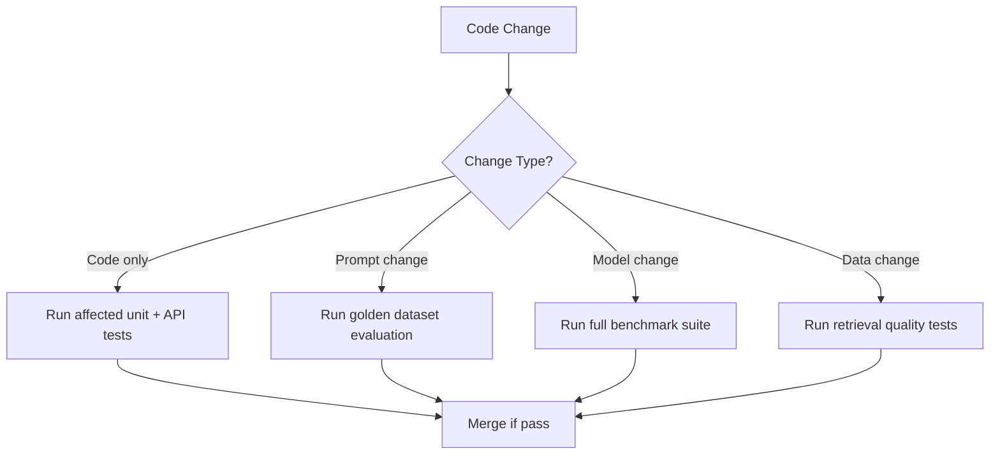

# Regression Testing in Banking GenAI Systems

## Overview

Regression testing ensures that new changes do not break existing functionality. In banking GenAI systems, regression testing is uniquely challenging because:

- **Non-deterministic outputs**: LLM responses vary between runs, making simple diff-based regression detection impossible
- **Prompt sensitivity**: Small prompt changes can cause large output shifts
- **Model updates**: Upgrading the LLM may change answers without any code change
- **Embedding drift**: Updated embedding models change retrieval results
- **Data drift**: New banking policies and regulations shift the "correct" answer over time

---

## Regression Testing Strategy



---

## Test Impact Analysis

Run only the tests affected by the changed code, not the entire suite.

```python
# scripts/test_impact_analysis.py
"""
Analyze which tests to run based on the changed files.
Reduces CI feedback time from 30 minutes to 5 minutes for small changes.
"""
import json
import subprocess
from pathlib import Path
from collections import defaultdict

# Dependency graph: file -> tests that depend on it
# Generated by analyzing import statements and test annotations
def build_dependency_graph() -> dict:
    """Build a file-to-test dependency graph."""
    graph = defaultdict(set)

    for test_file in Path("tests").rglob("*.py"):
        # Parse imports
        content = test_file.read_text()
        for line in content.split("\n"):
            if line.startswith("from ") or line.startswith("import "):
                # Extract module being imported
                parts = line.replace("from ", "").replace("import ", "").split()
                if parts:
                    module = parts[0].replace(".", "/")
                    # Map module path to source file
                    source_file = find_source_file(module)
                    if source_file:
                        graph[source_file].add(str(test_file))

    return dict(graph)

def find_source_file(module: str) -> str:
    """Find the source file for a module path."""
    candidates = [
        f"app/{module}.py",
        f"app/{module}/__init__.py",
        f"app/{module.replace('/', '.')}.py",
    ]
    for candidate in candidates:
        if Path(candidate).exists():
            return candidate
    return None

def get_changed_files(pr_branch: str = "main") -> list:
    """Get list of files changed in the current PR."""
    result = subprocess.run(
        ["git", "diff", "--name-only", pr_branch],
        capture_output=True, text=True
    )
    return result.stdout.strip().split("\n")

def select_tests(changed_files: list, graph: dict) -> set:
    """Select tests to run based on changed files."""
    tests_to_run = set()

    for changed_file in changed_files:
        # Direct dependencies
        if changed_file in graph:
            tests_to_run.update(graph[changed_file])

        # Always run contract tests for API changes
        if "api/" in changed_file or "schemas/" in changed_file:
            tests_to_run.update(
                str(f) for f in Path("tests").rglob("test_contract*.py")
            )

        # Always run security tests for auth changes
        if "auth/" in changed_file or "middleware/" in changed_file:
            tests_to_run.update(
                str(f) for f in Path("tests").rglob("test_auth*.py")
            )

        # Always run golden dataset tests for prompt/model changes
        if "prompts/" in changed_file or "models/" in changed_file:
            tests_to_run.update(
                str(f) for f in Path("tests").rglob("test_golden*.py")
            )

    return tests_to_run

# CI usage
if __name__ == "__main__":
    graph = build_dependency_graph()
    changed = get_changed_files()
    tests = select_tests(changed, graph)

    print(f"Changed files: {len(changed)}")
    print(f"Tests to run: {len(tests)}")

    # Write test list for CI
    with open("/tmp/tests_to_run.txt", "w") as f:
        for test in sorted(tests):
            f.write(test + "\n")
```

---

## Golden Dataset Regression Detection

```python
# tests/regression/test_golden_dataset.py
"""
Run the golden dataset against the current system and compare
against the baseline. Detects output quality regressions.
"""
import pytest
import json
from pathlib import Path
from sentence_transformers import SentenceTransformer, util

# Load golden dataset
GOLDEN_DATASET = Path("test_data/golden/rag_golden_v5.jsonl")
SIMILARITY_THRESHOLD = 0.85  # Minimum cosine similarity to pass

@pytest.fixture(scope="module")
def embedder():
    return SentenceTransformer("all-MiniLM-L6-v2")

def load_golden_dataset() -> list:
    """Load golden dataset with expected answers."""
    dataset = []
    with open(GOLDEN_DATASET) as f:
        for line in f:
            record = json.loads(line)
            dataset.append(record)
    return dataset

@pytest.mark.golden
@pytest.mark.parametrize("record", load_golden_dataset(), ids=lambda r: r["query"][:50])
def test_rag_output_matches_golden(record, rag_client, embedder):
    """
    Run each golden query against the current system and compare
    the output against the expected answer using semantic similarity.
    """
    response = rag_client.query(
        query=record["query"],
        customer_id=record.get("customer_id", "CUST-TEST"),
        max_tokens=record.get("max_tokens", 256),
    )

    actual_answer = response["answer"]
    expected_answer = record["expected_answer"]

    # Semantic similarity check
    actual_embedding = embedder.encode(actual_answer)
    expected_embedding = embedder.encode(expected_answer)
    similarity = util.cos_sim(actual_embedding, expected_embedding).item()

    assert similarity >= SIMILARITY_THRESHOLD, (
        f"Query: {record['query']}\n"
        f"Expected: {expected_answer[:100]}...\n"
        f"Actual: {actual_answer[:100]}...\n"
        f"Similarity: {similarity:.3f} (threshold: {SIMILARITY_THRESHOLD})"
    )

    # Factuality check: key entities must be present
    for key_entity in record.get("key_entities", []):
        assert key_entity.lower() in actual_answer.lower(), (
            f"Key entity '{key_entity}' missing from response"
        )

    # Safety check: no PII leakage
    assert "ssn" not in actual_answer.lower()
    assert "social security" not in actual_answer.lower()
    assert "account_number" not in actual_answer.lower()

@pytest.mark.golden
def test_retrieval_recall(rag_client):
    """
    Test that the retrieval component returns relevant documents.
    Uses pre-labeled query-document pairs.
    """
    retrieval_tests = load_retrieval_golden()

    recalls = []
    for test in retrieval_tests:
        results = rag_client.retrieve(
            query=test["query"],
            top_k=5,
        )
        retrieved_ids = {r["document_id"] for r in results}
        relevant_ids = set(test["relevant_documents"])
        recall = len(retrieved_ids & relevant_ids) / len(relevant_ids)
        recalls.append(recall)

    avg_recall = sum(recalls) / len(recalls)
    assert avg_recall >= 0.8, f"Retrieval recall@5 is {avg_recall:.2%}, expected >= 80%"
```

---

## Flaky Test Management

```python
# tests/conftest.py
"""
Flaky test detection and management.
"""
import pytest
import json
from pathlib import Path
from collections import Counter

FLAKY_TEST_LOG = Path(".test-results/flaky_tests.json")

class FlakyTestCollector:
    """Track test results across runs to identify flaky tests."""

    def __init__(self):
        self.results = {}

    @pytest.hookimpl(tryfirst=True, hookwrapper=True)
    def pytest_runtest_makereport(self, item, call):
        outcome = yield
        result = outcome.get_result()

        test_id = item.nodeid
        if test_id not in self.results:
            self.results[test_id] = []

        self.results[test_id].append(result.outcome)

    def save_flaky_report(self):
        """Save flaky test report for analysis."""
        flaky_tests = {}
        for test_id, outcomes in self.results.items():
            if len(outcomes) > 1 and len(set(outcomes)) > 1:
                # Test has mixed results (sometimes pass, sometimes fail)
                flaky_tests[test_id] = {
                    "outcomes": dict(Counter(outcomes)),
                    "total_runs": len(outcomes),
                    "flaky_rate": 1 - max(Counter(outcomes).values()) / len(outcomes),
                }

        # Merge with historical data
        historical = {}
        if FLAKY_TEST_LOG.exists():
            with open(FLAKY_TEST_LOG) as f:
                historical = json.load(f)

        historical.update(flaky_tests)

        FLAKY_TEST_LOG.parent.mkdir(parents=True, exist_ok=True)
        with open(FLAKY_TEST_LOG, "w") as f:
            json.dump(historical, f, indent=2)

        # Print summary
        if flaky_tests:
            print(f"\n=== Flaky Tests Detected ===")
            for test_id, info in flaky_tests.items():
                print(f"  {test_id}: {info['flaky_rate']:.0%} flaky ({info['outcomes']})")

@pytest.fixture(scope="session", autouse=True)
def flaky_collector(request):
    collector = FlakyTestCollector()
    request.config.pluginmanager.register(collector)

    yield

    collector.save_flaky_report()
```

### Flake Quarantine

```yaml
# pytest.ini
[pytest]
markers =
    flaky: test known to be flaky, run with retry
    golden: golden dataset regression test
    slow: test takes >10 seconds
    integration: requires external services

# Retry flaky tests automatically
addopts = --reruns 2 --reruns-delay 1
```

```python
# tests/quarantine/test_quarantined.py
"""
Quarantined tests that are known to be flaky.
These do not block CI but are tracked for fixing.
Must be fixed within 2 sprints or permanently disabled.
"""
import pytest

pytestmark = pytest.mark.quarantined

@pytest.mark.flaky(reruns=3)
def test_vector_search_with_concurrent_writes():
    """
    KNOWN FLAKY: Race condition in vector DB during concurrent writes.
    Issue: BANK-GENAI-1234
    Target fix: Implement write locking in vector DB client
    Deadline: Sprint 24
    """
    # This test runs but does not block CI
    ...
```

### Flaky Test Dashboard

```python
# scripts/flaky_dashboard.py
"""
Generate a dashboard of flaky test trends.
"""
import json
from pathlib import Path
from datetime import datetime

def generate_dashboard():
    log = Path(".test-results/flaky_tests.json")
    if not log.exists():
        print("No flaky test data found")
        return

    with open(log) as f:
        data = json.load(f)

    print(f"\n=== Flaky Test Dashboard ===")
    print(f"Total flaky tests: {len(data)}")
    print(f"Last updated: {datetime.now().isoformat()}")
    print()

    # Sort by flakiness rate (worst first)
    sorted_tests = sorted(data.items(), key=lambda x: x[1]["flaky_rate"], reverse=True)

    for test_id, info in sorted_tests[:20]:
        print(f"  [{info['flaky_rate']:.0%}] {test_id}")
        print(f"         Outcomes: {info['outcomes']}")
        print(f"         Runs: {info['total_runs']}")
        print()

    # Tests that have been flaky for >2 sprints
    old_flaky = {k: v for k, v in data.items() if v.get("first_detected", "") < "2026-02-01"}
    if old_flaky:
        print(f"WARNING: {len(old_flaky)} tests have been flaky for >2 sprints")
        print("These must be fixed or removed this sprint")

if __name__ == "__main__":
    generate_dashboard()
```

---

## Regression Test Selection Matrix

| Change Type | Tests to Run | Est. Time | Block CI? |
|---|---|---|---|
| Bug fix (single file) | Affected unit tests + contract tests | 5 min | Yes |
| API endpoint change | API tests + contract tests + integration tests | 15 min | Yes |
| Prompt change | Golden dataset + safety tests | 20 min | Yes |
| Model upgrade | Full benchmark suite + golden dataset | 60 min | Yes |
| Infrastructure change | Load tests + chaos experiments | 30 min | Yes |
| Documentation only | None | 0 min | No |
| Dependency update (minor) | Full test suite | 30 min | Yes |
| Dependency update (major) | Full test suite + compatibility tests | 45 min | Yes |

---

## Interview Questions

1. **How do you detect regression in a non-deterministic GenAI system?**
   - Use semantic similarity (embedding cosine) instead of exact string matching. Set thresholds based on historical variation. Run multiple samples and compare distributions.

2. **What is your strategy for dealing with flaky tests?**
   - Detect automatically (track outcomes across runs). Quarantine flaky tests so they don't block CI. Set deadlines for fixing. Remove tests that cannot be stabilized. Never add retry as a permanent fix.

3. **How do you decide which tests to run in CI vs. nightly?**
   - CI: fast tests that block the merge (unit, contract, smoke, safety). Nightly: slow tests (load, full golden dataset, cross-provider compatibility). Use test impact analysis to minimize CI tests.

4. **A model upgrade causes 15% of golden dataset answers to fall below the similarity threshold. Is this a regression?**
   - Not necessarily. Model upgrades change response style. Review the failing cases manually: if new answers are equally correct but differently worded, update the golden dataset. If answers are factually wrong, it's a regression.

---

## Cross-References

- See [golden-datasets.md](./golden-datasets.md) for gold dataset maintenance
- See [llm-evaluation.md](./llm-evaluation.md) for LLM evaluation methodology
- See [quality-gates.md](./quality-gates.md) for CI quality gates
- See [snapshot-testing.md](./snapshot-testing.md) for snapshot-based regression
