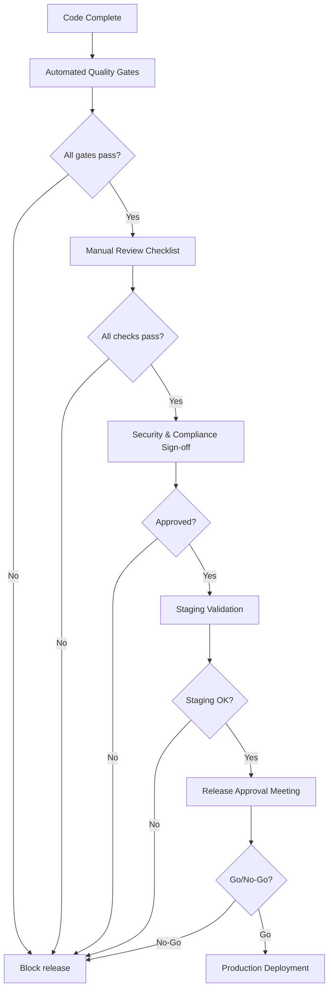
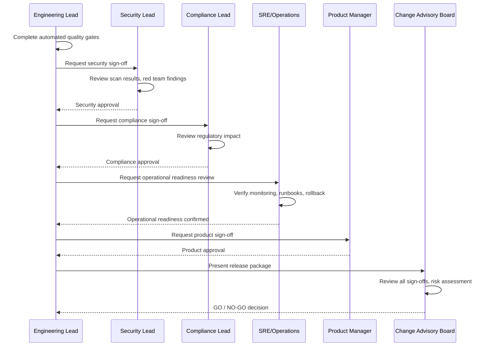

# Release Readiness for Banking GenAI Systems

## Overview

Release readiness is the systematic evaluation of whether a GenAI system is safe, compliant, performant, and reliable enough for production deployment. In banking, releasing an AI system carries regulatory obligations and customer trust implications that go far beyond standard software releases.

A GenAI system that produces incorrect regulatory advice, leaks customer data, or fails under load can result in:
- **Regulatory penalties**: OCC, CFPB, and state regulators can fine the institution
- **Customer harm**: Incorrect financial advice leading to monetary losses
- **Reputational damage**: Public failures erode trust in the institution's technology
- **Legal liability**: Discriminatory AI outputs creating fair lending violations

---

## Release Readiness Framework



---

## Automated Quality Gates

These gates run in CI/CD and must pass before a release can proceed.

| Gate | Threshold | Tool | Failure Action |
|---|---|---|---|
| Unit test coverage | > 80% | pytest-cov | Block merge |
| Mutation score | > 80% | MutPy/Stryker | Block release |
| API contract tests | 100% pass | OpenAPI validation | Block merge |
| Golden dataset score | > 85% pass rate | Custom evaluator | Block release |
| Safety tests | 100% pass | Red team suite | Block release |
| Performance P95 | < 3s | k6 | Block release |
| Security scan | 0 critical, 0 high | Snyk/Trivy | Block merge |
| License compliance | No GPL/AGPL | FOSSA | Block merge |
| Dependency freshness | No deprecated | Dependabot | Warning |
| Docker image scan | 0 critical CVEs | Trivy | Block merge |

```yaml
# .github/workflows/release-gates.yaml
name: Release Quality Gates
on:
  push:
    branches: [release/**]

jobs:
  quality-gates:
    runs-on: ubuntu-latest
    steps:
      - uses: actions/checkout@v4

      - name: Run test suite
        run: |
          pytest tests/ -v \
            --cov=app \
            --cov-report=xml \
            --junitxml=test-results.xml \
            --cov-fail-under=80

      - name: Run golden dataset evaluation
        run: |
          python tests/evaluate_golden.py \
            --dataset test_data/golden/banking_rag_v2.jsonl \
            --threshold 0.85 \
            --fail-below-threshold

      - name: Run safety and red team tests
        run: |
          pytest tests/red_team/ tests/adversarial/ -v \
            --fail-on-critical

      - name: Run performance tests
        run: |
          k6 run load-tests/release-validation.js \
            --out json=perf-results.json

      - name: Run security scan
        uses: aquasecurity/trivy-action@master
        with:
          scan-type: 'fs'
          exit-code: '1'
          severity: 'CRITICAL,HIGH'

      - name: Generate quality report
        run: |
          python scripts/generate_quality_report.py \
            --test-results test-results.xml \
            --perf-results perf-results.json \
            --golden-results golden-results.json \
            --output quality-report.md

      - name: Upload quality report
        uses: actions/upload-artifact@v4
        with:
          name: quality-report
          path: quality-report.md
```

---

## Manual Review Checklist

### Code Quality

- [ ] All PR comments addressed and resolved
- [ ] Code review completed by at least 2 senior engineers
- [ ] Architecture review board approved (for major changes)
- [ ] Database migrations tested and rollback script prepared
- [ ] API versioning strategy followed (no breaking changes)
- [ ] Feature flags implemented for gradual rollout
- [ ] Deprecation notices added for removed functionality

### GenAI-Specific Checks

- [ ] Golden dataset evaluation passes threshold (> 85%)
- [ ] Red team findings resolved (no critical/high open findings)
- [ ] Adversarial robustness score meets target (> 80)
- [ ] Prompt changes reviewed by security team
- [ ] Model version documented with changelog
- [ ] Fallback behavior tested (what happens when LLM is unavailable)
- [ ] Output validation filters are active (PII, toxic content, hallucination detection)
- [ ] Rate limiting configured for all AI endpoints
- [ ] Cost monitoring and budget alerts configured
- [ ] Audit logging captures: prompts, responses, confidence scores, sources

### Security

- [ ] SAST scan passed (0 critical, 0 high)
- [ ] DAST scan completed and findings addressed
- [ ] Dependency scan passed (0 critical, 0 high CVEs)
- [ ] Secrets scan passed (no hardcoded credentials)
- [ ] TLS enabled for all endpoints
- [ ] Authentication and authorization verified on all endpoints
- [ ] Rate limiting tested and thresholds confirmed
- [ ] Input validation on all user-facing endpoints
- [ ] Output sanitization confirmed (no PII leakage in responses)
- [ ] API keys and tokens rotated before release

### Performance

- [ ] Load test results reviewed and within SLA
- [ ] P95 response time under target
- [ ] Memory usage stable under sustained load (no leaks)
- [ ] Database query plans reviewed for new queries
- [ ] Cache hit rate above 80% for frequently accessed data
- [ ] Vector database index performance validated
- [ ] Auto-scaling policies tested and thresholds confirmed

### Operational Readiness

- [ ] Runbook created/updated for all new features
- [ ] On-call team briefed on new functionality
- [ ] Monitoring dashboards configured and alerts set
- [ ] Log aggregation verified (all critical logs captured)
- [ ] Error tracking integrated (Sentry/Datadog)
- [ ] Health check endpoints updated
- [ ] Graceful shutdown tested
- [ ] Backup and restore procedures validated

### Compliance

- [ ] Privacy impact assessment completed (for new data handling)
- [ ] Model risk management documentation updated
- [ ] Fair lending analysis completed (if applicable)
- [ ] Regulatory notifications prepared (if required)
- [ ] Audit trail completeness verified
- [ ] Data retention policies configured
- [ ] Customer consent/notice updated (if applicable)
- [ ] Third-party vendor risk assessment (for new LLM providers)

### Rollback Plan

- [ ] Rollback procedure documented and tested
- [ ] Database rollback strategy defined
- [ ] Feature flags can disable new functionality without redeployment
- [ ] Rollback time estimated and within RTO
- [ ] Rollback decision criteria defined (what triggers a rollback)

---

## Release Approval Process



### Release Package Contents

```
release-package-v2.3.0/
├── CHANGELOG.md                    # All changes since last release
├── quality-report.md               # Automated quality gate results
├── security-scan-results/          # SAST, DAST, dependency scans
├── red-team-report.md              # Red team findings and remediation
├── performance-report.md           # Load test results vs. SLA
├── golden-dataset-evaluation.md    # Golden dataset scores and analysis
├── runbook-v2.3.0.md              # Updated operational runbook
├── rollback-plan.md               # Rollback procedure
├── compliance-checklist.md        # Regulatory compliance checklist
├── sign-offs/
│   ├── engineering.md             # Engineering lead sign-off
│   ├── security.md                # Security lead sign-off
│   ├── compliance.md              # Compliance sign-off
│   ├── operations.md              # SRE sign-off
│   └── product.md                 # Product manager sign-off
└── cab-decision.md                # Change Advisory Board decision
```

---

## Gradual Rollout Strategy

```yaml
# rollout/gradual-deployment.yaml
deployment_strategy:
  type: "canary"
  phases:
    - name: "internal"
      traffic_percentage: 0
      duration: "1h"
      audience: "internal-employees"
      success_criteria:
        error_rate: "< 1%"
        p95_latency: "< 3000ms"
        user_satisfaction: "> 4.0/5"

    - name: "canary-1"
      traffic_percentage: 5
      duration: "2h"
      audience: "opt-in customers"
      success_criteria:
        error_rate: "< 1%"
        p95_latency: "< 3000ms"
        user_satisfaction: "> 3.8/5"

    - name: "canary-2"
      traffic_percentage: 25
      duration: "4h"
      audience: "all retail banking customers"
      success_criteria:
        error_rate: "< 0.5%"
        p95_latency: "< 2500ms"
        user_satisfaction: "> 3.8/5"

    - name: "full-rollout"
      traffic_percentage: 100
      duration: "ongoing"
      audience: "all customers"
      success_criteria:
        error_rate: "< 0.1%"
        p95_latency: "< 2000ms"

  rollback_triggers:
    - metric: "error_rate"
      threshold: "> 2%"
      action: "immediate rollback"
    - metric: "p95_latency"
      threshold: "> 5000ms"
      action: "investigate, rollback if > 10 min"
    - metric: "user_complaints"
      threshold: "> 10 per hour"
      action: "investigate, rollback if confirmed"
    - metric: "golden_dataset_score"
      threshold: "< 75%"
      action: "immediate rollback"
```

---

## Interview Questions

1. **What is the single most important quality gate for a GenAI release in banking?**
   - Safety: The system must never produce harmful, discriminatory, or regulatory-violting outputs. Safety tests (red team, adversarial, content filters) must have a 100% pass rate. No exceptions.

2. **How do you handle a situation where the golden dataset score drops from 90% to 82% after a model upgrade?**
   - Block the release. Investigate the 18% of failing cases. Determine if failures are due to: (a) factual errors (unacceptable), (b) style/tone changes (acceptable with golden dataset update), or (c) prompt changes (fix the prompt). Only proceed if all failures are category (b).

3. **Who should be in the Change Advisory Board for a GenAI release?**
   - Engineering lead, security lead, compliance/regulatory lead, SRE/operations lead, product manager, and a customer experience representative. For banking, include the model risk management team as well.

4. **What is your rollback strategy for a GenAI system?**
   - Use feature flags for instant rollback without redeployment. Keep the previous model version warm (running) so failover is immediate. Define clear rollback triggers (error rate, latency, quality score thresholds). Test the rollback procedure before every release.

---

## Cross-References

- See [quality-gates.md](./quality-gates.md) for automated quality gates
- See [golden-datasets.md](./golden-datasets.md) for golden dataset evaluation
- See [red-teaming.md](./red-teaming.md) for security testing
- See [performance-testing.md](./performance-testing.md) for performance validation
- See [cicd-devops/](../cicd-devops/) for deployment pipeline configuration
- See [incident-management/](../incident-management/) for incident response
