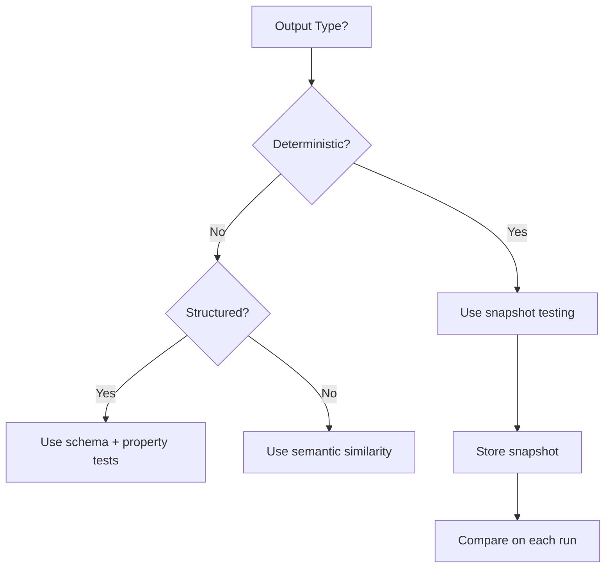
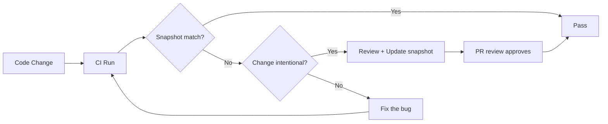

# Snapshot Testing in Banking GenAI Systems

## Overview

Snapshot testing captures the output of a function and compares it against a stored "snapshot" on subsequent runs. It is particularly useful for detecting unintended changes in complex outputs like generated JSON, HTML, or LLM responses.

In banking GenAI systems, snapshot testing is valuable for:
- **Prompt templates**: Detecting unintended changes in prompt formatting
- **API responses**: Capturing the full structure of API responses
- **Configuration files**: Detecting drift in infrastructure configuration
- **LLM outputs**: Capturing expected outputs for deterministic prompts
- **SQL queries**: Verifying generated SQL from ORM or query builders

The key challenge is that LLM outputs are non-deterministic, so snapshot testing must be applied selectively.

---

## When to Use Snapshot Testing



**Good candidates for snapshots:**
- API response schemas
- Prompt templates rendered with inputs
- Generated SQL queries
- Infrastructure configurations (Terraform, Kubernetes manifests)
- Error messages
- Log output formats

**Poor candidates for snapshots:**
- LLM-generated text (non-deterministic)
- Timestamps
- UUIDs
- Randomly ordered results

---

## Snapshot Testing with pytest-snapshot

```python
# tests/snapshots/test_api_responses.py
"""
Snapshot tests for API response structures.
Catches unintended changes to response format.
"""
import pytest
import json

@pytest.fixture
def snapshot_dir():
    return "tests/snapshots/api_responses"

def test_rag_query_response_snapshot(snapshot, rag_client):
    """
    Capture the full response structure for a standard RAG query.
    Any change to the response format will fail this test.
    """
    response = rag_client.query(
        query="What is the wire transfer fee?",
        customer_id="CUST-TEST-001",
    )

    # Remove non-deterministic fields
    response.pop("request_id", None)
    response.pop("timestamp", None)
    for source in response.get("sources", []):
        source.pop("retrieved_at", None)

    snapshot.assert_match(json.dumps(response, indent=2), "rag_query_response.json")

def test_error_response_snapshot(snapshot, rag_client):
    """Capture the error response structure."""
    with pytest.raises(Exception) as exc_info:
        rag_client.query(
            query="",  # Invalid: empty query
            customer_id="CUST-TEST-001",
        )

    error_response = exc_info.value.response.json()
    snapshot.assert_match(json.dumps(error_response, indent=2), "error_empty_query.json")

def test_health_endpoint_snapshot(snapshot, api_client):
    """Capture the health check response structure."""
    response = api_client.get("/health")
    data = response.json()

    # Remove dynamic fields
    data.pop("timestamp", None)
    data.pop("uptime_seconds", None)

    snapshot.assert_match(json.dumps(data, indent=2), "health_response.json")
```

### Generated Snapshots

```json
// tests/snapshots/api_responses/rag_query_response.json
{
  "answer": "The wire transfer fee is $25 for domestic transfers and $45 for international transfers. Fees may vary based on your account type. Premium accounts receive a 50% discount on wire transfer fees.",
  "confidence": 0.92,
  "sources": [
    {
      "document_id": "DOC-FEES-2026",
      "title": "Fee Schedule 2026",
      "relevance_score": 0.95,
      "content_snippet": "Wire transfer fees: Domestic $25, International $45..."
    }
  ],
  "metadata": {
    "model": "gpt-4-turbo",
    "processing_time_ms": 1250,
    "documents_retrieved": 5,
    "cache_hit": false
  }
}
```

---

## Snapshot Testing for Prompt Templates

```python
# tests/snapshots/test_prompts.py
"""
Snapshot tests for rendered prompt templates.
Detects unintended changes in prompt construction.
"""
from app.prompts import render_rag_prompt, render_summarization_prompt

def test_rag_prompt_snapshot(snapshot):
    """Capture the rendered RAG prompt for a standard query."""
    prompt = render_rag_prompt(
        query="What are the requirements for a home equity loan?",
        context_documents=[
            {
                "title": "Loan Products Guide",
                "content": "Home equity loans require: (1) minimum 20% equity in the property, (2) credit score of 620 or higher, (3) debt-to-income ratio below 43%, (4) property appraisal within 60 days."
            },
            {
                "title": "Interest Rate Schedule",
                "content": "Home equity loan rates start at Prime + 1.5% for borrowers with credit scores above 740."
            }
        ],
        system_instructions="You are a banking assistant. Provide accurate, helpful answers based on the provided context.",
    )

    snapshot.assert_match(prompt, "rag_prompt_rendered.txt")

def test_summarization_prompt_snapshot(snapshot):
    """Capture the summarization prompt for a regulatory document."""
    prompt = render_summarization_prompt(
        document="BSA/AML Compliance Policy v3.2 -- Full regulatory text...",
        summary_type="executive",
    )

    snapshot.assert_match(prompt, "summarization_prompt_executive.txt")
```

---

## Snapshot Testing for SQL Queries

```python
# tests/snapshots/test_sql_generation.py
"""
Snapshot tests for generated SQL queries.
Detects ORM or query builder changes that alter SQL output.
"""
from app.queries import (
    build_customer_transactions_query,
    build_risk_assessment_query,
)

def test_customer_transactions_sql_snapshot(snapshot):
    """Capture the SQL for customer transaction history."""
    sql, params = build_customer_transactions_query(
        customer_id="CUST-1234",
        start_date="2026-01-01",
        end_date="2026-03-31",
        min_amount=100.00,
    )

    # Format for readability
    formatted_sql = format_sql(sql)
    snapshot.assert_match(formatted_sql, "customer_transactions.sql")
    snapshot.assert_match(json.dumps(params, indent=2), "customer_transactions_params.json")

def test_risk_assessment_sql_snapshot(snapshot):
    """Capture the SQL for risk assessment query."""
    sql, params = build_risk_assessment_query(
        customer_id="CUST-1234",
        assessment_date="2026-03-31",
    )

    formatted_sql = format_sql(sql)
    snapshot.assert_match(formatted_sql, "risk_assessment.sql")

def format_sql(sql: str) -> str:
    """Simple SQL formatter for readable snapshots."""
    # In practice, use sqlparse or similar
    keywords = ["SELECT", "FROM", "WHERE", "JOIN", "ON", "AND", "OR",
                "GROUP BY", "ORDER BY", "LIMIT", "HAVING"]
    formatted = sql
    for keyword in keywords:
        formatted = formatted.replace(f" {keyword} ", f"\n{keyword} ")
    return formatted.strip()
```

```sql
-- tests/snapshots/customer_transactions.sql
SELECT
    t.transaction_id,
    t.customer_id,
    t.type,
    t.amount,
    t.currency,
    t.timestamp,
    t.merchant_category,
    t.channel,
    m.name AS merchant_name
FROM transactions t
LEFT JOIN merchants m ON t.merchant_id = m.merchant_id
WHERE t.customer_id = %(customer_id)s
    AND t.timestamp >= %(start_date)s
    AND t.timestamp <= %(end_date)s
    AND t.amount >= %(min_amount)s
ORDER BY t.timestamp DESC
LIMIT 100
```

---

## Snapshot Testing for Kubernetes Manifests

```python
# tests/snapshots/test_k8s_manifests.py
"""
Snapshot tests for rendered Kubernetes manifests.
Detects unintended changes to deployment configuration.
"""
import yaml
from app.infrastructure.k8s import render_deployment

def test_rag_api_deployment_snapshot(snapshot):
    """Capture the rendered Kubernetes deployment manifest."""
    manifest = render_deployment(
        service="banking-rag-api",
        image="banking-rag-api:v2.3.0",
        replicas=3,
        environment="production",
        resources={
            "requests": {"cpu": "2", "memory": "4Gi", "nvidia.com/gpu": "1"},
            "limits": {"cpu": "4", "memory": "8Gi", "nvidia.com/gpu": "1"},
        },
        env_vars={
            "LLM_PROVIDER": "openai",
            "LLM_MODEL": "gpt-4-turbo",
            "VECTOR_DB_URL": "https://qdrant.banking-genai.internal:6333",
        },
    )

    snapshot.assert_match(
        yaml.dump(manifest, default_flow_style=False),
        "k8s_rag_api_deployment.yaml"
    )
```

---

## Snapshot Update Workflow



```bash
# Update snapshots (only when the change is intentional)
pytest tests/snapshots/ --snapshot-update

# Review what changed
git diff tests/snapshots/

# In CI, never update -- always compare
pytest tests/snapshots/  # Fails if snapshot doesn't match
```

### CI Guard Against Accidental Updates

```yaml
# .github/workflows/snapshot-tests.yaml
name: Snapshot Tests
on:
  pull_request:
    paths:
      - 'app/**'
      - 'tests/snapshots/**'

jobs:
  snapshot-tests:
    runs-on: ubuntu-latest
    steps:
      - uses: actions/checkout@v4

      - name: Run snapshot tests
        run: pytest tests/snapshots/ -v

      - name: Fail if snapshots were modified
        run: |
          if git diff --exit-code tests/snapshots/; then
            echo "No snapshot changes"
          else
            echo "ERROR: Snapshots were modified during test run"
            echo "Run 'pytest --snapshot-update' locally and commit the changes"
            exit 1
          fi
```

---

## Handling Non-Deterministic LLM Outputs

For LLM outputs, use a hybrid approach: snapshot the structure, semantic-similarity the content.

```python
# tests/snapshots/test_llm_structured.py
"""
Snapshot test for LLM output STRUCTURE (not content).
The actual text varies, but the structure should be consistent.
"""
import json
from sentence_transformers import SentenceTransformer, util

def test_llm_structured_output(snapshot, llm_client):
    """
    Test that the LLM returns the expected JSON structure.
    Content varies, so we only snapshot the schema.
    """
    response = llm_client.extract_entities(
        text="Customer John Doe (SSN: 123-45-6789) opened a checking account on 2026-01-15."
    )

    # Snapshot the structure (keys and types)
    structure = {
        key: type(value).__name__
        for key, value in response.items()
    }
    snapshot.assert_match(json.dumps(structure, indent=2), "entity_extraction_structure.json")

    # Verify content separately with semantic checks
    assert "entities" in response
    assert len(response["entities"]) > 0

def test_llm_response_semantic_stability(llm_client):
    """
    Run the same prompt multiple times and verify outputs are semantically similar.
    This catches model changes without requiring exact matches.
    """
    embedder = SentenceTransformer("all-MiniLM-L6-v2")
    prompt = "What is the routing number for wire transfers?"

    responses = []
    for _ in range(5):
        response = llm_client.complete(prompt, temperature=0.0)  # Lowest temperature
        responses.append(response["text"])

    # All responses should be semantically similar
    embeddings = embedder.encode(responses)
    similarities = []
    for i in range(len(embeddings)):
        for j in range(i + 1, len(embeddings)):
            sim = util.cos_sim(embeddings[i], embeddings[j]).item()
            similarities.append(sim)

    avg_similarity = sum(similarities) / len(similarities)
    assert avg_similarity > 0.8, f"LLM output consistency: {avg_similarity:.3f} (expected > 0.8)"
```

---

## Interview Questions

1. **When should you NOT use snapshot testing?**
   - For non-deterministic outputs (timestamps, UUIDs, LLM-generated text without temperature=0). For outputs that change frequently with legitimate reasons. For performance-critical tests where snapshot serialization adds overhead.

2. **How do you handle snapshot drift when LLM providers update their models?**
   - Run the golden dataset evaluation. If the new model produces equally correct but differently worded answers, update snapshots. If answers are wrong, it's a regression. Always review snapshot diffs manually before updating.

3. **What is the difference between snapshot testing and golden master testing?**
   - Snapshot testing captures any output for comparison. Golden master testing specifically captures the output of a known-good system version. In practice, they overlap significantly.

4. **A snapshot test fails because whitespace changed. How do you fix this?**
   - Normalize the output before snapshotting (strip whitespace, sort JSON keys, normalize line endings). The snapshot should capture semantic differences, not formatting noise.

---

## Cross-References

- See [regression-testing.md](./regression-testing.md) for regression detection strategies
- See [golden-datasets.md](./golden-datasets.md) for gold dataset curation
- See [contract-testing.md](./contract-testing.md) for schema validation
- See [unit-testing.md](./unit-testing.md) for unit testing fundamentals
