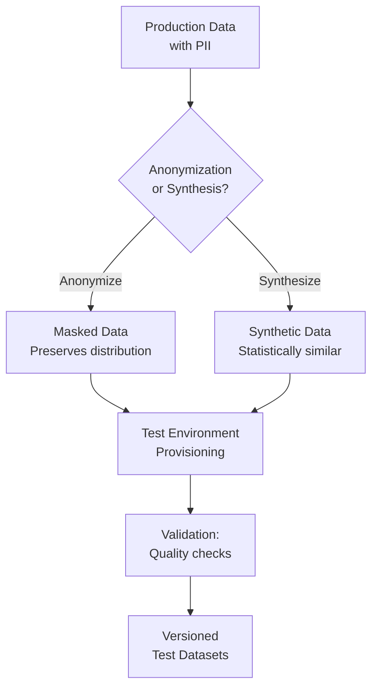

# Test Data Management in Banking GenAI Systems

## Overview

Test data management (TDM) is the practice of creating, maintaining, and provisioning data for testing. In banking GenAI systems, TDM is particularly challenging because:

- **PII/PCI data**: Real customer data cannot leave production without anonymization
- **GenAI training data**: Requires high-quality, representative datasets
- **Vector embeddings**: Test vector databases need realistic embedding distributions
- **Cross-referential integrity**: Customer data spans multiple systems (core banking, CRM, payments)
- **Regulatory constraints**: GDPR, CCPA, GLBA, and PCI-DSS all impose data handling requirements

---

## Test Data Strategy



---

## Data Anonymization

### PII Masking Pipeline

```python
# test_data/anonymize.py
"""
Anonymize production banking data for use in test environments.
Preserves data distribution while removing identifiable information.
"""
import hashlib
import random
import re
from typing import Dict, List
import pandas as pd
from faker import Faker

faker = Faker()

# Deterministic hashing for referential integrity
def pseudonymize(value: str, salt: str = "banking-test-salt") -> str:
    """Replace a value with a deterministic pseudonym."""
    return hashlib.sha256(f"{salt}:{value}".encode()).hexdigest()[:12]

def anonymize_ssn(ssn: str) -> str:
    """Replace SSN with a realistic but fake number."""
    return faker.ssn()

def anonymize_name(name: str) -> str:
    """Replace name with a realistic fake name."""
    return faker.name()

def anonymize_address(address: str) -> str:
    """Replace address with a realistic fake address."""
    return faker.address()

def mask_credit_card(card_number: str) -> str:
    """Mask all but last 4 digits of credit card."""
    if len(card_number) >= 4:
        return "****" + card_number[-4:]
    return "****"

def generalize_date(date_str: str, granularity: str = "month") -> str:
    """Reduce date precision to prevent re-identification."""
    # e.g., "2026-03-15" -> "2026-03-01" (month-level)
    if granularity == "month":
        return date_str[:7] + "-01"
    elif granularity == "quarter":
        month = int(date_str[5:7])
        quarter_month = ((month - 1) // 3) * 3 + 1
        return f"{date_str[:4]}-{quarter_month:02d}-01"
    return date_str

def anonymize_customer_record(record: Dict) -> Dict:
    """Anonymize a single customer record."""
    anonymized = record.copy()

    # Direct identifiers -- always replace
    anonymized["customer_id"] = pseudonymize(record["customer_id"])
    anonymized["first_name"] = anonymize_name(record["first_name"])
    anonymized["last_name"] = anonymize_name(record["last_name"])
    anonymized["ssn"] = anonymize_ssn(record["ssn"])
    anonymized["email"] = faker.email()
    anonymized["phone"] = faker.phone_number()
    anonymized["address"] = anonymize_address(record.get("address", ""))

    # Quasi-identifiers -- generalize
    anonymized["date_of_birth"] = generalize_date(record["date_of_birth"], "quarter")
    anonymized["account_opened"] = generalize_date(record["account_opened"], "month")

    # Financial data -- preserve distribution but perturb slightly
    anonymized["balance"] = record["balance"] * random.uniform(0.95, 1.05)
    anonymized["credit_limit"] = round(record["credit_limit"] * random.uniform(0.9, 1.1), 2)

    return anonymized

def anonymize_transaction_batch(transactions: pd.DataFrame) -> pd.DataFrame:
    """Anonymize a batch of transactions."""
    df = transactions.copy()

    # Pseudonymize customer references
    df["customer_id"] = df["customer_id"].apply(pseudonymize)
    df["merchant_id"] = df["merchant_id"].apply(pseudonymize)

    # Mask card numbers
    df["card_number"] = df["card_number"].apply(mask_credit_card)

    # Generalize timestamps
    df["transaction_date"] = df["transaction_date"].apply(lambda x: generalize_date(str(x)[:10], "month"))

    # Preserve amounts (financial data is needed for testing)
    # But add small noise to prevent exact matching
    df["amount"] = df["amount"] * (1 + (random.random() - 0.5) * 0.02)

    return df
```

### Automated PII Detection

```python
# test_data/pii_scanner.py
"""
Scan datasets for PII that may have been missed during anonymization.
Uses regex patterns, entropy analysis, and ML-based detection.
"""
import re
import pandas as pd
from presidio_analyzer import AnalyzerEngine

class PIIScanner:
    """Scan data for PII using Microsoft Presidio."""

    def __init__(self):
        self.analyzer = AnalyzerEngine()

    # Banking-specific PII patterns
    PII_PATTERNS = {
        "ssn": r"\b\d{3}-\d{2}-\d{4}\b",
        "routing_number": r"\b\d{9}\b",
        "account_number": r"\b\d{8,17}\b",
        "credit_card": r"\b(?:4\d{3}|5[1-5]\d{2}|3[47]\d{2})\d{12}\b",
        "swift_code": r"\b[A-Z]{6}[A-Z0-9]{2}([A-Z0-9]{3})?\b",
        "email": r"\b[A-Za-z0-9._%+-]+@[A-Za-z0-9.-]+\.[A-Z|a-z]{2,}\b",
        "phone_us": r"\b\(?[0-9]{3}\)?[-.\s]?[0-9]{3}[-.\s]?[0-9]{4}\b",
    }

    def scan_column(self, column_name: str, values: pd.Series) -> List[Dict]:
        """Scan a column for PII."""
        findings = []

        # Pattern-based detection
        for pii_type, pattern in self.PII_PATTERNS.items():
            matches = values.astype(str).str.contains(pattern, regex=True, na=False)
            if matches.any():
                findings.append({
                    "column": column_name,
                    "pii_type": pii_type,
                    "match_count": matches.sum(),
                    "confidence": "high",
                })

        # Entity-based detection using Presidio
        sample = values.head(100).astype(str).tolist()
        for text in sample:
            results = self.analyzer.analyze(text=text, language="en")
            for result in results:
                if result.score > 0.7:
                    findings.append({
                        "column": column_name,
                        "pii_type": result.entity_type,
                        "match_count": 1,
                        "confidence": f"{result.score:.2f}",
                    })

        return findings

    def scan_dataframe(self, df: pd.DataFrame) -> pd.DataFrame:
        """Scan entire DataFrame for PII and return report."""
        all_findings = []
        for col in df.columns:
            findings = self.scan_column(col, df[col])
            all_findings.extend(findings)

        report = pd.DataFrame(all_findings)
        if not report.empty:
            report = report.groupby(["column", "pii_type"]).agg({
                "match_count": "sum",
                "confidence": "first",
            }).reset_index()

        return report

# Usage
scanner = PIIScanner()
customer_data = pd.read_csv("test_data/raw/customers.csv")
report = scanner.scan_dataframe(customer_data)
print(f"Found {len(report)} PII findings across {report['column'].nunique()} columns")

# Block test data provisioning if PII is found
if len(report) > 0:
    raise ValueError(
        f"PII detected in test data: {report[['column', 'pii_type']].to_dict('records')}. "
        "Run anonymization pipeline before provisioning."
    )
```

---

## Synthetic Data Generation

### Banking Customer Generator

```python
# test_data/synthetic_customers.py
"""
Generate synthetic banking customer data for testing.
Preserves statistical properties of production data.
"""
import numpy as np
import pandas as pd
from faker import Faker
from datetime import datetime, timedelta

faker = Faker()

class SyntheticCustomerGenerator:
    """Generate realistic synthetic banking customers."""

    def __init__(self, seed: int = 42):
        np.random.seed(seed)
        faker.seed_instance(seed)

    def generate(self, n: int) -> pd.DataFrame:
        """Generate n synthetic customers."""
        customers = []
        for _ in range(n):
            customer = {
                "customer_id": f"CUST-{faker.unique.random_number(digits=6)}",
                "age": int(np.random.normal(45, 15)),
                "income_bracket": np.random.choice(
                    ["<50K", "50K-100K", "100K-200K", "200K+"],
                    p=[0.3, 0.35, 0.25, 0.1],
                ),
                "credit_score": int(np.clip(np.random.normal(720, 60), 300, 850)),
                "account_types": np.random.choice(
                    [["checking"], ["savings"], ["checking", "savings"],
                     ["checking", "savings", "credit"], ["checking", "mortgage"]],
                    p=[0.1, 0.1, 0.35, 0.3, 0.15],
                ),
                "monthly_balance": float(np.clip(np.random.lognormal(8, 1.5), 0, 1000000)),
                "avg_monthly_transactions": int(np.random.poisson(25)),
                "risk_profile": np.random.choice(["low", "medium", "high"], p=[0.6, 0.3, 0.1]),
                "onboarded_date": faker.date_between(start_date="-10y", end_date="today"),
                "region": np.random.choice(
                    ["northeast", "southeast", "midwest", "west", "southwest"],
                    p=[0.2, 0.25, 0.2, 0.2, 0.15],
                ),
            }
            customer["age"] = max(18, min(95, customer["age"]))
            customers.append(customer)

        return pd.DataFrame(customers)

    def generate_transactions(self, customers: pd.DataFrame, months: int = 12) -> pd.DataFrame:
        """Generate transaction history for synthetic customers."""
        transactions = []
        txn_types = ["purchase", "withdrawal", "deposit", "transfer", "payment"]

        for _, customer in customers.iterrows():
            n_txns = customer["avg_monthly_transactions"] * months
            for _ in range(n_txns):
                txn = {
                    "customer_id": customer["customer_id"],
                    "transaction_id": f"TXN-{faker.unique.random_number(digits=10)}",
                    "type": np.random.choice(txn_types, p=[0.5, 0.15, 0.15, 0.1, 0.1]),
                    "amount": round(float(np.clip(np.random.lognormal(3, 1.5), 0.01, 50000)), 2),
                    "currency": "USD",
                    "timestamp": faker.date_time_between(
                        start_date=f"-{months*30}d", end_date="now"
                    ),
                    "merchant_category": np.random.choice(
                        ["grocery", "restaurant", "utilities", "entertainment",
                         "healthcare", "travel", "other"],
                        p=[0.2, 0.15, 0.1, 0.1, 0.05, 0.1, 0.3],
                    ),
                    "channel": np.random.choice(
                        ["pos", "online", "atm", "branch", "mobile"],
                        p=[0.3, 0.3, 0.15, 0.05, 0.2],
                    ),
                }
                transactions.append(txn)

        return pd.DataFrame(transactions)
```

---

## Synthetic GenAI Test Data

### Prompt-Response Pairs for RAG Testing

```python
# test_data/synthetic_rag_data.py
"""
Generate synthetic prompt-response pairs for RAG testing.
Creates realistic banking queries with expected answers from policy documents.
"""
import json
from typing import List, Dict

class SyntheticRAGDataGenerator:
    """Generate synthetic RAG test data for banking domain."""

    def __init__(self):
        self.query_templates = self._load_query_templates()

    def _load_query_templates(self) -> List[Dict]:
        return [
            {
                "category": "account_inquiry",
                "templates": [
                    "What is my {account_type} balance?",
                    "How much money do I have in my {account_type}?",
                    "Show me my {account_type} statement for {month}",
                ],
                "variables": {
                    "account_type": ["checking", "savings", "money market", "CD"],
                    "month": ["January", "February", "March", "last month"],
                },
            },
            {
                "category": "transaction_dispute",
                "templates": [
                    "I don't recognize a charge of ${amount} on {date}",
                    "How do I dispute a {merchant_type} transaction?",
                    "What is the chargeback process for unauthorized transactions?",
                ],
                "variables": {
                    "amount": ["25.00", "150.00", "500.00", "1200.00"],
                    "date": ["March 15th", "yesterday", "last week", "the 20th"],
                    "merchant_type": ["online", "international", "recurring", "ATM"],
                },
            },
            {
                "category": "loan_inquiry",
                "templates": [
                    "What is the current {loan_type} interest rate?",
                    "How do I apply for a {loan_type}?",
                    "What documents do I need for a {loan_type} application?",
                ],
                "variables": {
                    "loan_type": ["mortgage", "personal loan", "auto loan", "home equity line of credit"],
                },
            },
            {
                "category": "fraud_alert",
                "templates": [
                    "I think my account was compromised",
                    "There are transactions I didn't authorize",
                    "My card was stolen, what should I do?",
                ],
            },
            {
                "category": "regulatory",
                "templates": [
                    "What are my rights under Regulation E?",
                    "Explain the Truth in Lending Act requirements",
                    "How does the bank handle BSA/AML reporting?",
                ],
            },
        ]

    def generate_queries(self, n_per_category: int = 20) -> List[Dict]:
        """Generate synthetic queries."""
        import random
        queries = []

        for template_group in self.query_templates:
            for template in template_group["templates"]:
                for _ in range(n_per_category):
                    query = template
                    if "variables" in template_group:
                        for var_name, values in template_group["variables"].items():
                            query = query.replace(f"{{{var_name}}}", random.choice(values))

                    queries.append({
                        "query": query,
                        "category": template_group["category"],
                        "difficulty": random.choice(["simple", "moderate", "complex"]),
                        "expected_intent": self._classify_intent(query),
                    })

        return queries

    def _classify_intent(self, query: str) -> str:
        """Simple intent classification for testing."""
        query_lower = query.lower()
        if any(w in query_lower for w in ["stolen", "compromised", "unauthorized", "fraud"]):
            return "fraud_urgent"
        elif any(w in query_lower for w in ["dispute", "chargeback", "don't recognize"]):
            return "dispute"
        elif any(w in query_lower for w in ["rate", "apply", "documents"]):
            return "product_inquiry"
        else:
            return "general_inquiry"


# Generate and save
generator = SyntheticRAGDataGenerator()
queries = generator.generate_queries(n_per_category=20)

with open("test_data/synthetic/rag_queries.jsonl", "w") as f:
    for q in queries:
        f.write(json.dumps(q) + "\n")

print(f"Generated {len(queries)} synthetic RAG queries across {len(generator.query_templates)} categories")
```

---

## Test Data Versioning

```yaml
# test_data/catalog.yaml
# Versioned catalog of test datasets
datasets:
  synthetic_customers_v3:
    type: synthetic
    format: parquet
    records: 100000
    generated: "2026-03-01"
    seed: 42
    checksum: "sha256:a1b2c3d4..."
    pii_scan: clean
    location: "s3://test-data-bank/synthetic/customers_v3/"

  anonymized_transactions_q1_2026:
    type: anonymized_production
    format: parquet
    records: 5000000
    source: "production_transactions_2026_q1"
    anonymized: "2026-03-15"
    anonymization_version: "2.1.0"
    pii_scan: clean
    location: "s3://test-data-bank/anonymized/transactions_q1_2026/"

  rag_gold_dataset_v5:
    type: human_curated
    format: jsonl
    records: 5000
    curated_by: "domain-experts"
    last_reviewed: "2026-03-20"
    categories: [account_inquiry, dispute, loan, fraud, regulatory]
    location: "s3://test-data-bank/gold/rag_v5.jsonl"
```

---

## Interview Questions

1. **What is the difference between data anonymization and data synthesis?**
   - Anonymization transforms real data to remove identifiers while preserving structure. Synthesis generates entirely new data that statistically resembles production. Anonymization risks re-identification; synthesis risks distribution mismatch.

2. **How do you ensure referential integrity in anonymized test data?**
   - Use deterministic pseudonymization (consistent hashing with salt) so the same real ID always maps to the same synthetic ID. Maintain a mapping table for cross-system joins.

3. **What are the regulatory requirements for test data in banking?**
   - GDPR: Right to erasure applies to test data too. CCPA: Opt-out rights. GLBA: Financial data protection. PCI-DSS: No real card numbers in test environments. FFIEC: Risk management for all data handling.

4. **How do you validate that synthetic data is representative?**
   - Compare statistical distributions: column means, variances, correlations, and categorical frequencies between synthetic and production data. Use KL divergence for distribution comparison.

---

## Cross-References

- See [golden-datasets.md](./golden-datasets.md) for gold dataset curation
- See [security-testing.md](./security-testing.md) for PII scanning
- See [data-engineering/](../data-engineering/) for data pipeline patterns
- See [databases/data-anonymization.md](../databases/data-anonymization.md) for DB-level masking
